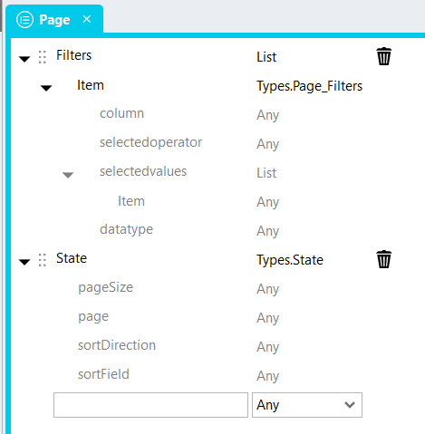
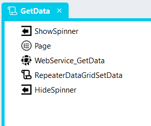
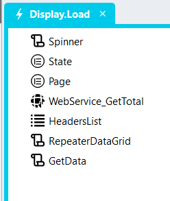
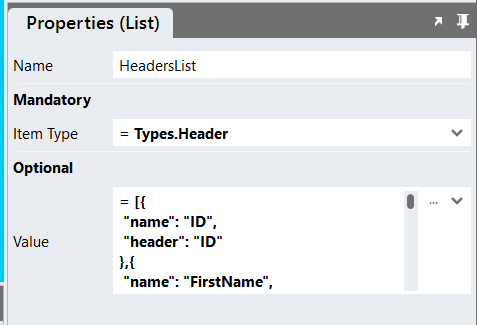

# Server-Side DataGrid Repeater <!-- omit in toc -->

## Contents <!-- omit in toc -->
1. [Overview](#overview)
2. [Basic Setup Overview](#basic-setup-overview)
3. [Version](#version)
4. [Application Setup](#application-setup)
   1. [Application Properties](#application-properties)
   2. [Connector](#connector)
   3. [RepeaterDataGrid Global Script](#repeaterdatagrid-global-script)
   4. [RepeaterDataGridGetState Global Script](#repeaterdatagridgetstate-global-script)
   5. [RepeaterDataGridSetData Global Script](#repeaterdatagridsetdata-global-script)
   6. [Types](#types)
      1. [Column](#column)
         1. [Type Import](#type-import)
      2. [State](#state)
         1. [Type Import](#type-import-1)
      3. [DataSet](#dataset)
      4. [Page](#page)
         1. [Type Import](#type-import-2)
   7. [Page](#page-1)
      1. [Container](#container)
      2. [Grid](#grid)
      3. [Repeater](#repeater)
      4. [Various Controls](#various-controls)
   8. [Page Scripts](#page-scripts)
      1. [Script Actions](#script-actions)
   9. [Page.Load Event Handler](#pageload-event-handler)
   10. [Advanced Features](#advanced-features)
   11. [CSS](#css)
   12. [Upgrading Stadium Repos](#upgrading-stadium-repos)

# Overview
The Stadium *DataGrid* loads all records a query or API return into memory as a JSON array of objects. When datasets are large, they take a long time to transmit across networks and client machines can run out of memory, causing browsers to freeze or even crash. One solution is to break large datasets into smaller units, here called "pages" of data. This cannot be achieved using the DataGrid control. 

An alternative to the DataGrid for the display of datasets is the Repeater control. This module provides a method for displaying data from sets in individual pages in the Repeater control that is made to look and function similar to the standard Stadium *DataGrid* control. Use this module when you want to give users access to datasets that are too large for the standard DataGrids. 

When using this module, the queries or WebServices limit the number of records they return to specific slices. This is done using parameters from the DataGrid in conjunction  with the paging techniques the respective databases support. The example below shows how this works with MSSQL databases. 

https://github.com/user-attachments/assets/c83d203c-d2de-45a4-bb21-5cca30a8f350

# Basic Setup Overview

1. Create your [Connectors](#connector) and DataSources (Queries or WebServices)
2. Add the [RepeaterDataGrid Global Script](#repeaterdatagrid-global-script) script
3. Add the [RepeaterDataGridGetState Global Script](#repeaterdatagridgetstate-global-script)
4. Add the [RepeaterDataGridSetData Global Script](#repeaterdatagridsetdata-global-script)
5. Add the [types](#types)
6. Add the [controls](#page) to your Page
7. Create a [Page Script](#page-scripts)
8. Create the [Page.Load](#pageload-event-handler) event handler

# Version
2.0 Simplified all scripts and enhanced the sample application

# Application Setup

## Application Properties
Check the *Enable Style Sheet* checkbox in the application properties

## Connector
This module requires two queries or end points

1. TotalRecords

Returns an integer that represents the total number of records (used to set the pages count and control the page navigation buttons)

1. Data

Returns a set of records for a DataGrid page

## RepeaterDataGrid Global Script
1. Create a Global Script called "RepeaterDataGrid"
2. Add the input parameters below to the Global Script
   1. ContainerClass
   2. EventCallback
   3. Headers
   4. PagingType
   5. State
   6. TotalRecords
3. Drag a *JavaScript* action into the script
4. Add the Javascript below unchanged into the JavaScript code property
```javascript
/* Stadium Script v2.0 https://github.com/stadium-software/repeater-datagrid */
let scope = this;
loadCSS();
let cols = ~.Parameters.Input.Headers;
let eventHandler = ~.Parameters.Input.EventCallback;
let pagingType = ~.Parameters.Input.PagingType || "default";
pagingType = pagingType.toLowerCase();
let state = ~.Parameters.Input.State;
let pageSize = parseInt(state.pageSize);
let sortField = state.sortField;
let sortDirection = state.sortDirection;
let page = parseInt(state.page);
let totalRecords = parseInt(~.Parameters.Input.TotalRecords);
if (isNaN(page)) page = 1;
let totalPages = Math.ceil(totalRecords / pageSize);
let pagers = 10;
let containerClass = ~.Parameters.Input.ContainerClass;
if (!containerClass) {
     console.error("The ContainerClass parameter is required");
     return false;
}
let container = document.querySelectorAll("." + containerClass);
if (container.length == 0) {
    console.error("The class '" + containerClass + "' is not assigned to any container");
    return false;
} else if (container.length > 1) {
    console.error("The class '" + containerClass + "' is assigned to multiple containers");
    return false;
}
container = container[0];
container.classList.add("stadium-server-side-dg-repeater");
let grid = container.querySelectorAll(".grid-layout");
if (grid.length == 0) {
    console.error("The container '" + containerClass + "' must contain a Grid control");
    return false;
} else if (grid.length > 1) {
    console.error("The container '" + containerClass + "' must contain only one Grid control");
    return false;
} else { 
    grid = grid[0];
}
let infinitePaging = false;
if (pagingType == "infinite") {
    infinitePaging = true;
}
if (infinitePaging) {
    var infiniteObserver = new IntersectionObserver(entries => {
        if (entries[0].isIntersecting) {
            page++;
            callBack(page);
        }
    }, {
            rootMargin: '0px 0px 100px 0px'
    });
}
let contID = container.id;
let cellsPerRow = cols.length;
if (document.getElementById(contID + "_stylesheet")) document.getElementById(contID + "_stylesheet").remove();
attachStyling();
addHeaders(cols);
addPaging();
writeCookie();
let cells = container.querySelectorAll(".grid-repeater-item");
let rowNo = 1, cellCounter = 0;
for (let i = 0; i < cells.length; i++) {
    cellCounter++;
    cells[i].setAttribute("row-no", rowNo);
    if (cellCounter >= cellsPerRow) {
        cellCounter = 0;
        rowNo++;
    }
}
/*----------------------------------------------------------------------------------------------*/
function callBack(page) { 
    let st = { sortField: sortField, sortDirection: sortDirection, page: page, pageSize: pageSize };
    scope[eventHandler](st);
}
function addHeaders(c) { 
    let headers = container.querySelectorAll(".repeater-header");
    for (let i = 0; i < headers.length; i++) {
        headers[i].remove();
    }
    for (let i = c.length-1; i > -1; i--) {
        let gItem = createTag("div", ["grid-item", "repeater-header"], []);
        let el = createTag("div"), inner;
        if (c[i].header && c[i].hasOwnProperty('sortable') && c[i].sortable !== false && c[i].sortable !== "false") {
            el = createTag("div", ["control-container", "link-container"]);
            inner = createTag("a", ["btn", "btn-lg", "btn-link"], [{name: "rel", value:"noopener noreferrer"}, {name: "field", value:c[i].name}], c[i].header);
            inner.addEventListener("click", handleSort);
            el.appendChild(inner);
        } else if (c[i].header) { 
            el = createTag("div", ["control-container", "label-container"]);
            inner = createTag("span", [], [], c[i].header);
            el.appendChild(inner);
        }
        if (c[i].hasOwnProperty('visible') && c[i].visible == false || c[i].visible == 'false') el.classList.add("visually-hidden");
        if (c[i].name == sortField && sortDirection.toLowerCase() == "asc") el.classList.add("dg-asc-sorting");
        if (c[i].name == sortField && sortDirection.toLowerCase() == "desc") el.classList.add("dg-desc-sorting");
        gItem.appendChild(el);
        grid.insertBefore(gItem, grid.firstChild);
    }
}
function addPaging() { 
    if (container.querySelector(".paging")) container.querySelector(".paging").remove();
    let pagingContainer = createTag("div", ["layout-control", "container-layout", "paging", "inline-block-element"], []);
    if (pagingType == "classic") {
        let pagingButtonsContainer = createTag("ul", ["pagination"], []);
        let pagingButtons = addClassicPagingButtons(pagingButtonsContainer, page);
        pagingContainer.appendChild(pagingButtons);
    } else if (pagingType == "default") {
        let prevButtonContainer = createTag("div", ["control-container", "button-container", "previous-button"], []);
        let prevButton = createTag("button", ["btn", "btn-lg", "btn-default"], [], "<<");
        let nextButtonContainer = createTag("div", ["control-container", "button-container", "next-button"], []);
        let nextButton = createTag("button", ["btn", "btn-lg", "btn-default"], [], ">>");
        let goInputContainer = createTag("div", ["control-container", "text-box-container", "specific-page"], []);
        let goInput = createTag("input", ["form-control", "error-border", "text-box-input", "specific-page-input"], [{ name: "type", value: "text" }]);
        let goButtonContainer = createTag("div", ["control-container", "button-container", "specific-page-go"], []);
        let goButton = createTag("button", ["btn", "btn-lg", "btn-default"], [], "Go");
        let pageInfoContainer = createTag("div", ["control-container", "label-container", "page-info"]);
        let pageInfo = createTag("span", [], [], getPageLabel());
        if (page == 1) prevButtonContainer.classList.add("disabled");
        if (page == totalPages) nextButtonContainer.classList.add("disabled");
        prevButtonContainer.appendChild(prevButton);
        nextButtonContainer.appendChild(nextButton);
        goInputContainer.appendChild(goInput);
        goButtonContainer.appendChild(goButton);
        pageInfoContainer.appendChild(pageInfo);

        pagingContainer.appendChild(prevButtonContainer);
        pagingContainer.appendChild(nextButtonContainer);
        pagingContainer.appendChild(goInputContainer);
        pagingContainer.appendChild(goButtonContainer);
        pagingContainer.appendChild(pageInfoContainer);

        prevButton.addEventListener("click", function () {
            handlePaging("previous");
        });
        nextButton.addEventListener("click", function () {
            handlePaging("next");
        });
        goButton.addEventListener("click", function () {
            handlePaging("go");
        });
        goInput.addEventListener("keypress", function (e) {
            if ((e.keyCode < 48 || e.keyCode > 57)) {
                e.preventDefault();
            }
            if (e.keyCode === 13) {
                handlePaging("go");
            }
        });
    }
    let stackLayout, allStacks = container.querySelectorAll(".stack-layout-container");
    for (let i = 0; i < allStacks.length; i++) {
        if (allStacks[i].contains(grid) && allStacks.length > i) {
            stackLayout = allStacks[i + 1];
        }
    }
    if (!stackLayout) {
        stackLayout = createTag("div", ["stack-layout-container"]);
        container.appendChild(stackLayout);
    }
    stackLayout.classList.add('paging-stack-layout');
    stackLayout.insertBefore(pagingContainer, stackLayout.firstChild);
    if (infinitePaging) {
        infiniteObserver.observe(container.querySelector(".paging"));
    }
}
function handlePaging(tp) { 
    let nextBtn = container.querySelector(".next-button"),
        prevBtn = container.querySelector(".previous-button"),
        goInpt = container.querySelector(".specific-page-input"),
        pageInfo = container.querySelector(".page-info span"),
        fire = false;
    if (tp == "next" && page < totalPages) {
        page++;
        fire = true;
    }
    if (tp == "previous" && page > 1) {
        page--;
        fire = true;
    }
    if (tp == "go" && goInpt.value) {
        let pgVal = goInpt.value;
        goInpt.value = "";
        if (!isNaN(pgVal) && pgVal >= 1 && pgVal <= totalPages) {
            page = parseInt(pgVal);
            fire = true;
        }
    }
    if (fire) {
        nextBtn.classList.remove("disabled");
        prevBtn.classList.remove("disabled");
        if (page == 1) prevBtn.classList.add("disabled");
        if (page == totalPages) nextBtn.classList.add("disabled");
        pageInfo.textContent = getPageLabel();
        callBack(page);
        writeCookie();
    }
}
function addClassicPagingButtons(parent, currentPage) {
    currentPage = currentPage - 1;
    let firstPage = currentPage - (currentPage % 10);
    let lastPage = firstPage + pagers;
    parent.innerHTML = "";
    if (totalPages < lastPage) lastPage = totalPages;
    if (firstPage >= pagers) {
        let pagingButton = createTag("li", [], []);
        let pagingButtonInner = createTag("a", [], [], "«");
        pagingButtonInner.addEventListener("click", handleClassicPaging);
        pagingButton.appendChild(pagingButtonInner);
        parent.appendChild(pagingButton);
    }
    for (let i = firstPage; i < lastPage; i++) {
        let pagingButton = createTag("li", [], []);
        if (i == currentPage) pagingButton.classList.add('active');
        let pagingButtonInner = createTag("a", [], [], i + 1);
        pagingButtonInner.addEventListener("click", handleClassicPaging);
        pagingButton.appendChild(pagingButtonInner);
        parent.appendChild(pagingButton);
    }
    if (totalPages > (firstPage + pagers)) {
        let pagingButton = createTag("li", [], []);
        let pagingButtonInner = createTag("a", [], [], "»");
        pagingButtonInner.addEventListener("click", handleClassicPaging);
        pagingButton.appendChild(pagingButtonInner);
        parent.appendChild(pagingButton);
    }
    return parent;
}
function handleClassicPaging(ev) {
    let el = ev.target;
    let elParent = el.closest("li");
    if (el.classList.contains("active")) {
        return false;
    }
    let paging = container.querySelector(".paging");
    let pagination = container.querySelector(".pagination");
    paging.querySelector(".active").classList.remove("active");
    let pg = el.textContent;
    if (pg == "»") {
        page = page % 10 === 0 ? page + 1 : page + pagers - (page % 10) + 1;
        if (page > totalPages) page = totalPages - (totalPages % 10) + 1;
        let pagingButtons = addClassicPagingButtons(pagination, page);
        paging.appendChild(pagingButtons);
    } else if (pg == "«") {
        page = page % 10 === 0 ? page - pagers : page - (page % 10);
        let pagingButtons = addClassicPagingButtons(pagination, page);
        paging.appendChild(pagingButtons);
    }
    else {
        page = Number(pg);
        elParent.classList.add("active");
    }
    callBack(page);
}
function handleSort(e) { 
    let clickedEl = e.target;
    let colHead = clickedEl.getAttribute("field");
    let dir = "asc";
    if (clickedEl.closest(".dg-asc-sorting")) {
        dir = "desc";
    }
    sort(colHead, dir);
}
function sort(field, direction) {
    if (!["asc", "desc"].includes(direction.toLowerCase())) direction = "asc";
    let allHeaders = container.querySelectorAll(".grid-item:not(.grid-repeater-item) .link-container");
    for (let i = 0; i < allHeaders.length; i++) {
        allHeaders[i].classList.remove("dg-asc-sorting", "dg-desc-sorting");
        if (allHeaders[i].querySelector("a").getAttribute("field").toLowerCase() == field.toLowerCase()) {
            allHeaders[i].classList.add("dg-" + direction + "-sorting");
        }
    }
    sortDirection = direction;
    sortField = field;
    if (infinitePaging) {
        page = 1;
    }
    callBack(page);
    writeCookie();
}
function createTag(type, arrClasses, arrAttributes, text) {
    let el = document.createElement(type);
    if (arrClasses && arrClasses.length > 0) {
        arrClasses = arrClasses.filter(function( element ) { return element !== undefined; });
        let cl = el.classList;
        cl.add.apply(cl, arrClasses);
    }
    if (arrAttributes && arrAttributes.length > 0) { 
        for (let i = 0; i < arrAttributes.length; i++) { 
            if (arrAttributes[i].name) el.setAttribute(arrAttributes[i].name, arrAttributes[i].value);
        }
    }
    if (text) el.textContent = text;
    return el;
}
function getPageLabel() {
    let pgLabel = "No records found";
    if (totalPages > 0) {
        pgLabel = "Page " + page.toLocaleString() + " of " + totalPages.toLocaleString();
    }
    return pgLabel;
}
function writeCookie() {
    let value = JSON.stringify({
        "pageSize": pageSize,
        "page": page,
        "sortDirection": sortDirection,
        "sortField": sortField
    });
    let options = {
        secure: true,
        samesite: "strict",
        domain: window.location.hostname,
    };
    let updatedCookie = encodeURIComponent(contID) + "=" + encodeURIComponent(value);
    for (let optionKey in options) {
        updatedCookie += "; " + optionKey;
        let optionValue = options[optionKey];
        if (optionValue !== true) {
            updatedCookie += "=" + optionValue;
        }
    }
    document.cookie = updatedCookie;
}
function attachStyling() {
    let selector = [];
    for (let i = 0; i < cellsPerRow; i++) {
        selector.push(".grid-repeater-item:nth-child(" + (cellsPerRow * 2) + "n+" + (i + 1) + ")");
    }
    let css = `
#${contID} {
    .grid-item:nth-child(${cellsPerRow}n+1) {
        border-left: 1px solid var(--dg-border-color);
    }
    .grid-item:nth-child(${cellsPerRow}n) {
        border-right: 1px solid var(--dg-border-color);
    }
    ${selector.join(", ")} {
        background-color: var(--dg-alternate-row-bg-color, var(--DATA-GRID-ODD-ROW-BACKGROUND-COLOR));
    }
}`;
    let head = document.head || document.getElementsByTagName('head')[0], style = document.createElement('style');
    head.appendChild(style);
    style.type = 'text/css';
    style.id = contID + "_stylesheet";
    style.appendChild(document.createTextNode(css));
}
function loadCSS() {
    let moduleID = "stadium-server-side-dg";
    if (!document.getElementById(moduleID)) {
        let cssMain = document.createElement("style");
        cssMain.id = moduleID;
        cssMain.type = "text/css";
        cssMain.textContent = `.stadium-server-side-dg-repeater {
    margin-top: 1rem;
    align-items: center;

    .control-container.grid-container.grid-layout {
        padding-right: 0;
    }

    .grid-item {
        display: flex;
        align-items: center;
        border-bottom: 0.1rem solid var(--dg-border-color, var(--DATA-GRID-BORDER-COLOR, #ccc));
        padding: var(--DATA-GRID-CELL-TOPBOTTOM-PADDING, 0.8rem) var(--DATA-GRID-CELL-RIGHTLEFT-PADDING, 0.8rem);

        .control-container {
            font-size: var(--dg-item-font-size, var(--DATA-GRID-CELL-FONT-SIZE, 1.4rem));
            margin-top: 0;
            vertical-align: -webkit-baseline-middle;
            padding-right: 1rem;
            color: var(--DATA-GRID-CELL-FONT-COLOR, var(--BODY-FONT-COLOR, #333));
        }
    }

    .grid-item:has(> .control-container.visually-hidden),
    .grid-item:has(> .control-container[style='display: none;']) {
        padding: 0;
        margin: 0;
    }

    .control-container.visually-hidden {
        padding: 0;
        display: none;
    }

    .repeater-header {
        border-top: 0.1rem solid var(--dg-border-color, var(--DATA-GRID-HEADER-CELL-BORDER-COLOR, #ccc));
        border-bottom: 0.3rem solid var(--dg-border-color, var(--DATA-GRID-HEADER-CELL-BORDER-COLOR, #ccc));
        padding: var(--dg-header-topbottom-padding, var(--DATA-GRID-HEADER-CELL-TOPBOTTOM-PADDING, 0.8rem)) var(--dg-header-rightleft-padding, var(--DATA-GRID-HEADER-CELL-RIGHTLEFT-PADDING, 0.8rem));
        background-color: var(--DATA-GRID-HEADER-ROW-BACKGROUND-COLOR, #fff);

        .btn.btn-link,
        span {
            text-transform: var(--dg-header-text-transform, var(--DATA-GRID-HEADER-CELL-TEXT-TRANSFORM, uppercase));
            font-weight: var(--dg-header-font-weight, var(--DATA-GRID-HEADER-CELL-FONT-WEIGHT, 600));
            font-size: var(--dg-header-font-size, var(--DATA-GRID-HEADER-CELL-FONT-SIZE, 1.2rem));
            color: var(--DATA-GRID-HEADER-CELL-FONT-COLOR, #1976d2);
            line-height: var(--DATA-GRID-HEADER-CELL-LINE-HEIGHT, 1.428571429);
            white-space: nowrap;
        }

        .btn.btn-link {
            text-decoration: var(--dg-header-link-underline, var(--DATA-GRID-HEADER-CELL-TEXT-DECORATION, underline));

            &:hover {
                text-decoration: var(--dg-header-link-underline, var(--DATA-GRID-HEADER-CELL-HOVER-TEXT-DECORATION, underline));
                color: var(--DATA-GRID-HEADER-CELL-HOVER-FONT-COLOR, #999)
            }
        }
    }

    .dg-alternate-row {
        background-color: var(--dg-alternate-row-bg-color, var(--DATA-GRID-ODD-ROW-BACKGROUND-COLOR));
    }

    .dg-asc-sorting {
        background-image: var(--dg-sorting-asc-icon, var(--DATA-GRID-SORT-ARROW-ASC-ICON));
        background-repeat: no-repeat;
        background-position: right center;
        background-size: var(--dg-sorting-icon-size, var(--DATA-GRID-SORT-ARROW-ASCDESC-ICON-SIZE));
    }

    .dg-desc-sorting {
        background-image: var(--dg-sorting-desc-icon, var(--DATA-GRID-SORT-ARROW-DESC-ICON));
        background-repeat: no-repeat;
        background-position: right center;
        background-size: var(--dg-sorting-icon-size, var(--DATA-GRID-SORT-ARROW-ASCDESC-ICON-SIZE));
    }

    .paging-stack-layout {
        display: flex;
        align-items: center;
        padding: 0.4rem 0;
        border: 0.1rem solid var(--dg-border-color, var(--DATA-GRID-BORDER-COLOR));

        .control-container {
            margin-top: 0;
            vertical-align: -webkit-baseline-middle;
            padding-right: 1.2rem;
        }

        .current-page {
            font-style: italic;
        }

        .label-container {
            margin-left: 0.4rem;

            span {
                font-size: 1.2rem;
            }
        }

        .button-container {
            padding-right: 0.2rem;
        }

        .button-container:first-child {
            padding-left: 0.6rem;
        }

        .button-container.disabled .btn {
            background-color: var(--dg-border-color, var(--DATA-GRID-BORDER-COLOR));
            border-color: var(--dg-border-color, var(--DATA-GRID-BORDER-COLOR));
        }

        .btn {
            width: auto;
            padding: 0.2rem 0.6rem;
            font-size: 1.2rem;
            box-shadow: none;
            color: var(--DATA-GRID-PAGINATION-ACTIVE-FONT-COLOR);
            background-color: var(--DATA-GRID-PAGINATION-ACTIVE-BACKGROUND-COLOR);
            border-color: var(--DATA-GRID-PAGINATION-ACTIVE-BORDER-COLOR);
        }

        .text-box-container {
            padding: 0 0.4rem 0 1.2rem;

            .specific-page-input {
                width: var(--dg-paging-specific-page-textbox-width, 6rem);
                height: 2.2rem;
                padding: 0 0.4rem;
            }
        }

        .pagination {
            padding: 0.2rem 0.6rem;

            a {
                user-select: none;
                text-decoration: none;
                color: var(--DATA-GRID-PAGINATION-FONT-COLOR);
                background-color: var(--DATA-GRID-PAGINATION-BACKGROUND-COLOR);
                border: 0.1rem solid var(--DATA-GRID-PAGINATION-BORDER-COLOR);
            }

            .active a,
            a:hover {
                color: var(--DATA-GRID-PAGINATION-ACTIVE-FONT-COLOR);
                background-color: var(--DATA-GRID-PAGINATION-ACTIVE-BACKGROUND-COLOR);
                border-color: var(--DATA-GRID-PAGINATION-ACTIVE-BORDER-COLOR);
            }
        }
    }
    .hide {
        display: none;
    }
    .show-inline {
        display: block;
    }
    .nodata {
        border-right: 1px solid var(--dg-border-color);
        border-left: 1px solid var(--dg-border-color);
        padding: 0.4rem 0.6rem;
    }
}

html {
    min-height: 100%;
    font-size: 62.5%;
}`;
        document.head.appendChild(cssMain);
    }
}
```

## RepeaterDataGridGetState Global Script
1. Create a Global Script called "RepeaterDataGridGetState"
2. Add the input parameters below to the Global Script
   1. ContainerClass
3. Drag a *JavaScript* action into the script
4. Add the Javascript below unchanged into the JavaScript code property
```javascript
/* Stadium Script v2.0 https://github.com/stadium-software/repeater-datagrid-client-side */
let containerClass = ~.Parameters.Input.ContainerClass;
if (!containerClass) {
     console.error("The ContainerClass parameter is required");
     return false;
}
let container = document.querySelectorAll("." + containerClass);
if (container.length == 0) {
    console.error("The class '" + containerClass + "' is not assigned to any container");
    return false;
} else if (container.length > 1) {
    console.error("The class '" + containerClass + "' is assigned to multiple containers");
    return false;
}
container = container[0];
const getCookieValue = (name) => (document.cookie.match('(^|;)\\s*' + name + '\\s*=\\s*([^;]+)')?.pop() || '');
let ret = getCookieValue(container.id);
if (ret)  ret = JSON.parse(decodeURIComponent(ret));
return ret;
```

## RepeaterDataGridSetData Global Script
1. Create a Global Script called "RepeaterDataGridSetData"
2. Add the input parameters below to the Global Script
   1. Append
   2. ContainerClass
   3. Data
   4. RepeaterName
3. Drag a *JavaScript* action into the script
4. Add the Javascript below unchanged into the JavaScript code property
```javascript
/* Stadium Script v2.0 https://github.com/stadium-software/repeater-datagrid */
let scope = this;
let containerClass = ~.Parameters.Input.ContainerClass;
if (!containerClass) {
     console.error("The ContainerClass parameter is required");
     return false;
}
let container = document.querySelectorAll("." + containerClass);
if (container.length == 0) {
    console.error("The class '" + containerClass + "' is not assigned to any container");
    return false;
} else if (container.length > 1) {
    console.error("The class '" + containerClass + "' is assigned to multiple containers");
    return false;
}
container = container[0];
let repeater = ~.Parameters.Input.RepeaterName;
if (!repeater) {
     console.error("The RepeaterName parameter is required");
     return false;
}
let pageData = ~.Parameters.Input.Data || [];
let append = ~.Parameters.Input.Append;
let repeaterData = scope[repeater + 'List'];
if (!repeaterData) repeaterData = [];
if (append === true) {
    scope[repeater + 'List'].push.apply(repeaterData, pageData);
} else { 
    scope[repeater + 'List'] = pageData;
}
attachNoData();
function attachNoData() {
    let nodata = container.querySelector(".nodata");
    if (!nodata) {
        nodata = document.createElement("div");
        nodata.classList.add("label-container", "nodata", "hide");
        let nodataLabel = document.createElement("span");
        nodataLabel.textContent = "No data found";
        nodata.appendChild(nodataLabel);
        container.appendChild(nodata);
    }
    if (scope[repeater + 'List'].length == 0) {
        nodata.classList.remove("hide");
    } else {
        nodata.classList.add("hide");
    }
}
```

## Types
Create the following types
1. Column
2. State
3. DataSet
4. Page (only needed if filtering is a requirement)

### Column
This type is used to define the columns in the DataGrid
1. name (any)
2. header (any)
3. visible (any)
4. sortable (any)


#### Type Import
1. Right-click on the `Types` node in the `Application Explorer`
2. In the `Import Type` popup
    1. Add "Column" into the `Name` input field
    2. Copy & paste the JSON below into the main input area

```json
{
	"name": "",
	"header": "",
    "visible": "",
    "sortable": ""
}
```

### State
The state of the DataGrid is stored in this type
1. pageSize (any)
2. page (any)
3. sortDirection (any)
4. sortField (any)


#### Type Import
1. Right-click on the `Types` node in the `Application Explorer`
2. In the `Import Type` popup
    1. Add "State" into the `Name` input field
    2. Copy & paste the JSON below into the main input area

```json
{
	"pageSize": "",
	"page": "",
    "sortDirection": "",
    "sortField": ""
}
```

### DataSet
This type will be used in the *Repeater* *ListItem Type* property. The "DataSet" type must contain properties for all columns the DataGrid you create (visible, hidden, checkboxes, etc.). 

The "DataSet" type for the sample application as the following properties
1. ID (any)
2. FirstName (any)
3. LastName (any)
4. NoOfChildren (any)
5. NoOfPets (any)
6. StartDate (any)
7. EndDate (any)
8. Healthy (any)
9. Happy (any)
10. Subscription (any)


### Page
A type containing the state and the filters (only needed if filtering is a requirement)
1. State (state)
2. Filters (list)



#### Type Import
1. Right-click on the `Types` node in the `Application Explorer`
2. In the `Import Type` popup
    1. Add "Page" into the `Name` input field
    2. Copy & paste the JSON below into the main input area

```json
{
    "Filters":[],
    "State":{
        "pageSize":"",
        "page":"",
        "sortDirection":"",
        "sortField":""
    }
}
```

## Page
The page must contain a number of controls


### Container
A *Container* is the wrapper for all DataGrid controls
1. Drag a *Container* control to the page and give it a suitable name (e.g. DataGridContainer)
3. Add a class of your choice to the control *Classes* property to uniquely identify the control in the application (e.g. server-side-datagrid)

### Grid
A *Grid* control will create the DataGrid rows and columns
1. Drag a *Grid* control into the *Container* control

### Repeater
A *Repeater* control will contain the data (rows) in the DataGrid
1. Drag a *Repeater* control into the *Grid* control
2. Assign the "DataSet" *Type* to the *Repeater* *ListItem Type* property


### Various Controls
All controls that represent the columns in the DataGrid
1. For each column (field) in your DataSet
   1. Drag a control into the *Repeater*
   2. Bind the control to a corresponding *Repeater ListItem* property in the dropdown (see screenshot below)


## Page Scripts
1. Create a script on the page that will fetch and assign the data for each DataGrid page 
2. Add the input Parameter:
   1. State

### Script Actions



1. Call the endpoint or query that returns the appropriate slice of data to display
2. Drag the "RepeaterDataGridSetData" script into the page script and complete the input parameters
   1. Append: Leave blank for normal paging. Set to true when infinite scrolling is used
   2. ContainerClass: The unique class you assigned to the Container
   3. Data: The data to be assigned 
   4. RepeaterName: The name of the Repeater control from the Stadium Designer


## Page.Load Event Handler



1. Drag a "State" type to the event handler
2. Define the initial loading state
   1. pageSize: The number of records to show in the DataGrid
   2. page; The initial page of data to show
   3. sortDirection: asc or desc
   4. sortField: The initial dataset property to sort by
3. Call the Totals end point or query
4. Drag a `List` into the event handler and assign the `Headers` type to it



5. Add an entry in this list for **every column** in your *Repeater* DataGrid
   1. name (required): The column name (case sensitive)
   2. header (optional): The header title shown on this column. A value is necessary for users to be able to sort by the column
   3. visible (optional): Add "false" to hide the column (default is true)
   4. sortable (optional): Add "false" to show the heading as an (unclickable) *Label* instead of a *Link* (default is true)

**Example HeadersList Value**
```json
[{
 "name": "ID",
 "header": "ID"
},{
 "name": "FirstName",
 "header": "First Name",
 "visible": false,
 "sortable": false
},{
 "name": "LastName",
 "header": "Last Name"
},{
 "name": "NoOfChildren",
 "header": "Children"
},{
 "name": "NoOfPets",
 "header": "Pets"
},{
 "name": "StartDate",
 "header": "Start Date"
},{
 "name": "EndDate",
 "header": "End Date"
},{
 "name": "Healthy",
 "header": "Healthy"
},{
 "name": "Happy",
 "header": "Happy"
},{
 "name": "Subscription",
 "header": "Subscription"
}]
```

6. Drag the "RepeaterDataGrid" into the script and complete the input parameters
   1. ContainerClass: The unique class you assigned to the Container
   2. EventCallback: The name of the page script that assigns the data
   3. Headers: The list of headers you defined
   4. PagingType: Leave blank for default paging. Optionally add "Classic" or "infinite"
   5. State: The State type you created
   6. TotalRecords: The total number of records in the dataset
7. Drag the script that fetches and assigns the data (e.g. GetData) to the DataGrid and assign the "State" type to the input parameter

## Advanced Features
Review the sample application for supported advanced features, including:

1. Link or icon columns
2. Editable columns
3. Conditional cell formatting
4. Custom filters
5. Data export
6. Selectable rows
7. Settable page sizes

## CSS
Optionally, you can use the variables exposed in the [*stadium-repeater-datagrid-variables.css*](stadium-repeater-datagrid-variables.css) file to customise the look of various aspects of the DataGrid. 

1. Open the CSS file called [*stadium-repeater-datagrid-variables.css*](stadium-repeater-datagrid-variables.css) from this repo
2. Adjust the variables in the *:root* element as you see fit
3. Stadium 6.12+ users can comment out any variable they do **not** want to customise
4. Add the [*stadium-repeater-datagrid-variables.css*](stadium-repeater-datagrid-variables.css) to the "CSS" folder in the EmbeddedFiles (overwrite)
5. Paste the link tag below into the *head* property of your application (if you don't already have it there)
```html
<link rel="stylesheet" href="{EmbeddedFiles}/CSS/stadium-repeater-datagrid-variables.css">
``` 
1. Add the file to the "CSS" inside of your Embedded Files in your application

## Upgrading Stadium Repos
Stadium Repos are not static. They change as additional features are added and bugs are fixed. Using the right method to work with Stadium Repos allows for upgrading them in a controlled manner. 

How to use and update application repos is described here: [Working with Stadium Repos](https://github.com/stadium-software/samples-upgrading)# Optional Extensions

