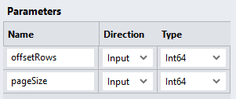
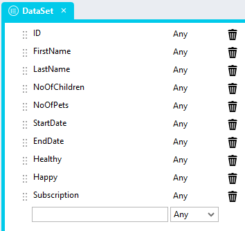
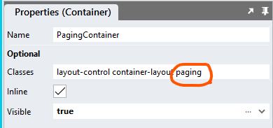
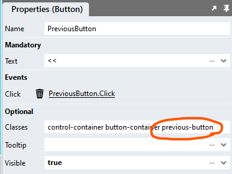
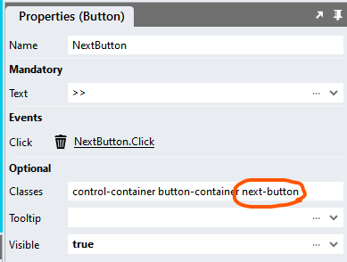
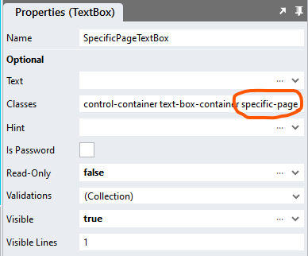
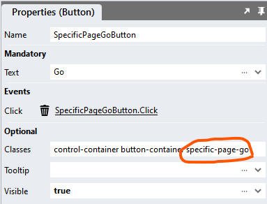
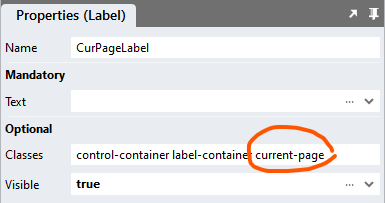

# DataGrid Repeater <!-- omit in toc -->

## Contents <!-- omit in toc -->
- [Overview](#overview)
  - [Example Application](#example-application)
- [Version](#version)
- [Application Setup](#application-setup)
  - [Application Properties](#application-properties)
- [Connector](#connector)
  - [StadiumFilterData Queries](#stadiumfilterdata-queries)
    - ["TotalRecords"](#totalrecords)
    - ["BasicSelect"](#basicselect)
  - [Page](#page)
    - [Main Container](#main-container)
    - [Grid](#grid)
    - [Repeater](#repeater)
    - [Paging Container](#paging-container)
  - [Global Scripts](#global-scripts)
    - [Initialisation Script](#initialisation-script)
    - [DataGrid State Script](#datagrid-state-script)
    - [DataGridState Type](#datagridstate-type)
    - [RepeaterDataGridState Return Object](#repeaterdatagridstate-return-object)
  - [Page Scripts and Events](#page-scripts-and-events)
    - [Initialise Page Script](#initialise-page-script)
    - [GetData Page Script](#getdata-page-script)
    - [Page.Load](#pageload)
    - [Paging](#paging)
  - [CSS](#css)
    - [Customising CSS](#customising-css)
    - [CSS Upgrading](#css-upgrading)
- [Additional Features](#additional-features)
  - [Sortable Columns](#sortable-columns)
  - [Link Columns](#link-columns)
  - [Data Export](#data-export)
  - [Custom Filters](#custom-filters)
  - [Load Specific Page](#load-specific-page)
  - [Selectable Page Size](#selectable-page-size)
  - [Conditional Cell Styling](#conditional-cell-styling)
  - [Editable Columns](#editable-columns)
  - [Loading Spinners](#loading-spinners)

# Overview
Using this module, a *Repeater* control can be configured to look and function similar to the standard Stadium *DataGrid* control. 

Use this module to display data from data sources that contain too many records to display in the standard (client-side) Stadium DataGrid. 

https://github.com/user-attachments/assets/46a9d673-d14d-4329-9574-235980898ac4

## Example Application
The repo includes the sample application shown in the video. To run the example application, follow these steps:
1. Setup the Database
   1. [Follow these instructions](database-setup.md) to set up the database for the [sample application](Stadium6/RepeaterDataGrid.sapz)
   2. Use the [data scripts](data/data.zip) to populate the *MyData* table with as many records as you wish
2. Open the [sample application](Stadium6/RepeaterDataGrid.sapz)
   1. Amend the database connector
   2. Hit the *Preview* button

# Version
1.0 initial

# Application Setup

## Application Properties
1. Check the *Enable Style Sheet* checkbox in the application properties

# Connector
A database connector to the "StadiumFilterData" database is required

## StadiumFilterData Queries

### "TotalRecords"
Create a query called "TotalRecords". The result is used when calulating the total number of pages in the *Repeater*
```sql
select count(ID) as total from MyData
```

### "BasicSelect"
Create a query called "BasicSelect". This will return a page of data that must be attached to the *Repeater*

The "BasicSelect" query include the parameters below to facilitate *paging*:
1. @offsetRows: The number of records to skip
2. @pageSize: The number of records to fetch



**NOTE: When pasting this SQL into Stadium and pressing the "Fetch Fields & Parameters" button, an error will pop up. This is expected and not a problem. You need to set the Type option for the parameters called "offsetRows" and "pageSize" to "Int64" as shown below and press the "Fetch Fields & Parameters" button again.**

```sql
SELECT ID
      ,FirstName
      ,LastName
      ,NoOfChildren
      ,NoOfPets
      ,StartDate
      ,EndDate
      ,Healthy
      ,Happy
      ,Subscription
  FROM dbo.MyData
  ORDER BY ID
  OFFSET @offsetRows ROWS FETCH NEXT @pageSize ROWS ONLY
```

## Page
To function correctly, the page must contain a number of controls. Some of these provide for DataGrid-specific functions, like paging, while others serve to simply display the data from your dataset. Each control set is defined in detail below. The final result will look something like this:


### Main Container
1. Drag a *Container* control to the page
2. Give it a suitable name (e.g. ServerSideDataGridContainer)
3. Add a class of your choice to the control *Classes* property to uniquely identify the control (e.g. server-side-datagrid)

### Grid
1. Drag a *Grid* control into the *Container* control
2. For each column in your dataset, drag a *Label* control into the *Grid*


### Repeater
1. Drag a *Repeater* control into the *Grid* control (under the header row)
2. Create a *Type* called "DataSet" that represents your dataset. The sample dataset type is called "DataSet" and contains the following fields:
   1. ID (Any)
   2. FirstName (Any)
   3. LastName (Any)
   4. NoOfChildren (Any)
   5. NoOfPets (Any)
   6. StartDate (Any)
   7. EndDate (any)
   8. Healthy (any)
   9. Happy (any)
   10. Subscription (any)



3. Assign the "DataSet" *Type* to the *Repeater* *ListItem Type* property


4. For each field in your DataSet
   1. Drag a *Label* control into the *Grid*


   2. Map the correct ListItem Property to the *Label Text* property (example shows the "ID" Label)


### Paging Container
To enable paging a specific set of controls with specific classnames is required as depicted and described below


1. Drag a *Container* control below the *Grid* control, but inside the main container 
   1. Give it a suitable name (e.g. PagingContainer)
   2. Add the class "paging" to the *Container* classes property (it must be this exact class!)



4. Drag a *Button* control into the PagingContainer
   1. Name the Button "PreviousButton"
   2. Add the text "<<" in the button text property
   3. Add the class "previous-button" to the button classes property



5. Drag another *Button* control into the PagingContainer and place it next to the PreviousButton
   1. Name the Button "NextButton"
   2. Add the text ">>" in the button text property
   3. Add the class "next-button" to the button classes property



6. Drag a *TextBox* into the the PagingContainer and place it next to the NextButton
   1. Name the TextBox "SpecificPageTextBox"
   2. Add the class "specific-page" to the SpecificPageTextBox classes property



7. Drag a *Button* control into the PagingContainer and place it next to the SpecificPageTextBox control
   1. Name the Button "SpecificPageGoButton"
   2. Add the text "Go" in the button text property
   3. Add the class "specific-page-go" to the button classes property



8. Drag a *Label* control to the PagingContainer and place it next to the SpecificPageGoButton control
   1. Name the Label "CurPageLabel"
   2. Add the class "current-page" to the label classes property



**Rendered Container**


## Global Scripts
The module requires two global scripts:
1. The "Initialisation Script" is used to initialise the *Repeater*
2. The "RepeaterDataGridState" is used when users use the paging options

### Initialisation Script
1. Create a Global Script called "RepeaterDataGridInit"
2. Add the input parameters below to the Global Script
   1. ContainerClass
   2. DefaultSortField
   3. PageSize
   4. TotalRecords
   5. InitialPage
3. Drag a *JavaScript* action into the script
4. Add the Javascript below into the JavaScript code property
```javascript
/* Stadium Script v1.0 Init https://github.com/stadium-software/repeater-datagrid */
let scope = this;
let pageSize = parseInt(~.Parameters.Input.PageSize);
let sortField = ~.Parameters.Input.SortField;
let sortDirection = ~.Parameters.Input.SortDirection;
let totalRecords = parseInt(~.Parameters.Input.TotalRecords);
let initialPage = parseInt(~.Parameters.Input.InitialPage);
if (isNaN(initialPage)) {
    initialPage = 1;
}
let initialOffset = calcOffset(pageSize, initialPage);
let containerClass = ~.Parameters.Input.ContainerClass;
if (!containerClass) {
     console.error("The ContainerClass parameter is required");
     return false;
}
let container = document.querySelectorAll("." + containerClass);
if (container.length == 0) {
    console.error("The class '" + containerClass + "' is not assigned to any container");
    return false;
} else if (container.length > 1) {
    console.error("The class '" + containerClass + "' is assigned to multiple containers");
    return false;
} else { 
    container = container[0];
}
container.classList.add("stadium-dg-repeater");
let getObjectName = (obj) => {
    let objname = obj.id.replace("-container","");
    do {
        let arrNameParts = objname.split(/_(.*)/s);
        objname = arrNameParts[1];
    } while ((objname.match(/_/g) || []).length > 0 && !scope[`${objname}Classes`]);
    return objname;
};
let sortEl = container.querySelector(".dg-asc-sorting, .dg-desc-sorting");
if (sortEl) sortEl.classList.remove("dg-asc-sorting", "dg-desc-sorting");
let cells = container.querySelectorAll(".grid-item");
let headerCells = container.querySelectorAll(".grid-item:not(.grid-repeater-item)");
let cellsPerRow = headerCells.length;
if (!document.getElementById(container.id + "_stylesheet")) {
    let css = '#' + container.id + ' {.grid-item:nth-child(' + cellsPerRow + 'n+1) {border-left: 1px solid var(--dg-border-color);}.grid-item:nth-child(' + cellsPerRow + 'n) {border-right: 1px solid var(--dg-border-color);}';
    let head = document.head || document.getElementsByTagName('head')[0], style = document.createElement('style');
    head.appendChild(style);
    style.type = 'text/css';
    style.id = container.id + "_stylesheet";
    style.appendChild(document.createTextNode(css));
}

let cellCount = 0;
let alt = false;
for (let i = 0; i < cells.length; i++) {
    cellCount++;
    if (alt) cells[i].classList.add("dg-alternate-row");
    if (!alt) cells[i].classList.add("dg-row");
    if (cellCount == cellsPerRow) {
        cellCount = 0;
        alt = !alt;
    }
}
sessionStorage.setItem(container.id + "_Page", initialPage);
sessionStorage.setItem(container.id + "_PageSize", pageSize);
sessionStorage.setItem(container.id + "_Offset", initialOffset);
sessionStorage.setItem(container.id + "_TotalRecords", totalRecords);
sessionStorage.setItem(container.id + "_TotalPages", Math.ceil(totalRecords / pageSize));
sessionStorage.setItem(container.id + "_SortDirection", sortDirection);
sessionStorage.setItem(container.id + "_SortField", sortField);
setPageLabel();
setNextButton(initialPage);
setPrevButton(initialPage);
sort(sessionStorage.getItem(container.id + "_SortField"), sessionStorage.getItem(container.id + "_SortDirection"));

for (let i = 0; i < headerCells.length; i++) {
    let headerLink = headerCells[i].querySelector(".link-container");
    if (headerLink && !headerLink.getAttribute("dg-listener")) {
        headerLink.querySelector(".btn-link").addEventListener("mousedown", handleSort);
        headerLink.setAttribute("dg-listener", true);
    }
}
let prevBt = container.querySelector(".previous-button");
if (prevBt && !prevBt.getAttribute("dg-listener")) { 
    prevBt.querySelector("button").addEventListener("mousedown", handlePrevPg);
    prevBt.setAttribute("dg-listener", true);
}
let nextBt = container.querySelector(".next-button");
if (nextBt && !nextBt.getAttribute("dg-listener")) { 
    nextBt.querySelector("button").addEventListener("mousedown", handleNextPg);
    nextBt.setAttribute("dg-listener", true);
}
let spcBt = container.querySelector(".specific-page-go");
if (spcBt && !spcBt.getAttribute("dg-listener")) { 
    spcBt.querySelector("button").addEventListener("mousedown", handleSetPg);
    spcBt.setAttribute("dg-listener", true);
}
function handlePrevPg() {
    let page = parseInt(sessionStorage.getItem(container.id + "_Page"));
    if (page > 1) { 
        page = page - 1;
        sessionStorage.setItem(container.id + "_Page", page);
        let offset = calcOffset(sessionStorage.getItem(container.id + "_PageSize"), page);
        sessionStorage.setItem(container.id + "_Offset", offset);
    }
    setNextButton(page);
    setPrevButton(page);
    setPageLabel();
}
function setPrevButton(pg) { 
    let previousButton = container.querySelector(".previous-button");
    if (pg == 1) {
        previousButton.classList.add("disabled");
    } else { 
        previousButton.classList.remove("disabled");
    }
}
function handleNextPg() {
    let page = parseInt(sessionStorage.getItem(container.id + "_Page"));
    if (page < parseInt(sessionStorage.getItem(container.id + "_TotalPages"))) { 
        page = page + 1;
        sessionStorage.setItem(container.id + "_Page", page);
        let offset = calcOffset(sessionStorage.getItem(container.id + "_PageSize"), page);
        sessionStorage.setItem(container.id + "_Offset", offset);
    }
    setNextButton(page);
    setPrevButton(page);
    setPageLabel();
}
function setNextButton(pg) { 
    let nextButton = container.querySelector(".next-button");
    if (pg == parseInt(sessionStorage.getItem(container.id + "_TotalPages")) || parseInt(sessionStorage.getItem(container.id + "_TotalPages")) < 2) {
        nextButton.classList.add("disabled");
    } else { 
        nextButton.classList.remove("disabled");
    }
}
function handleSetPg() {
    let pageInputContainer = container.querySelector(".specific-page");
    let pageInput = pageInputContainer.querySelector("input");
    let page = pageInput.value;
    if (!isNaN(page) && page > 0 && page <= parseInt(sessionStorage.getItem(container.id + "_TotalPages"))) {
        sessionStorage.setItem(container.id + "_Page", page);
        let offset = calcOffset(sessionStorage.getItem(container.id + "_PageSize"), page);
        sessionStorage.setItem(container.id + "_Offset", offset);
        setNextButton(page);
        setPrevButton(page);
        setPageLabel();
    }
    setDMValues(pageInputContainer, "Text", "");
}
function setPageLabel() {
    if (container.querySelector(".current-page") && parseInt(sessionStorage.getItem(container.id + "_TotalPages")) > 0) {
        container.querySelector(".current-page span").textContent = "Page " + parseInt(sessionStorage.getItem(container.id + "_Page")).toLocaleString() + " of " + parseInt(sessionStorage.getItem(container.id + "_TotalPages")).toLocaleString();
    } else if (parseInt(sessionStorage.getItem(container.id + "_TotalPages")) == 0) { 
        container.querySelector(".current-page span").textContent = "No records found";
    }
}
function handleSort(e) { 
    let clickedEl = e.target;
    let colHead = clickedEl.textContent;
    let dir = "asc";
    if (clickedEl.closest(".dg-asc-sorting")) {
        dir = "desc";
    }
    sort(colHead, dir);
}
function sort(field, direction) {
    if (!["asc", "desc"].includes(direction.toLowerCase())) direction = "asc";
    sessionStorage.setItem(container.id + "_SortDirection", direction);
    sessionStorage.setItem(container.id + "_SortField", field);
    let allHeaders = container.querySelectorAll(".grid-item:not(.grid-repeater-item) .link-container");
    for (let i = 0; i < allHeaders.length; i++) {
        allHeaders[i].classList.remove("dg-asc-sorting", "dg-desc-sorting");
        if (allHeaders[i].textContent.toLowerCase() == field.toLowerCase()) {
            allHeaders[i].classList.add("dg-" + direction + "-sorting");
        }
    }
}
function setDMValues(ob, property, value) {
    let obname = getObjectName(ob);
    scope[`${obname}${property}`] = value;
}
function calcOffset(size, pg) { 
    let rtn = (parseInt(pg) - 1) * parseInt(size);
    return rtn;
}
```

### DataGrid State Script
1. Create a second Global Script called "RepeaterDataGridState"
2. Add the **input** parameters below to the Global Script
   1. ContainerClass
3. Add the **output** parameters below to the Global Script
   1. Values
4. Drag a *JavaScript* action into the script
5. Add the Javascript below into the JavaScript code property
```javascript
/* Stadium Script v1.0 GetData https://github.com/stadium-software/repeater-datagrid */
let containerClass = ~.Parameters.Input.ContainerClass;
if (!containerClass) {
     console.error("The ContainerClass parameter is required");
     return false;
}
let container = document.querySelector("." + containerClass);
return {
     page: sessionStorage.getItem(container.id + "_Page"),
     pageSize: sessionStorage.getItem(container.id + "_PageSize"),
     offset: sessionStorage.getItem(container.id + "_Offset"),
     totalRecords: sessionStorage.getItem(container.id + "_TotalRecords"),
     totalPages: sessionStorage.getItem(container.id + "_TotalPages"),
     sortDirection: sessionStorage.getItem(container.id + "_SortDirection"),
     sortField: sessionStorage.getItem(container.id + "_SortField")
};
```
6. Drag a *SetValue* under the *Javascript* action
   1. Set ouput parameter called "Values" as the **target**
   2. Set the *Javascript* action as the **source**


### DataGridState Type
Add a type called "DataGridState" with the properties below:
1. page (any)
2. pageSize (any)
3. offset (any)
4. totalRecords (any)
5. totalPages (any)
6. sortDirection (any)
7. sortField (any)


### RepeaterDataGridState Return Object
To easily access the values returned by the "DataGridState" script, assign the Values output from the "RepeaterDataGridState" script to the type. 

The "RepeaterDataGridState" script returns an object called "Values" with the properties below:
1. page: The page of data to show (int)
2. pageSize: The number of records each page must contain (int)
3. offset: The number of rows to skip before starting to return rows from the query (PageSize * Page) (int)
4. totalRecords: The total number of records the dataset contains (int)
5. totalPages: the total number of pages the DataGrid will handle (TotalRecords / PageSize) (int)
6. sortDirection: one of these values (string)
   1. Empty (initial value)
   2. 'asc'
   3. 'desc'
7. sortField: the field the data is currently sorted by (string)

**Example "RepeaterDataGridState" Return Object**
```javascript
{ 
    page: 41,
    pageSize: 10,
    offset: 410,
    totalRecords: 2000000,
    totalPages: 200000,
    sortDirection: 'asc',
    sortField: 'ID'
}
```

## Page Scripts and Events
All events in the example application either call a script to initialise the DataGrid or one to retreive the DataGrid state. 

### Initialise Page Script
The "RepeaterDataGridInit" script allows for the initalisation of the *Repeater* as a DataGrid. Call this script to initialise the DataGrid in the Page.Load script and whenever the dataset changes, like when it is filtered for example. Since each page has slightly different requirements and the "Initialise" script is not exactly the same across pagtes. 

In events that initialise or re-initialise the DataGrid, the example application simply calls a Page Script called "Initialise". The simplest example of this script can be created as follows:

1. Create a Script called "Initialise" under the page
2. Drag the "TotalRecords" query to the script
3. Drag the "Select" query to the script and complete the input parameters
   1. offsetRows: 0 (to start with the first record the initial offset 0)
   2. pageSize: an interger that defines how many records the DataGrid shows (e.g. 10)
   3. sortField: a string specifying the initial column by which the DataGrid is sorted (e.g. ID)
   4. sortDirection: a string specifying initial sort direction of the DataGrid (e.g. asc)
4. Drag a *SetValue* action into the script
   1. Target: The List property of the *Repeater*
   2. Source: the dataset returned by the query


5.  Drag the "RepeaterDataGridInit" script to the event Handler
6.  Enter values for the input parameters
    1.  ContainerClass: The unique class you assigned to the container (e.g. ServerSideDataGridContainer)
    2.  DefaultSortField: The SQL column of the default sort field (e.g. ID)
    3.  InitialPage (optional): The page number to display (default is 1)
    4.  PageSize: The number of records to display per page (e.g. 10)
    5.  TotalRecords: The total number of records in the dataset (select count)

**Initialise Script**


### GetData Page Script
Using the "RepeaterDataGridState" script, you can find out how the DataGrid is sorted, what page of data must be shown and how many records a page must contain. You can then use this information when querying the data source and assigning the correct set of data to the *Repeater*. Use this script in the Link.Click events that handle sorting as well as the Button.Click events that handle the paging of the DataGrid. 

In all sorting and paging events, the example application simply calls a Page Script called "GetData"

1. Create a Script called "GetData" under the page
2. Drag the "RepeaterDataGridState" script into the "GetData" script
   1. Add the class you assigned to the Main Container to the input parameter of the "RepeaterDataGridState" script (e.g. server-side-datagrid)
3. Drag the type called "DataGridState" to the script
   1. Assign the output called "Values" from the "RepeaterDataGridState" script to the "DataGridState" type
4. Drag the "Select" query into the script
5. Complete the "Select" query input parameters by selecting the properties from the "DataGridState" type. If you are using your own datasource, you need to make use of these values to return the correct dataset to the *Repeater*
   1. offsetRows: = ~.DataGridState.offset
   2. pageSize: = ~.DataGridState.pageSize
   3. sortField: = ~.DataGridState.sortField
   4. sortDirection: = ~.DataGridState.sortDirection
6. Drag a *SetValue* to the script to set the Repeater data
   1. Target: The Repeater List Property
   2. Source: The data returned by the connector


**GetData Script**


### Page.Load
Drag the "Initialise" script into the Page.Load event handler


### Paging
1. For all paging *Button* controls
   1. Create the *Click Event Handler*
   2. Drag the "GetData" script into the control *Click Event Handler* script


## CSS
The CSS below is required for the correct functioning of the module. Some elements can be [customised](#customising-css) using a variables CSS file. 

**Stadium 6.6 or higher**
1. Create a folder called "CSS" inside of your Embedded Files in your application
2. Drag the two CSS files from this repo [*stadium-repeater-datagrid-variables.css*](stadium-repeater-datagrid-variables.css) and [*stadium-repeater-datagrid.css*](stadium-repeater-datagrid.css) into that folder
3. Paste the link tags below into the *head* property of your application
```html
<link rel="stylesheet" href="{EmbeddedFiles}/CSS/stadium-repeater-datagrid.css">
<link rel="stylesheet" href="{EmbeddedFiles}/CSS/stadium-repeater-datagrid-variables.css">
``` 

### Customising CSS
1. Open the CSS file called [*stadium-repeater-datagrid-variables.css*](stadium-repeater-datagrid-variables.css) from this repo
2. Adjust the variables in the *:root* element as you see fit
3. Overwrite the file in the CSS folder of your application with the customised file

### CSS Upgrading
To upgrade the CSS in this module, follow the [steps outlined in this repo](https://github.com/stadium-software/samples-upgrading)

# Additional Features

## Sortable Columns
[Sortable Columns](sortable.md)

## Link Columns
[Link Columns](link-columns.md)

## Data Export
[Data Exports](export.md)

## Custom Filters
[Custom Filters](custom-filters.md)

## Load Specific Page
[Loading a specific page](load-specific-page.md)

## Selectable Page Size
[Selectable Page Size](customisable-page-size.md)

## Conditional Cell Styling
[conditional-cell-styling.md](conditional-cell-styling.md)

## Editable Columns
[Making columns editable](editable-columns.md)

## Loading Spinners
To add a loading spinner to the DataGrid, implement the [Spinners Module](https://github.com/stadium-software/spinners)