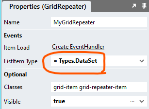
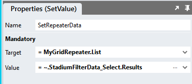

# DataGrid Repeater <!-- omit in toc -->

## Contents <!-- omit in toc -->
- [Overview](#overview)
  - [Example Application](#example-application)
- [Version](#version)
- [Application Setup](#application-setup)
  - [Application Properties](#application-properties)
  - [Connector](#connector)
    - ["TotalRecords"](#totalrecords)
    - ["Select"](#select)
  - [Types](#types)
    - [Column](#column)
    - [State](#state)
    - [DataSet](#dataset)
  - [Page](#page)
    - [Container](#container)
    - [Grid](#grid)
    - [Repeater](#repeater)
    - [Labels](#labels)
  - [Global Script](#global-script)
  - [Page Scripts](#page-scripts)
    - ["GetData" Page Script](#getdata-page-script)
    - ["Initialise" Page Script](#initialise-page-script)
  - [Page.Load Event Handler](#pageload-event-handler)
  - [CSS](#css)
    - [Customising CSS](#customising-css)
    - [CSS Upgrading](#css-upgrading)
- [Additional Features](#additional-features)
  - [Loading Spinners](#loading-spinners)
  - [Link Columns](#link-columns)
  - [Selectable Rows](#selectable-rows)
  - [Load Specific Page](#load-specific-page)
  - [Selectable Page Size](#selectable-page-size)
  - [Conditional Cell Styling](#conditional-cell-styling)
  - [Custom Filters](#custom-filters)
  - [Editable DataGrids](#editable-datagrids)
  - [REST API Example](#rest-api-example)
  - [Data Export](#data-export)

# Overview
The purpose of this module is to allow for the display of datasets that are too large to be shown in the standard Stadium DataGrid. This module displays individual pages of data in a *Repeater* control that is made to look and function similar to the standard Stadium *DataGrid* control. 

Use this module to display data from data sources that contain too many records to display in the standard (client-side) Stadium DataGrid. 

https://github.com/user-attachments/assets/46a9d673-d14d-4329-9574-235980898ac4

## Example Application
The repo includes the sample application shown in the video. To run the example application, follow these steps:
1. Setup the Database
   1. [Follow these instructions](database-setup.md) to set up the database for the [sample application](Stadium6/RepeaterDataGrid.sapz)
   2. Use the [data scripts](data/data.zip) to populate the *MyData* table with as many records as you wish
2. Open the [sample application](Stadium6/RepeaterDataGrid.sapz)
   1. Amend the database connector
   2. Hit the *Preview* button

# Version
1.0 initial

# Application Setup

## Application Properties
Check the *Enable Style Sheet* checkbox in the application properties

## Connector
To run the sample, a database connector to the "StadiumFilterData" database and two Queries need to be added

### "TotalRecords"
Create a query called "TotalRecords". The result is used when calculating the total number of pages in the *Repeater*
```sql
select count(ID) as total from MyData
```

### "Select"
Create a query called "Select"

**NOTE: When pasting this SQL into Stadium and pressing the "Fetch Fields & Parameters" button, an error will pop up. Set the "Type" option for the parameters called "offsetRows" and "pageSize" to "Int64" as shown below and press the "Fetch Fields & Parameters" button again.**

```sql
SELECT ID
      ,FirstName
      ,LastName
      ,NoOfChildren
      ,NoOfPets
      ,StartDate
      ,EndDate
      ,Healthy
      ,Happy
      ,Subscription
  FROM dbo.MyData
  ORDER BY
  case when UPPER(@sortField) = 'ID' AND (LOWER(@sortDirection) = 'asc' OR @sortDirection = '') THEN ID END ASC,
  case when UPPER(@sortField) = 'ID' AND LOWER(@sortDirection) = 'desc' THEN ID END DESC,
  case when LOWER(@sortField) = 'FirstName' AND (LOWER(@sortDirection) = 'asc' OR @sortDirection = '') THEN FirstName END ASC,
  case when LOWER(@sortField) = 'FirstName' AND LOWER(@sortDirection) = 'desc' THEN FirstName END DESC,
  case when LOWER(@sortField) = 'LastName' AND (LOWER(@sortDirection) = 'asc' OR @sortDirection = '') THEN LastName END ASC,
  case when LOWER(@sortField) = 'LastName' AND LOWER(@sortDirection) = 'desc' THEN LastName END DESC,
  case when LOWER(@sortField) = 'NoOfChildren' AND (LOWER(@sortDirection) = 'asc' OR @sortDirection = '') THEN NoOfChildren END ASC,
  case when LOWER(@sortField) = 'NoOfChildren' AND LOWER(@sortDirection) = 'desc' THEN NoOfChildren END DESC,
  case when LOWER(@sortField) = 'NoOfPets' AND (LOWER(@sortDirection) = 'asc' OR @sortDirection = '') THEN NoOfPets END ASC,
  case when LOWER(@sortField) = 'NoOfPets' AND LOWER(@sortDirection) = 'desc' THEN NoOfPets END DESC,
  case when LOWER(@sortField) = 'StartDate' AND (LOWER(@sortDirection) = 'asc' OR @sortDirection = '') THEN StartDate END ASC,
  case when LOWER(@sortField) = 'StartDate' AND LOWER(@sortDirection) = 'desc' THEN StartDate END DESC,
  case when LOWER(@sortField) = 'EndDate' AND (LOWER(@sortDirection) = 'asc' OR @sortDirection = '') THEN EndDate END ASC,
  case when LOWER(@sortField) = 'EndDate' AND LOWER(@sortDirection) = 'desc' THEN EndDate END DESC,
  case when LOWER(@sortField) = 'Healthy' AND (LOWER(@sortDirection) = 'asc' OR @sortDirection = '') THEN Healthy END ASC,
  case when LOWER(@sortField) = 'Healthy' AND LOWER(@sortDirection) = 'desc' THEN Healthy END DESC,
  case when LOWER(@sortField) = 'Happy' AND (LOWER(@sortDirection) = 'asc' OR @sortDirection = '') THEN Happy END ASC,
  case when LOWER(@sortField) = 'Happy' AND LOWER(@sortDirection) = 'desc' THEN Happy END DESC,
  case when LOWER(@sortField) = 'Subscription' AND (LOWER(@sortDirection) = 'asc' OR @sortDirection = '') THEN Subscription END ASC,
  case when LOWER(@sortField) = 'Subscription' AND LOWER(@sortDirection) = 'desc' THEN Subscription END DESC,
  case when @sortField = '' then ID end ASC,
  case when @sortField = 'undefined' then ID end ASC
  OFFSET @offsetRows ROWS FETCH NEXT @pageSize ROWS ONLY
```

## Types
Create the types below

### Column
Properties
1. name (any)
2. header (any)
3. visible (any)
4. sortable (any)


### State
Properties
1. pageSize (any)
2. page (any)
3. sortDirection (any)
4. sortField (any)


### DataSet
The type must contain a property for all columns your DataGrid will contain (visible and hidden). This type will be used in the *Repeater* *ListItem Type* property.

The "DataSet" type for the sample application as the following properties
1. ID (any)
2. FirstName (any)
3. LastName (any)
4. NoOfChildren (any)
5. NoOfPets (any)
6. StartDate (any)
7. EndDate (any)
8. Healthy (any)
9. Happy (any)
10. Subscription (any)


## Page
The page must contain a number of controls


### Container
1. Drag a *Container* control to the page and give it a suitable name (e.g. DataGridContainer)
3. Add a class of your choice to the control *Classes* property to uniquely identify the control in the application (e.g. server-side-datagrid)

### Grid
1. Drag a *Grid* control into the *Container* control

### Repeater
1. Drag a *Repeater* control into the *Grid* control
2. Assign the "DataSet" *Type* to the *Repeater* *ListItem Type* property



### Labels
1. For each field in your DataSet
   1. Drag a *Label* control into the *Repeater*
   2. Name the *Label* "*ColumnName*Label"
   3. In the *Label* *Text* property, select the corresponding ListItem property in the dropdown (see screenshot below)
   4. Set the *Visible* property of the *Label* to "false" to hide the column


## Global Script
1. Create a Global Script called "RepeaterDataGrid"
2. Add the input parameters below to the Global Script
   1. Columns
   2. ContainerClass
   3. EditableGrid
   4. EventCallback
   5. State
   6. TotalRecords
3. Drag a *JavaScript* action into the script
4. Add the Javascript below into the JavaScript code property
```javascript
/* Stadium Script v1.1 Init https://github.com/stadium-software/repeater-datagrid */
let scope = this;
let cols = ~.Parameters.Input.Columns;
let eventHandler = ~.Parameters.Input.EventCallback;
let editMode = ~.Parameters.Input.EditableGrid || false;
let state = ~.Parameters.Input.State;
let pageSize = parseInt(state.pageSize);
let sortField = state.sortField;
let sortDirection = state.sortDirection;
let page = parseInt(state.page);
let totalRecords = parseInt(~.Parameters.Input.TotalRecords);
if (isNaN(page)) page = 1;
let totalPages = Math.ceil(totalRecords / pageSize);
let containerClass = ~.Parameters.Input.ContainerClass;
if (!containerClass) {
     console.error("The ContainerClass parameter is required");
     return false;
}
let container = document.querySelectorAll("." + containerClass);
if (container.length == 0) {
    console.error("The class '" + containerClass + "' is not assigned to any container");
    return false;
} else if (container.length > 1) {
    console.error("The class '" + containerClass + "' is assigned to multiple containers");
    return false;
} else { 
    container = container[0];
}
container.classList.add("stadium-dg-repeater");
let grid = container.querySelectorAll(".grid-layout");
if (grid.length == 0) {
    console.error("The container '" + containerClass + "' must contain a Grid control");
    return false;
} else if (grid.length > 1) {
    console.error("The container '" + containerClass + "' must contain only one Grid control");
    return false;
} else { 
    grid = grid[0];
}
let contID = container.id;
let cellsPerRow = cols.length;
if (document.getElementById(contID + "_stylesheet")) document.getElementById(contID + "_stylesheet").remove();
attachStyling();
addHeaders(cols);
if (!editMode) {
    addPaging();
}
let cells = container.querySelectorAll(".grid-repeater-item");
let rowNo = 1, cellCounter = 0;
for (let i = 0; i < cells.length; i++) {
    cellCounter++;
    cells[i].setAttribute("row-no", rowNo);
    if (cellCounter >= cellsPerRow) {
        cellCounter = 0;
        rowNo++;
    }
}
/*----------------------------------------------------------------------------------------------*/
function addHeaders(c) { 
    let headers = container.querySelectorAll(".repeater-header");
    for (let i = 0; i < headers.length; i++) {
        headers[i].remove();
    }
    for (let i = c.length-1; i > -1; i--) {
        let gItem = createTag("div", ["grid-item", "repeater-header"], []);
        let el = createTag("div"), inner;
        if (c[i].header && c[i].hasOwnProperty('sortable') && c[i].sortable !== false && c[i].sortable !== "false" && !editMode) {
            el = createTag("div", ["control-container", "link-container"]);
            inner = createTag("a", ["btn", "btn-lg", "btn-link"], [{name: "rel", value:"noopener noreferrer"}, {name: "field", value:c[i].name}], c[i].header);
            inner.addEventListener("click", handleSort);
            el.appendChild(inner);
        } else if (c[i].header) { 
            el = createTag("div", ["control-container", "label-container"]);
            inner = createTag("span", [], [], c[i].header);
            el.appendChild(inner);
        }
        if (c[i].hasOwnProperty('visible') && c[i].visible == false || c[i].visible == 'false') el.classList.add("visually-hidden");
        if (c[i].name == sortField && sortDirection.toLowerCase() == "asc") el.classList.add("dg-asc-sorting");
        if (c[i].name == sortField && sortDirection.toLowerCase() == "desc") el.classList.add("dg-desc-sorting");
        gItem.appendChild(el);
        grid.insertBefore(gItem, grid.firstChild);
    }
}
function addPaging() { 
    if (container.querySelector(".paging")) container.querySelector(".paging").remove();
    let pagingContainer = createTag("div", ["layout-control", "container-layout", "paging", "inline-block-element"], []);
    let prevButtonContainer = createTag("div", ["control-container", "button-container", "previous-button"], []);
    let prevButton = createTag("div", ["btn", "btn-lg", "btn-default"], [], "<<");
    let nextButtonContainer = createTag("div", ["control-container", "button-container", "next-button"], []);
    let nextButton = createTag("div", ["btn", "btn-lg", "btn-default"], [], ">>");
    let goInputContainer = createTag("div", ["control-container", "text-box-container", "specific-page"], []);
    let goInput = createTag("input", ["form-control", "error-border", "text-box-input", "specific-page-input"], [{name: "type", value: "text"}]);
    let goButtonContainer = createTag("div", ["control-container", "button-container", "specific-page-go"], []);
    let goButton = createTag("div", ["btn", "btn-lg", "btn-default"], [], "Go");
    let pageInfoContainer = createTag("div", ["control-container", "label-container", "page-info"]);
    let pageInfo = createTag("span", [], [], getPageLabel());
    if (page == 1) prevButtonContainer.classList.add("disabled");
    if (page == totalPages) nextButtonContainer.classList.add("disabled");
    prevButtonContainer.appendChild(prevButton);
    nextButtonContainer.appendChild(nextButton);
    goInputContainer.appendChild(goInput);
    goButtonContainer.appendChild(goButton);
    pageInfoContainer.appendChild(pageInfo);
    pagingContainer.appendChild(prevButtonContainer);
    pagingContainer.appendChild(nextButtonContainer);
    pagingContainer.appendChild(goInputContainer);
    pagingContainer.appendChild(goButtonContainer);
    pagingContainer.appendChild(pageInfoContainer);
    let stackLayout, allStacks = container.querySelectorAll(".stack-layout-container");
    for (let i = 0; i < allStacks.length; i++) {
        if (allStacks[i].contains(grid) && allStacks.length > i) {
            stackLayout = allStacks[i + 1];
        }
    }
    if (!stackLayout) {
        stackLayout = createTag("div", ["stack-layout-container"]);
        container.appendChild(stackLayout);
    }
    stackLayout.classList.add('paging-stack-layout');
    stackLayout.insertBefore(pagingContainer, stackLayout.firstChild);
    prevButton.addEventListener("click", function(){
        handlePaging("previous");
    });
    nextButton.addEventListener("click", function(){
        handlePaging("next");
    });
    goButton.addEventListener("click", function(){
        handlePaging("go");
    });
}
function handlePaging(tp) { 
    let nextBtn = container.querySelector(".next-button"),
        prevBtn = container.querySelector(".previous-button"),
        goInpt = container.querySelector(".specific-page-input"),
        pageInfo = container.querySelector(".page-info span");
    nextBtn.classList.remove("disabled");
    prevBtn.classList.remove("disabled");
    if (tp == "next" && page < totalPages) page++;
    if (tp == "previous" && page > 1) page--;
    if (tp == "go") {
        let pgVal = goInpt.value;
        goInpt.value = "";
        if (!isNaN(pgVal) && pgVal >= 1 && pgVal <= totalPages) {
            page = parseInt(pgVal);
        }
    }
    if (page == 1) prevBtn.classList.add("disabled");
    if (page == totalPages) nextBtn.classList.add("disabled");
    pageInfo.textContent = getPageLabel();
    scope[eventHandler]({ sortField: sortField, sortDirection: sortDirection, page: page, pageSize: pageSize });
}
function handleSort(e) { 
    let clickedEl = e.target;
    let colHead = clickedEl.getAttribute("field");
    let dir = "asc";
    if (clickedEl.closest(".dg-asc-sorting")) {
        dir = "desc";
    }
    sort(colHead, dir);
}
function sort(field, direction) {
    if (!["asc", "desc"].includes(direction.toLowerCase())) direction = "asc";
    let allHeaders = container.querySelectorAll(".grid-item:not(.grid-repeater-item) .link-container");
    for (let i = 0; i < allHeaders.length; i++) {
        allHeaders[i].classList.remove("dg-asc-sorting", "dg-desc-sorting");
        if (allHeaders[i].textContent.toLowerCase() == field.toLowerCase()) {
            allHeaders[i].classList.add("dg-" + direction + "-sorting");
        }
    }
    sortDirection = direction;
    sortField = field;
    scope[eventHandler]({ sortField: field, sortDirection: direction, page: page, pageSize: pageSize });
}
function createTag(type, arrClasses, arrAttributes, text) {
    let el = document.createElement(type);
    if (arrClasses && arrClasses.length > 0) {
        arrClasses = arrClasses.filter(function( element ) { return element !== undefined; });
        let cl = el.classList;
        cl.add.apply(cl, arrClasses);
    }
    if (arrAttributes && arrAttributes.length > 0) { 
        for (let i = 0; i < arrAttributes.length; i++) { 
            if (arrAttributes[i].name) el.setAttribute(arrAttributes[i].name, arrAttributes[i].value);
        }
    }
    if (text) el.textContent = text;
    return el;
}
function getPageLabel() {
    let pgLabel = "No records found";
    if (totalPages > 0) {
        pgLabel = "Page " + page.toLocaleString() + " of " + totalPages.toLocaleString();
    }
    return pgLabel;
}
function attachStyling() {
    let selector = [];
    for (let i = 0; i < cellsPerRow; i++) {
        selector.push(".grid-repeater-item:nth-child(" + (cellsPerRow * 2) + "n+" + (i + 1) + ")");
    }
    let css = `#${contID} {.grid-item:nth-child(${cellsPerRow}n+1) {border-left: 1px solid var(--dg-border-color);}.grid-item:nth-child(${cellsPerRow}n) {border-right: 1px solid var(--dg-border-color);}${selector.join(", ")} {background-color: var(--dg-alternate-row-bg-color, var(--DATA-GRID-ODD-ROW-BACKGROUND-COLOR));}}`;
    let head = document.head || document.getElementsByTagName('head')[0], style = document.createElement('style');
    head.appendChild(style);
    style.type = 'text/css';
    style.id = contID + "_stylesheet";
    style.appendChild(document.createTextNode(css));
}
```

## Page Scripts

### "GetData" Page Script
Create a script under the page called "GetData" with the input Parameter:
1. State

**Script Actions**


1. Drag a *Variable* to the script and call it "OffsetRows_var"
2. In the "OffsetRows_var" *Value* property, paste the following value (including the =) to calculate the offset
```javascript
= (~.Parameters.Input.State.page - 1) * ~.Parameters.Input.State.pageSize
```
3. Drag the "StadiumFilterData_Select" query to the script and paste the values below into the query input parameters
   1. sortField: 
   ```javascript
   = ~.Parameters.Input.State.sortField
   ```
   2. sortDirection: 
   ```javascript
   = ~.Parameters.Input.State.sortDirection
   ```
   3. offsetRows: 
   ```javascript
   = ~.OffsetRows_var
   ```
   4. pageSize: 
   ```javascript
   = ~.Parameters.Input.State.pageSize
   ```

4. Drag a *SetValue* to the script to set the *Repeater* data
   1. Target: The Repeater List Property
   2. Source: The data returned by the connector



### "Initialise" Page Script
Create a script under the page called "Initialise" with the input Parameter:
1. State

**Script Actions**


1. Drag a "State" *Type* into the script
   1. In the *Value* property of the "State" *Type*, assign the script input parameter called "State"


2. Drag the "TotalRecords" query into the "Initialise" script
3. Drag the "GetData" script into the "Initialise" script
   1. Assign the "State" type to the "State" input parameter of the "GetData" script


4. Drag a *List* into the script and call it "ColumnsList"
5. Assign the "Column" *Type* to the *Item Type* property
6. For each column in your *Repeater* / field in your dataset, provide the following
   1. name (required): The column name (case sensitive)
   2. header (optional): The header shown for this column. A header value is necessary for users to be able to sort by the column
   3. visible (optional): Add "false" to hide the column (default is true)
   4. sortable (optional): Add "false" to show the heading as an (unclickable) *Label* instead of a *Link* (default is true)

**Example ColumnsList Value**
```json
[{
 "name": "ID",
 "header": "ID"
},{
 "name": "FirstName",
 "header": "First Name",
 "visible": false,
 "sortable": false
},{
 "name": "LastName",
 "header": "Last Name"
},{
 "name": "NoOfChildren",
 "header": "Children"
},{
 "name": "NoOfPets",
 "header": "Pets"
},{
 "name": "StartDate",
 "header": "Start Date"
},{
 "name": "EndDate",
 "header": "End Date"
},{
 "name": "Healthy",
 "header": "Healthy"
},{
 "name": "Happy",
 "header": "Happy"
},{
 "name": "Subscription",
 "header": "Subscription"
}]
```

5. Drag the "RepeaterDataGrid" script into the "Initialise" script and provide the "RepeaterDataGrid" input parameters
   1. Columns: The *List* of columns called "ColumnsList"
   2. ContainerClass: The unique class you assigned to the main container (e.g. server-side-datagrid)
   3. EventCallback: The name of the script that fetches and assigns the data pages to the *Repeater*. In the example application this is called "GetData"
   4. State: The "State" *Type* created in step 1 of the "Initialise" script
   5. EditableGrid: Ignore this property for standard data display. It's a boolean that hides the paging controls and changes header *Links* controls into *Label* controls ([see Editable Datagrids](#editable-datagrids))
   6. TotalRecords: The "total" result returned by the "TotalRecords" query: 
```javascript
~.StadiumFilterData_Totals.FirstResult.total
```


## Page.Load Event Handler


1. Drag a "State" *Type* into the event handler
2. Open the *Object Editor* in the dropdown of the "State" *Values* property
3. Assign values to the properties
   1. pageSize: The number of items you want to show in each DataGrid page
   2. page: The initial page to show in the DataGrid
   3. sortDirection: The initial sort direction (asc or desc)
   4. sortField: The initial sort field of the dataset


4. Drag the "Initialise" script into the Page.Load event handler
   1. Assign the "State" type to the "State" input parameter

## CSS
The CSS below is required for the correct functioning of the module. Some elements can be [customised](#customising-css) using a variables CSS file. 

**Stadium 6.6 or higher**
1. Create a folder called "CSS" inside of your Embedded Files in your application
2. Drag the two CSS files from this repo [*stadium-repeater-datagrid-variables.css*](stadium-repeater-datagrid-variables.css) and [*stadium-repeater-datagrid.css*](stadium-repeater-datagrid.css) into that folder
3. Paste the link tags below into the *head* property of your application
```html
<link rel="stylesheet" href="{EmbeddedFiles}/CSS/stadium-repeater-datagrid.css">
<link rel="stylesheet" href="{EmbeddedFiles}/CSS/stadium-repeater-datagrid-variables.css">
``` 

### Customising CSS
1. Open the CSS file called [*stadium-repeater-datagrid-variables.css*](stadium-repeater-datagrid-variables.css) from this repo
2. Adjust the variables in the *:root* element as you see fit
3. Overwrite the file in the CSS folder of your application with the customised file

### CSS Upgrading
To upgrade the CSS in this module, follow the [steps outlined in this repo](https://github.com/stadium-software/samples-upgrading)

# Additional Features

## Loading Spinners
To add a loading spinner to the DataGrid implement the [Spinners Module](https://github.com/stadium-software/spinners)

## Link Columns
[Link Columns](link-columns.md)

## Selectable Rows
[Selectable Rows](selectable-rows.md)

## Load Specific Page
[Loading a specific page](load-specific-page.md)

## Selectable Page Size
[Selectable Page Size](customisable-page-size.md)

## Conditional Cell Styling
[Conditional Cell Styling](conditional-cell-styling.md)

## Custom Filters
[Custom Filters](custom-filters.md)

## Editable DataGrids
[Making columns or the entire DataGrid editable](editable.md)

## REST API Example
[REST WebService Integration](api-integration.md)

## Data Export
[Data Exports](export.md)