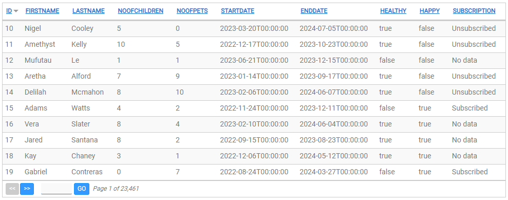
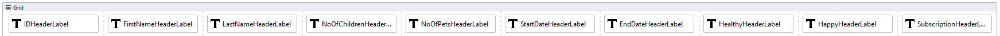
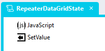
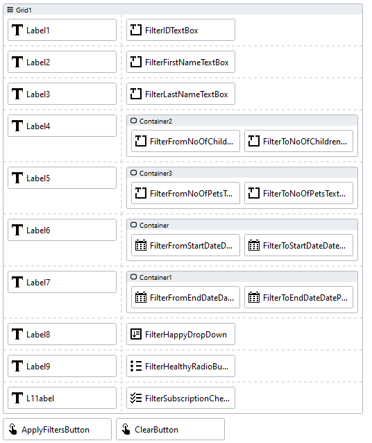
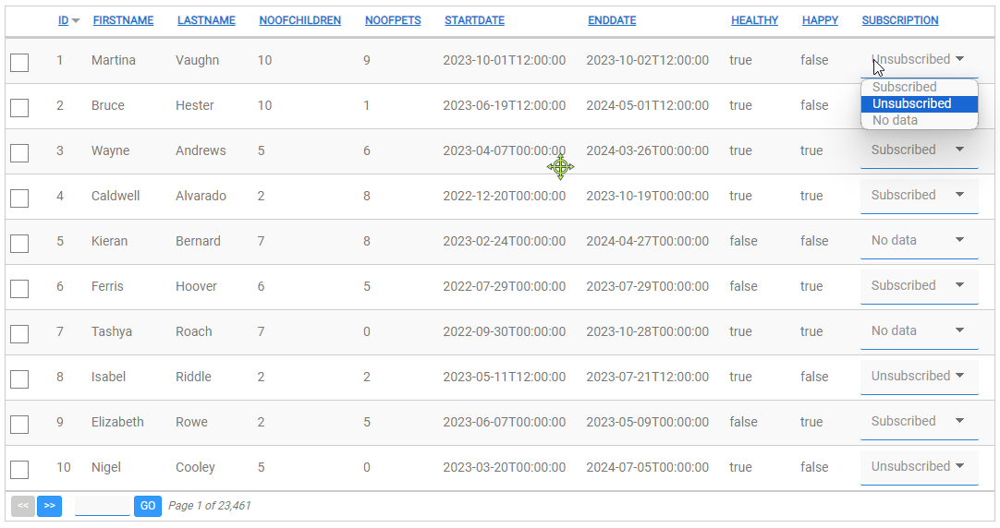
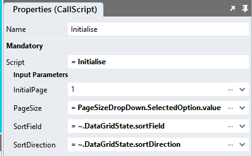

# DataGrid Repeater <!-- omit in toc -->

https://github.com/user-attachments/assets/46a9d673-d14d-4329-9574-235980898ac4

## Contents <!-- omit in toc -->
- [Overview](#overview)
- [Version](#version)
- [Sample Databases \& Connectors Setup](#sample-databases--connectors-setup)
  - [StadiumFilterData Database](#stadiumfilterdata-database)
  - [Connector](#connector)
  - [StadiumFilterData Queries (unfiltered)](#stadiumfilterdata-queries-unfiltered)
    - ["TotalRecords" Query](#totalrecords-query)
    - ["Select" Query](#select-query)
  - [StadiumFilterData Queries (filtered)](#stadiumfilterdata-queries-filtered)
    - ["FilterTotals" Query](#filtertotals-query)
    - ["FilterSelect" Query](#filterselect-query)
  - [REST API](#rest-api)
- [Application](#application)
  - [Application Properties](#application-properties)
  - [Types](#types)
    - [DataGridState Type](#datagridstate-type)
    - [FilterDataDataSet Type](#filterdatadataset-type)
  - [Page](#page)
    - [Main Container](#main-container)
    - [Grid](#grid)
    - [Repeater](#repeater)
    - [Paging Container](#paging-container)
  - [Global Scripts](#global-scripts)
    - [Initialisation Script](#initialisation-script)
    - [DataGrid State Script](#datagrid-state-script)
    - [RepeaterDataGridState Return Object](#repeaterdatagridstate-return-object)
  - [Scripts and Events](#scripts-and-events)
    - [Initialise Page Script](#initialise-page-script)
    - [GetData Page Script](#getdata-page-script)
    - [Page.Load](#pageload)
    - [Sorting](#sorting)
    - [Paging](#paging)
  - [CSS](#css)
    - [Customising CSS](#customising-css)
    - [CSS Upgrading](#css-upgrading)
- [Link Columns](#link-columns)
- [Data Export](#data-export)
- [Custom Filters](#custom-filters)
  - [Page](#page-1)
  - [Queries](#queries)
- [Conditional Cell Styling](#conditional-cell-styling)
- [Editable Columns](#editable-columns)
- [Load Specific Page](#load-specific-page)
- [Selectable Page Size](#selectable-page-size)
- [Loading Spinners](#loading-spinners)

# Overview
Using this module, you can configure a *Repeater* control to create a DataGrid that looks and works similar to the standard Stadium *DataGrid* control. Use this module to display data from data sources that contain too many records to display in the standard (client-side) Stadium DataGrid. 

**Notable features**

- Can be used with any connector (Database or Web Service)
- Cane be used with data sources of any size
- Provides for sorting and paging
- Configurable / selectable page size
- Configurable / selectable initial page
- Support for link columns
- Support for data export
- Support for editable columns
- Support for [custom filters](#custom-filters)

**Assets**

The module comes with two [CSS files](#css-setup) and [two scripts](#global-scripts). 

- The CSS makes the [collection of controls](#page) required in this module look similar to a *DataGrid* control
- The scripts provide functionality to facilitate the rendering of data and keeping the *DataGrid* state, including data page, sort field and sort direction

**Setup Overview**

To use this module in a Stadium application
1. Compose the *DataGrid* control from a [variety of other Stadium controls](#page), such as Containers, Grids, Repeaters, Labels and Links
2. Add SQL queries or API calls to return the data to be shown in the DataGrid
3. Retrieve and assign appropriate datasets in the various [event handlers](#scripts-and-events) when users load, page or sort the *DataGrid*

**Example Application**

To illustrate how this module works, [create this database](#database) and open the [sample application](Stadium6/RepeaterDataGrid.sapz). It displays data from the database table with over 100,000 records. It contains [scripts](#scripts-and-events) to demonstrate how to configure the sorting and paging features.



# Version
1.0 initial

# Sample Databases & Connectors Setup
The module can be configured to work with any data source and connector. 

The attached example application consists of multiple examples pages using a *Database Connector* and a *WebService Connector*. 

## StadiumFilterData Database
1. Use the instructions from [this repo](https://github.com/stadium-software/samples-database) to setup the database and DataGrid for this sample
2. To increase the records in the database, run the SQL scripts contained in the zip file in the [database](/database) folder in this repo

## Connector
Set up your connector to your datasource as you normally would or change the sample connectors to connect to your "StadiumFilterData" database. 

## StadiumFilterData Queries (unfiltered)
The module requires four data sets: 

1. The total number of records (to calculate the number of pages)
2. The data to be attached to the *Repeater* (from a database or an API)

Create the queries below and press the "Fetch Fields & Parameters" button to run the example application. These queries include parameters to facilitate DataGrid *paging* and *sorting*. 


### "TotalRecords" Query
```sql
select count(ID) as total from MyData
```

### "Select" Query

NOTE: When pasting this SQL into Stadium and pressing the "Fetch Fields & Parameters" button, an error will pop up. This is expected and not a problem. You need to set the Type option for the parameters called "offsetRows" and "pageSize" to "Int64"
 as shown below and press the "Fetch Fields & Parameters" button again. 


```sql
SELECT ID
      ,FirstName
      ,LastName
      ,NoOfChildren
      ,NoOfPets
      ,StartDate
      ,EndDate
      ,Healthy
      ,Happy
      ,Subscription
  FROM dbo.MyData
  ORDER BY
  case when UPPER(@sortField) = 'ID' AND (LOWER(@sortDirection) = 'asc' OR @sortDirection = '') THEN ID END ASC,
  case when UPPER(@sortField) = 'ID' AND LOWER(@sortDirection) = 'desc' THEN ID END DESC,
  case when LOWER(@sortField) = 'FirstName' AND (LOWER(@sortDirection) = 'asc' OR @sortDirection = '') THEN FirstName END ASC,
  case when LOWER(@sortField) = 'FirstName' AND LOWER(@sortDirection) = 'desc' THEN FirstName END DESC,
  case when LOWER(@sortField) = 'LastName' AND (LOWER(@sortDirection) = 'asc' OR @sortDirection = '') THEN LastName END ASC,
  case when LOWER(@sortField) = 'LastName' AND LOWER(@sortDirection) = 'desc' THEN LastName END DESC,
  case when LOWER(@sortField) = 'NoOfChildren' AND (LOWER(@sortDirection) = 'asc' OR @sortDirection = '') THEN NoOfChildren END ASC,
  case when LOWER(@sortField) = 'NoOfChildren' AND LOWER(@sortDirection) = 'desc' THEN NoOfChildren END DESC,
  case when LOWER(@sortField) = 'NoOfPets' AND (LOWER(@sortDirection) = 'asc' OR @sortDirection = '') THEN NoOfPets END ASC,
  case when LOWER(@sortField) = 'NoOfPets' AND LOWER(@sortDirection) = 'desc' THEN NoOfPets END DESC,
  case when LOWER(@sortField) = 'StartDate' AND (LOWER(@sortDirection) = 'asc' OR @sortDirection = '') THEN StartDate END ASC,
  case when LOWER(@sortField) = 'StartDate' AND LOWER(@sortDirection) = 'desc' THEN StartDate END DESC,
  case when LOWER(@sortField) = 'EndDate' AND (LOWER(@sortDirection) = 'asc' OR @sortDirection = '') THEN EndDate END ASC,
  case when LOWER(@sortField) = 'EndDate' AND LOWER(@sortDirection) = 'desc' THEN EndDate END DESC,
  case when LOWER(@sortField) = 'Healthy' AND (LOWER(@sortDirection) = 'asc' OR @sortDirection = '') THEN Healthy END ASC,
  case when LOWER(@sortField) = 'Healthy' AND LOWER(@sortDirection) = 'desc' THEN Healthy END DESC,
  case when LOWER(@sortField) = 'Happy' AND (LOWER(@sortDirection) = 'asc' OR @sortDirection = '') THEN Happy END ASC,
  case when LOWER(@sortField) = 'Happy' AND LOWER(@sortDirection) = 'desc' THEN Happy END DESC,
  case when LOWER(@sortField) = 'Subscription' AND (LOWER(@sortDirection) = 'asc' OR @sortDirection = '') THEN Subscription END ASC,
  case when LOWER(@sortField) = 'Subscription' AND LOWER(@sortDirection) = 'desc' THEN Subscription END DESC,
  case when @sortField = '' then ID end ASC,
  case when @sortField = 'undefined' then ID end ASC
OFFSET @offsetRows ROWS FETCH NEXT @pageSize ROWS ONLY
```

## StadiumFilterData Queries (filtered)
The module requires four data sets: 

1. The total number of records when filtered
2. The data to be attached to the *Repeater* (a list of objects from a database or an API) when filtered

Create the queries below and press the "Fetch Fields & Parameters" button to run the example application. These queries include parameters to facilitate DataGrid *paging* and *sorting*. 


### "FilterTotals" Query
```sql
select count(ID) as total from MyData
 WHERE 
	ID = IsNull(nullif(@ID,''),ID) AND 
	FirstName like IsNull(nullif('%' + @FirstName + '%',''),FirstName) AND 
	LastName like IsNull(nullif('%' + @LastName + '%',''),LastName) AND 
	IsNull(nullif(@Subscription,''),Subscription) like '%' + Subscription + '%' COLLATE Latin1_General_CS_AS  AND 
	Healthy = IsNull(nullif(@Healthy,''),Healthy) AND 
	Happy = IsNull(nullif(@Happy,''),Happy) AND 
	(NoOfChildren >= IsNull(nullif(@fromNoOfChildren,''),0) AND 
	NoOfChildren <= IsNull(nullif(@toNoOfChildren,''),1000000)) AND 
	(NoOfPets >= IsNull(nullif(@fromNoOfPets,''),0) AND 
	NoOfPets <= IsNull(nullif(@toNoOfPets,''),1000000)) AND 
	(StartDate >= IsNull(nullif(CONVERT(datetime, @fromStartDate, 127),''),'1900-01-01') AND 
	StartDate <= IsNull(nullif(CONVERT(datetime, @toStartDate, 127),''),'2100-01-01')) AND 
	(EndDate >= IsNull(nullif(CONVERT(datetime, @fromEndDate, 127),''),'1900-01-01') AND 
	EndDate <= IsNull(nullif(CONVERT(datetime, @toEndDate, 127),''),'2100-01-01'))
```

### "FilterSelect" Query

NOTE: When pasting this SQL into Stadium and pressing the "Fetch Fields & Parameters" button, an error will pop up. This is expected and not a problem. You need to set the Type option for the parameters called "offsetRows" and "pageSize" to "Int64"
 as shown below and press the "Fetch Fields & Parameters" button again. 


```sql
SELECT ID
      ,FirstName
      ,LastName
      ,NoOfChildren
      ,NoOfPets
      ,StartDate
      ,EndDate
      ,Healthy
      ,Happy
      ,Subscription
  FROM dbo.MyData
  WHERE 
	ID = IsNull(nullif(@ID,''),ID) AND 
	FirstName like IsNull(nullif('%' + @FirstName + '%',''),FirstName) AND 
	LastName like IsNull(nullif('%' + @LastName + '%',''),LastName) AND 
	IsNull(nullif(@Subscription,''),Subscription) like '%' + Subscription + '%' COLLATE Latin1_General_CS_AS  AND 
	Healthy = IsNull(nullif(@Healthy,''),Healthy) AND 
	Happy = IsNull(nullif(@Happy,''),Happy) AND 
	(NoOfChildren >= IsNull(nullif(@fromNoOfChildren,''),0) AND 
	NoOfChildren <= IsNull(nullif(@toNoOfChildren,''),1000000)) AND 
	(NoOfPets >= IsNull(nullif(@fromNoOfPets,''),0) AND 
	NoOfPets <= IsNull(nullif(@toNoOfPets,''),1000000)) AND 
	(StartDate >= IsNull(nullif(CONVERT(datetime, @fromStartDate, 127),''),'1900-01-01') AND 
	StartDate <= IsNull(nullif(CONVERT(datetime, @toStartDate, 127),''),'2100-01-01')) AND 
	(EndDate >= IsNull(nullif(CONVERT(datetime, @fromEndDate, 127),''),'1900-01-01') AND 
	EndDate <= IsNull(nullif(CONVERT(datetime, @toEndDate, 127),''),'2100-01-01'))
  ORDER BY
  case when UPPER(@sortField) = 'ID' AND (LOWER(@sortDirection) = 'asc' OR @sortDirection = '') THEN ID END ASC,
  case when UPPER(@sortField) = 'ID' AND LOWER(@sortDirection) = 'desc' THEN ID END DESC,
  case when LOWER(@sortField) = 'FirstName' AND (LOWER(@sortDirection) = 'asc' OR @sortDirection = '') THEN FirstName END ASC,
  case when LOWER(@sortField) = 'FirstName' AND LOWER(@sortDirection) = 'desc' THEN FirstName END DESC,
  case when LOWER(@sortField) = 'LastName' AND (LOWER(@sortDirection) = 'asc' OR @sortDirection = '') THEN LastName END ASC,
  case when LOWER(@sortField) = 'LastName' AND LOWER(@sortDirection) = 'desc' THEN LastName END DESC,
  case when LOWER(@sortField) = 'NoOfChildren' AND (LOWER(@sortDirection) = 'asc' OR @sortDirection = '') THEN NoOfChildren END ASC,
  case when LOWER(@sortField) = 'NoOfChildren' AND LOWER(@sortDirection) = 'desc' THEN NoOfChildren END DESC,
  case when LOWER(@sortField) = 'NoOfPets' AND (LOWER(@sortDirection) = 'asc' OR @sortDirection = '') THEN NoOfPets END ASC,
  case when LOWER(@sortField) = 'NoOfPets' AND LOWER(@sortDirection) = 'desc' THEN NoOfPets END DESC,
  case when LOWER(@sortField) = 'StartDate' AND (LOWER(@sortDirection) = 'asc' OR @sortDirection = '') THEN StartDate END ASC,
  case when LOWER(@sortField) = 'StartDate' AND LOWER(@sortDirection) = 'desc' THEN StartDate END DESC,
  case when LOWER(@sortField) = 'EndDate' AND (LOWER(@sortDirection) = 'asc' OR @sortDirection = '') THEN EndDate END ASC,
  case when LOWER(@sortField) = 'EndDate' AND LOWER(@sortDirection) = 'desc' THEN EndDate END DESC,
  case when LOWER(@sortField) = 'Healthy' AND (LOWER(@sortDirection) = 'asc' OR @sortDirection = '') THEN Healthy END ASC,
  case when LOWER(@sortField) = 'Healthy' AND LOWER(@sortDirection) = 'desc' THEN Healthy END DESC,
  case when LOWER(@sortField) = 'Happy' AND (LOWER(@sortDirection) = 'asc' OR @sortDirection = '') THEN Happy END ASC,
  case when LOWER(@sortField) = 'Happy' AND LOWER(@sortDirection) = 'desc' THEN Happy END DESC,
  case when LOWER(@sortField) = 'Subscription' AND (LOWER(@sortDirection) = 'asc' OR @sortDirection = '') THEN Subscription END ASC,
  case when LOWER(@sortField) = 'Subscription' AND LOWER(@sortDirection) = 'desc' THEN Subscription END DESC,
  case when @sortField = '' then ID end ASC,
  case when @sortField = 'undefined' then ID end ASC
OFFSET @offsetRows ROWS FETCH NEXT @pageSize ROWS ONLY
```

## REST API
In order to access the "LinxAPI" page in the application, it is also necessary to run the SimpleRESTHost service in the Linx application in this repo. The *Setting* called "DBConn" needs to be changed to point to your local SQL Server. 

# Application

## Application Properties
1. Check the *Enable Style Sheet* checkbox in the application properties

## Types
Add
1. The DataGridState type described below
2. A type that matches the field in your dataset (example below)

### DataGridState Type
Add a second type called "DataGridState" with the following properties

1. page (any)
2. pageSize (any)
3. offset (any)
4. totalRecords (any)
5. totalPages (any)
6. sortDirection (any)
7. sortField (any)


### FilterDataDataSet Type
The FilterData example dataset type is called "FilterDataDataSet" and contains the following columns:
1. ID (Any)
2. FirstName (Any)
3. LastName (Any)
4. NoOfChildren (Any)
5. NoOfPets (Any)
6. StartDate (Any)
7. EndDate (any)
8. Healthy (any)
9. Happy (any)
10. Subscription (any)
11. checked (any)


## Page
To function correctly, the page must contain a number of controls. Some of these provide for DataGrid-specific functions, like paging, while others serve to simply display the data from your dataset. Each control set is defined in detail below. 

Add controls that match your columns to the page. 

To run the sample, add controls that match the FilterData dataset in the example as described [above](#filterdatadataset-type). The set of controls needed for the LoadTest page in the example application will look like this:


### Main Container
1. Drag a *Container* control to the page
2. Give it a suitable name (e.g. ServerSideDataGridContainer)
3. Add a class of your choice to the control *Classes* property to uniquely identify the control (e.g. server-side-datagrid)

### Grid
1. Drag a *Grid* control into the *Container* control
2. For each column you wish to display
   1. Drag a *Link* control into the *Grid* if the column must be sortable
   2. Drag a *Label* control into the *Grid* if the column should not be sortable
   3. Leave the column empty if you don't want to display a column header (add a dummy control for now that you can remove later)



### Repeater
1. Drag a *Repeater* control into the *Grid* control (under the header row)
2. Assign the *Type* that contains the fields from your datasource you created above to the *Repeater* *ListItem Type* property


3. For each column you wish to display (these will become the columns in your DataGrid)
   1. Drag a *Label* control into the *Grid*
   2. Map the correct ListItem Property to the *Label Text* property (example shows the "ID" Label)


### Paging Container
To enable paging a specific set of controls with specific classnames is required as depicted and described below


1. Drag a *Container* control below the *Grid* control, but inside the main container 
2. Give it a suitable name (e.g. PagingContainer)
3. Add the class "paging" to the *Container* classes property (it must be this exact class!)
4. Drag a *Button* control into the PagingContainer
   1. Name the Button "PreviousButton"
   2. Add the text "<<" in the button text property
   3. Add the class "previous-button" to the button classes property
5. Drag another *Button* control into the PagingContainer and place it next to the PreviousButton
   1. Name the Button "NextButton"
   2. Add the text ">>" in the button text property
   3. Add the class "next-button" to the button classes property
6. Drag a *TextBox* into the the PagingContainer and place it next to the NextButton
   1. Name the TextBox "SpecificPageTextBox"
   2. Add the class "specific-page" to the SpecificPageTextBox classes property
7. Drag a *Button* control into the PagingContainer and place it next to the SpecificPageTextBox control
   1. Name the Button "SpecificPageGoButton"
   2. Add the text "Go" in the button text property
   3. Add the class "specific-page-go" to the button classes property
8. Drag a *Label* control to the PagingContainer and place it next to the SpecificPageGoButton control
   1. Name the Label "CurPageLabel"
   2. Add the class "current-page" to the label classes property

**Result**


## Global Scripts
The module requires two global scripts. The first one is used to set up the repeater to look and function like a DataGrid. The second one is used to query the module to find out how the DataGrid is sorted, what page of data must be shown and how many records a page must contain. 

### Initialisation Script
1. Create a Global Script called "RepeaterDataGridInit"
2. Add the input parameters below to the Global Script
   1. ContainerClass
   2. DefaultSortField
   3. PageSize
   4. TotalRecords
   5. InitialPage
3. Drag a *JavaScript* action into the script
4. Add the Javascript below into the JavaScript code property
```javascript
/* Stadium Script v1.0 Init https://github.com/stadium-software/repeater-datagrid */
let scope = this;
let pageSize = parseInt(~.Parameters.Input.PageSize);
let sortField = ~.Parameters.Input.SortField;
let sortDirection = ~.Parameters.Input.SortDirection;
let totalRecords = parseInt(~.Parameters.Input.TotalRecords);
let initialPage = parseInt(~.Parameters.Input.InitialPage);
if (isNaN(initialPage)) {
    initialPage = 1;
}
let initialOffset = calcOffset(pageSize, initialPage);
let containerClass = ~.Parameters.Input.ContainerClass;
if (!containerClass) {
     console.error("The ContainerClass parameter is required");
     return false;
}
let container = document.querySelectorAll("." + containerClass);
if (container.length == 0) {
    console.error("The class '" + containerClass + "' is not assigned to any container");
    return false;
} else if (container.length > 1) {
    console.error("The class '" + containerClass + "' is assigned to multiple containers");
    return false;
} else { 
    container = container[0];
}
container.classList.add("stadium-dg-repeater");
let getObjectName = (obj) => {
    let objname = obj.id.replace("-container","");
    do {
        let arrNameParts = objname.split(/_(.*)/s);
        objname = arrNameParts[1];
    } while ((objname.match(/_/g) || []).length > 0 && !scope[`${objname}Classes`]);
    return objname;
};
let sortEl = container.querySelector(".dg-asc-sorting, .dg-desc-sorting");
if (sortEl) sortEl.classList.remove("dg-asc-sorting", "dg-desc-sorting");
let cells = container.querySelectorAll(".grid-item");
let headerCells = container.querySelectorAll(".grid-item:not(.grid-repeater-item)");
let cellsPerRow = headerCells.length;
if (document.getElementById("#" + container.id + "_style")) document.getElementById("#" + container.id + "_style").remove();
let css = '#' + container.id + ' {.grid-item:nth-child(' + cellsPerRow + 'n+1) {border-left: 1px solid var(--dg-border-color);}.grid-item:nth-child(' + cellsPerRow + 'n) {border-right: 1px solid var(--dg-border-color);}';
let head = document.head || document.getElementsByTagName('head')[0], style = document.createElement('style');
head.appendChild(style);
style.type = 'text/css';
style.id = container.id + "_style";
style.appendChild(document.createTextNode(css));

let cellCount = 0;
let alt = false;
for (let i = 0; i < cells.length; i++) {
    cellCount++;
    if (alt) cells[i].classList.add("dg-alternate-row");
    if (!alt) cells[i].classList.add("dg-row");
    if (cellCount == cellsPerRow) {
        cellCount = 0;
        alt = !alt;
    }
}
sessionStorage.setItem(container.id + "_Page", initialPage);
sessionStorage.setItem(container.id + "_PageSize", pageSize);
sessionStorage.setItem(container.id + "_Offset", initialOffset);
sessionStorage.setItem(container.id + "_TotalRecords", totalRecords);
sessionStorage.setItem(container.id + "_TotalPages", Math.ceil(totalRecords / pageSize));
sessionStorage.setItem(container.id + "_SortDirection", sortDirection);
sessionStorage.setItem(container.id + "_SortField", sortField);
setPageLabel();
setNextButton(initialPage);
setPrevButton(initialPage);
sort(sessionStorage.getItem(container.id + "_SortField"), sessionStorage.getItem(container.id + "_SortDirection"));

for (let i = 0; i < headerCells.length; i++) {
    let headerLink = headerCells[i].querySelector(".link-container");
    if (headerLink && !headerLink.getAttribute("dg-listener")) {
        headerLink.querySelector(".btn-link").addEventListener("mousedown", handleSort);
        headerLink.setAttribute("dg-listener", true);
    }
}
let prevBt = container.querySelector(".previous-button");
if (prevBt && !prevBt.getAttribute("dg-listener")) { 
    prevBt.querySelector("button").addEventListener("mousedown", handlePrevPg);
    prevBt.setAttribute("dg-listener", true);
}
let nextBt = container.querySelector(".next-button");
if (nextBt && !nextBt.getAttribute("dg-listener")) { 
    nextBt.querySelector("button").addEventListener("mousedown", handleNextPg);
    nextBt.setAttribute("dg-listener", true);
}
let spcBt = container.querySelector(".specific-page-go");
if (spcBt && !spcBt.getAttribute("dg-listener")) { 
    spcBt.querySelector("button").addEventListener("mousedown", handleSetPg);
    spcBt.setAttribute("dg-listener", true);
}
function handlePrevPg() {
    let page = parseInt(sessionStorage.getItem(container.id + "_Page"));
    if (page > 1) { 
        page = page - 1;
        sessionStorage.setItem(container.id + "_Page", page);
        let offset = calcOffset(sessionStorage.getItem(container.id + "_PageSize"), page);
        sessionStorage.setItem(container.id + "_Offset", offset);
    }
    setNextButton(page);
    setPrevButton(page);
    setPageLabel();
}
function setPrevButton(pg) { 
    let previousButton = container.querySelector(".previous-button");
    if (pg == 1) {
        previousButton.classList.add("disabled");
    } else { 
        previousButton.classList.remove("disabled");
    }
}
function handleNextPg() {
    let page = parseInt(sessionStorage.getItem(container.id + "_Page"));
    if (page < parseInt(sessionStorage.getItem(container.id + "_TotalPages"))) { 
        page = page + 1;
        sessionStorage.setItem(container.id + "_Page", page);
        let offset = calcOffset(sessionStorage.getItem(container.id + "_PageSize"), page);
        sessionStorage.setItem(container.id + "_Offset", offset);
    }
    setNextButton(page);
    setPrevButton(page);
    setPageLabel();
}
function setNextButton(pg) { 
    let nextButton = container.querySelector(".next-button");
    if (pg == parseInt(sessionStorage.getItem(container.id + "_TotalPages")) || parseInt(sessionStorage.getItem(container.id + "_TotalPages")) < 2) {
        nextButton.classList.add("disabled");
    } else { 
        nextButton.classList.remove("disabled");
    }
}
function handleSetPg() {
    let pageInputContainer = container.querySelector(".specific-page");
    let pageInput = pageInputContainer.querySelector("input");
    let page = pageInput.value;
    if (!isNaN(page) && page > 0 && page <= parseInt(sessionStorage.getItem(container.id + "_TotalPages"))) {
        sessionStorage.setItem(container.id + "_Page", page);
        let offset = calcOffset(sessionStorage.getItem(container.id + "_PageSize"), page);
        sessionStorage.setItem(container.id + "_Offset", offset);
        setNextButton(page);
        setPrevButton(page);
        setPageLabel();
    }
    setDMValues(pageInputContainer, "Text", "");
}
function setPageLabel() {
    if (container.querySelector(".current-page") && parseInt(sessionStorage.getItem(container.id + "_TotalPages")) > 0) {
        container.querySelector(".current-page span").textContent = "Page " + parseInt(sessionStorage.getItem(container.id + "_Page")).toLocaleString() + " of " + parseInt(sessionStorage.getItem(container.id + "_TotalPages")).toLocaleString();
    } else if (parseInt(sessionStorage.getItem(container.id + "_TotalPages")) == 0) { 
        container.querySelector(".current-page span").textContent = "No records found";
    }
}
function handleSort(e) { 
    let clickedEl = e.target;
    let colHead = clickedEl.textContent;
    let dir = "asc";
    if (clickedEl.closest(".dg-asc-sorting")) {
        dir = "desc";
    }
    sort(colHead, dir);
}
function sort(field, direction) {
    if (!["asc", "desc"].includes(direction.toLowerCase())) direction = "asc";
    sessionStorage.setItem(container.id + "_SortDirection", direction);
    sessionStorage.setItem(container.id + "_SortField", field);
    let allHeaders = container.querySelectorAll(".grid-item:not(.grid-repeater-item) .link-container");
    for (let i = 0; i < allHeaders.length; i++) {
        allHeaders[i].classList.remove("dg-asc-sorting", "dg-desc-sorting");
        if (allHeaders[i].textContent.toLowerCase() == field.toLowerCase()) {
            allHeaders[i].classList.add("dg-" + direction + "-sorting");
        }
    }
}
function setDMValues(ob, property, value) {
    let obname = getObjectName(ob);
    scope[`${obname}${property}`] = value;
}
function calcOffset(size, pg) { 
    let rtn = (parseInt(pg) - 1) * parseInt(size);
    return rtn;
}
```

### DataGrid State Script
1. Create a second Global Script called "RepeaterDataGridState"
2. Add the **input** parameters below to the Global Script
   1. ContainerClass
3. Add the **output** parameters below to the Global Script
   1. Values
4. Drag a *JavaScript* action into the script
5. Add the Javascript below into the JavaScript code property
```javascript
/* Stadium Script v1.0 GetData https://github.com/stadium-software/repeater-datagrid */
let containerClass = ~.Parameters.Input.ContainerClass;
if (!containerClass) {
     console.error("The ContainerClass parameter is required");
     return false;
}
let container = document.querySelector("." + containerClass);
return {
     page: sessionStorage.getItem(container.id + "_Page"),
     pageSize: sessionStorage.getItem(container.id + "_PageSize"),
     offset: sessionStorage.getItem(container.id + "_Offset"),
     totalRecords: sessionStorage.getItem(container.id + "_TotalRecords"),
     totalPages: sessionStorage.getItem(container.id + "_TotalPages"),
     sortDirection: sessionStorage.getItem(container.id + "_SortDirection"),
     sortField: sessionStorage.getItem(container.id + "_SortField")
};
```
6. Drag a *SetValue* under the *Javascript* action
   1. Set ouput parameter called "Values" as the **target**
   2. Set the *Javascript* action as the **source**




### RepeaterDataGridState Return Object
The "RepeaterDataGridState" script returns an object called "Values" with the properties below. 

To easily access the values, drag type called "DataGridState" to the script and assign the Values output from the "RepeaterDataGridState" script to the type. 

1. page: The page of data to show (int)
2. pageSize: The number of records each page must contain (int)
3. offset: The number of rows to skip before starting to return rows from the query (PageSize * Page) (int)
4. totalRecords: The total number of records the dataset contains (int)
5. totalPages: the total number of pages the DataGrid will handle (TotalRecords / PageSize) (int)
6. sortDirection: one of these values (string)
   1. Empty (initial value)
   2. 'asc'
   3. 'desc'
7. sortField: the field the data is currently sorted by (string)

**Example "RepeaterDataGridState" Return Object**
```javascript
{ 
    page: 41,
    pageSize: 10,
    offset: 410,
    totalRecords: 2000000,
    totalPages: 200000,
    sortDirection: 'asc',
    sortField: 'ID'
}
```

## Scripts and Events
Alll events in the example application either call a script to initialise the DataGrid or one to retreive the DataGrid state. 

### Initialise Page Script
The "RepeaterDataGridInit" script allows for the initalisation of the *Repeater* as a DataGrid. Call this script to initialise the DataGrid in the Page.Load script and whenever the dataset changes, like when it is filtered for example. Since each page has slightly different requirements and the "Initialise" script is not exactly the same across pagtes. 

In events that initialise or re-initialise the DataGrid, the example application simply calls a Page Script called "Initialise". The simplest example of this script can be created as follows:

1. Create a Script called "Initialise" under the page
2. Drag the "TotalRecords" query to the script
3. Drag the "Select" query to the script and complete the input parameters
   1. offsetRows: 0 (to start with the first record the initial offset 0)
   2. pageSize: an interger that defines how many records the DataGrid shows (e.g. 10)
   3. sortField: a string specifying the initial column by which the DataGrid is sorted (e.g. ID)
   4. sortDirection: a string specifying initial sort direction of the DataGrid (e.g. asc)
4. Drag a *SetValue* action into the script
   1. Target: The List property of the *Repeater*
   2. Source: the dataset returned by the query


5.  Drag the "RepeaterDataGridInit" script to the event Handler
6.  Enter values for the input parameters
    1.  ContainerClass: The unique class you assigned to the container (e.g. ServerSideDataGridContainer)
    2.  DefaultSortField: The SQL column of the default sort field (e.g. ID)
    3.  InitialPage (optional): The page number to display (default is 1)
    4.  PageSize: The number of records to display per page (e.g. 10)
    5.  TotalRecords: The total number of records in the dataset (select count)

**Initialise Script**


### GetData Page Script
Using the "RepeaterDataGridState" script, you can find out how the DataGrid is sorted, what page of data must be shown and how many records a page must contain. You can then use this information when querying the data source and assigning the correct set of data to the *Repeater*. Use this script in the Link.Click events that handle sorting as well as the Button.Click events that handle the paging of the DataGrid. 

In all sorting and paging events, the example application simply calls a Page Script called "GetData"

1. Create a Script called "GetData" under the page
2. Drag the "RepeaterDataGridState" script into the "GetData" script
   1. Add the class you assigned to the Main Container to the input parameter of the "RepeaterDataGridState" script (e.g. server-side-datagrid)
3. Drag the type called "DataGridState" to the script
   1. Assign the output called "Values" from the "RepeaterDataGridState" script to the "DataGridState" type
4. Drag the "Select" query into the script
5. Complete the "Select" query input parameters by selecting the properties from the "DataGridState" type. If you are using your own datasource, you need to make use of these values to return the correct dataset to the *Repeater*
   1. offsetRows: = ~.DataGridState.offset
   2. pageSize: = ~.DataGridState.pageSize
   3. sortField: = ~.DataGridState.sortField
   4. sortDirection: = ~.DataGridState.sortDirection
6. Drag a *SetValue* to the script to set the Repeater data
   1. Target: The Repeater List Property
   2. Source: The data returned by the connector


**GetData Script**


### Page.Load
Drag the "Initialise" script into the Page.Load event handler


### Sorting
1. For all header *Link* controls
   1. Create the *Click Event Handler*
   2. Drag the "GetData" script into the control *Click Event Handler* script


### Paging
1. For all paging *Button* controls
   1. Create the *Click Event Handler*
   2. Drag the "GetData" script into the control *Click Event Handler* script


## CSS
The CSS below is required for the correct functioning of the module. Some elements can be [customised](#customising-css) using a variables CSS file. 

**Stadium 6.6 or higher**
1. Create a folder called "CSS" inside of your Embedded Files in your application
2. Drag the two CSS files from this repo [*stadium-repeater-datagrid-variables.css*](stadium-repeater-datagrid-variables.css) and [*stadium-repeater-datagrid.css*](stadium-repeater-datagrid.css) into that folder
3. Paste the link tags below into the *head* property of your application
```html
<link rel="stylesheet" href="{EmbeddedFiles}/CSS/stadium-repeater-datagrid.css">
<link rel="stylesheet" href="{EmbeddedFiles}/CSS/stadium-repeater-datagrid-variables.css">
``` 

### Customising CSS
1. Open the CSS file called [*stadium-repeater-datagrid-variables.css*](stadium-repeater-datagrid-variables.css) from this repo
2. Adjust the variables in the *:root* element as you see fit
3. Overwrite the file in the CSS folder of your application with the customised file

### CSS Upgrading
To upgrade the CSS in this module, follow the [steps outlined in this repo](https://github.com/stadium-software/samples-upgrading)

# Link Columns
To add a link columns to the Datagrid: 
1. Drag an *Image*, *Link* or *Button* control into the *Repeater* control


2. Create the *Click* Event Handler
3. In the *Click* Event Handler, you have access to all the controls in that *Repeater* row in the *Controls* group in the properties dropdown 

**Example shows how to access the ID.Label Text Property in a EditImage.Click event handler**


# Data Export
Enabling data export to CSV can be achieved with the use of the [List to CSV Download](https://github.com/stadium-software/utils-list-to-csv-download) repo
1. Fetch the data to be exported by executing a query in an event handler or by calling a WebService
2. Assign the results set to the List input property of the *List to CSV Download* module script

**Note: It may be necessary to split large datasets up into smaller batches**

# Custom Filters
Custom filters can be manually created and can work with the DataGrid as follows:

1. Additional conditions must be added into the datasource (by adding a custom where clause the query or API call)
2. Controls that enable users to provide filter criteria needs to be added to the page (custom filter UI)

Add the queries outlined [above](#stadiumfilterdata-database)

## Page
The example application provides users with an opportunity to filter the results by

1. ID (TextBox)
2. FirstName (TextBox)
3. LastName (TextBox)
4. NoOfChildren
   1. From (TextBox)
   2. To (TextBox)
5. NoOfPets
   1. From (TextBox)
   2. To (TextBox)
6. StartDate 
   1. From (DatePicker)
   2. To (DatePicker)
7. EndDate
   1. From (DatePicker)
   2. To (DatePicker)
8. Happy (DropDown)
9. Healthy (RadioButtonList)
10. Subscriptions (CheckBoxList)



The resulting filter should look like this


## Queries
Amend the "Initialise" and "GetData" scripts
1. Replace the "Select" and "Totals" queries with the "FilterSelect" and "FilterTotals" queries
2. Map the additional query parameters for the two queries to the respective filter fields

**FilterSelect Query**


**FilterTotals Query**


# Conditional Cell Styling
To conditionally style cells:
1. Add a RepeaterItemLoad event to the *Repeater* control


2. In the *Repeater* control event handler
   1. Add a *Decision* action
   2. Set the *Decision* condition you require (e.g. Control.Text > 10)
      1. Add a *SetValue* action into the condition 
      2. Add a class to the control *Classes* property
         1. Set the *Target* property to the *Control.CLasses* property
         2. Set the *Value* property to an expression like the one below

```javascript
NoOfChildrenLabel.Classes + ' red-background'
```

   3. In the *Else* condition
      1. Add a *SetValue* action into the condition 
      2. Remove the class from the control *Classes* property
         1. Set the *Target* property to the *Control.CLasses* property
         2. Set the *Value* property to an expression like the one below

```javascript
NoOfChildrenLabel.Classes.replaceAll('red-background', '')
```


3. Open the *StyleSheet*
4. Add the class and attributes to the *StyleSheet* as you see fit

**Example CSS**
```CSS
/*Changes the background color and font styles of a cell*/
.grid-repeater-item:has(.red-background) {
	background-color: red;
	span {
		color: white;
		font-weight: bold;
	}
}
/*Hides a cell label*/
.displaynone {
	display: none;
}
```

# Editable Columns
To make a column edibable: 
1. Drag a form control into the *Repeater* control (e.g. CheckBox, CheckBoxList, DatePicker, DropDown, RadioButtonList)


2. Create the *Change* Event Handler
3. In the *Change* Event Handler, you have access to all the controls in that *Repeater* row in the *Controls* group in the properties dropdown 

**Example shows how to add a CheckboxList column and a DropDown column**



# Load Specific Page
In order to load a specific page when the DataGrid loads, pass the page you wish to load into the "Initialise" script

# Selectable Page Size
To enable users to select a page size:
1. Add a *DropDown* control with the allowable page sizes
2. Add a *Change* event handler to the *DropDown* control
3. Drag the "RepeaterDataGridState" global script into the event handler and add the DataGrid class into the script "Classes" input parameter
4. Drag the "DataGridState" type into the event handler and assign the "RepeaterDataGridState" return value to the type
5. Drag the "Initialise" script into the event handler and 
   1. Pass the selected *DropDown* value into the "Initialise" script "PageSize" input parameter 
   2. Pass the "SortField" and "SortDirection" values form the "DataGridState" type into the appropriate "Initialise" script input parameters



# Loading Spinners
To add a loading spinner to the DataGrid

1. Add the [Spinner Repo](https://github.com/stadium-software/spinners) to your application
2. Drag a *Container* control anywhere into the "ServerSideDataGridContainer" and name it "Spinner"
3. Add the classes "stadium-spinner spinner-contained" to the "Spinner"
4. Add a class for the type of spinner you would like to display (e.g. spinner-type-1)
5. Drag the "Spinner" Glopbal Script to the Page.Load for page that will use the spinner
6. Add a *SetValue* action to any script when you want to show or hide the spinner
   1. Set the "Spinner.Visible" property to "true" to show the spinner
   2. Set the "Spinner.Visible" property to "false" to hide the spinner
