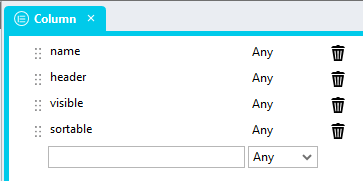

# Repeater As DataGrid <!-- omit in toc -->
Using this module, you can use a *Repeater* control to create a server-side DataGrid that looks and works similar to the standard Stadium *DataGrid* control. 

The module comes with two scripts and two CSS files. The scripts provide functionality to facilitate the rendering, sorting and paging features. The CSS makes a Stadium *Repeater* control look like a DataGrid. 

To illustrate the purpose and power of this module, the example application fetches data from a database table that contains 2 million records. However, this module can be configured to use any connector and data source, and works independent of the number of records in the datasource. 

## Contents <!-- omit in toc -->
- [Version](#version)
- [Database Setup](#database-setup)
  - [Application Setup](#application-setup)
  - [Types Setup](#types-setup)
  - [Page Setup](#page-setup)
    - [Container](#container)
    - [Grid](#grid)
    - [Repeater](#repeater)
    - [Sorting](#sorting)
    - [Paging](#paging)
    - [Link Columns](#link-columns)
  - [Connector Setup](#connector-setup)
  - [Queries Setup](#queries-setup)
  - [Global Script Setup](#global-script-setup)
    - [Initialising the module](#initialising-the-module)
    - [Querying the module](#querying-the-module)
  - [Page.Load Setup](#pageload-setup)
  - [CSS Setup](#css-setup)
- [Custom Filters](#custom-filters)
- [Showing Spinners](#showing-spinners)

# Version
1.0 initial

# Database Setup
The attached example application uses a database connector and queries. However, the module also works with any other data source, such as a REST service for example. 

To run the sample application, you need to:
1. Create a database in a SQL Server instance called "StadiumLoadTest"
2. The unzip and run the SQL script in the database folder in this repo (this will create a table called "User") [script file](database/script.zip)

## Application Setup
1. Check the *Enable Style Sheet* checkbox in the application properties

## Types Setup
Add a new type that contains all the columns in your dataset. 

The example dataset type is called "UserDG" and contains the following columns:
1. ID (Any)
2. name (Any)
3. gender (Any)
4. address (Any)
5. birthdate (Any)
6. adddatetime (Any)



## Page Setup
To function correctly, the page must contain a number of controls. Some of these provide for DataGrid-specific functions, like paging, while others serve to simply display the data from your dataset. Each control set is defined in detail below. 

The final set of controls for the example application will look like this:


### Container
1. Drag a *Container* control to the page
2. Give it a suitable name (e.g. ServerSideDataGridContainer)
3. Add a class of your choice to the control *Classes* property to uniquely identify the control (e.g. server-side-datagrid)

### Grid
1. Drag a *Grid* control to the page
2. For each column you wish to display
   1. Drag a *Link* control into the *Grid* if the column must be sortable
   2. Drag a *Label* control into the *Grid* if the column should not be sortable


### Repeater
1. Drag a *Repeater* control into the *Grid* control
2. For each column you wish to display
   1. Drag a *Label* control into the *Grid*


### Sorting

### Paging

### Link Columns

## Connector Setup

## Queries Setup


Example "Select" Query
```sql
SELECT 
	ID
      ,name
      ,gender
      ,address
      ,birthdate
      ,adddatetime
  FROM [User]
  where 
  	ID = IsNull(nullif(@ID,''),ID) AND 
    [name] like IsNull(nullif('%' + @name + '%',''),[name]) AND 
    gender = IsNull(nullif(@gender,''),gender) AND 
    (adddatetime >= IsNull(nullif(@fromadddatetime,''),'1900-01-01') AND 
	adddatetime <= IsNull(nullif(@toadddatetime,''),'2100-01-01'))
  ORDER BY
  case when UPPER(@sortField) = 'ID' AND (LOWER(@sortDirection) = 'asc' OR @sortDirection = '') THEN ID END ASC,
  case when UPPER(@sortField) = 'ID' AND LOWER(@sortDirection) = 'desc' THEN ID END DESC,
  case when LOWER(@sortField) = 'name' AND (LOWER(@sortDirection) = 'asc' OR @sortDirection = '') THEN [name] END ASC,
  case when LOWER(@sortField) = 'name' AND LOWER(@sortDirection) = 'desc' THEN [name] END DESC,
  case when LOWER(@sortField) = 'gender' AND (LOWER(@sortDirection) = 'asc' OR @sortDirection = '') THEN gender END ASC,
  case when LOWER(@sortField) = 'gender' AND LOWER(@sortDirection) = 'desc' THEN gender END DESC,
  case when LOWER(@sortField) = 'address' AND (LOWER(@sortDirection) = 'asc' OR @sortDirection = '') THEN [address] END ASC,
  case when LOWER(@sortField) = 'address' AND LOWER(@sortDirection) = 'desc' THEN [address] END DESC,
  case when LOWER(@sortField) = 'birthdate' AND (LOWER(@sortDirection) = 'asc' OR @sortDirection = '') THEN birthdate END ASC,
  case when LOWER(@sortField) = 'birthdate' AND LOWER(@sortDirection) = 'desc' THEN birthdate END DESC,
  case when @sortField = '' then ID end ASC,
  case when @sortField = 'undefined' then ID end ASC
OFFSET @offsetRows ROWS FETCH NEXT @pageSize ROWS ONLY
```
Example "TotalRecords" Query
```sql
select count(ID) as total from [User]
  where 
  	ID = IsNull(nullif(@ID,''),ID) AND 
    [name] like IsNull(nullif('%' + @name + '%',''),[name]) AND 
    gender = IsNull(nullif(@gender,''),gender) AND 
    (adddatetime >= IsNull(nullif(@fromadddatetime,''),'1900-01-01') AND 
	adddatetime <= IsNull(nullif(@toadddatetime,''),'2100-01-01'))
```

## Global Script Setup

### Initialising the module

### Querying the module

## Page.Load Setup

## CSS Setup

# Custom Filters

# Showing Spinners

