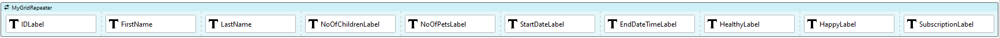
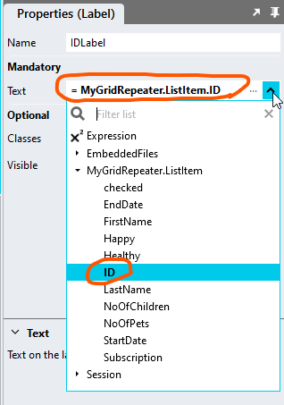
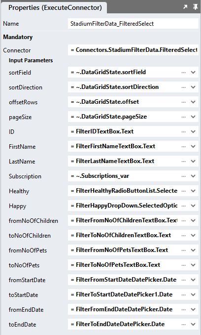

# DataGrid Repeater <!-- omit in toc -->
Using this module, you can configure a *Repeater* control to create a DataGrid that looks and works similar to the standard Stadium *DataGrid* control. Use this module to display data from data sources that contain too many records to display in the standard (client-side) Stadium DataGrid. 

**Notable features**

- Configurable page size
- Can be used with any connector
- Supports [custom filters](#custom-filters)


**Assets**

The module comes with two [CSS files](#css-setup) and [two scripts](#global-scripts). 

- The CSS makes a Stadium *Repeater* control look like a DataGrid. The *Repeater* control must contain a [variety of controls](#page). 
- The scripts provide functionality to facilitate the rendering of data and keeping the DataGrid state. This includes recording when users use the controls to sort or page the data. 

**Integration**

To use this module in a Stadium application
1. Add link, label and other controls to a Grid and Repeater control to create the DataGrid columns
2. Add SQL queries or API calls to retrieve and assign the correct data when loading the DataGrid data, when users sort the data or when they page through the data in the control [event handlers](#scripts-and-events). 

**Example Application**

To illustrate how this module works, [create this database](#database) and open the [sample application](Stadium6/RepeaterDataGrid.sapz). It displays data from the database table with 2 million records. It contains [scripts](#scripts-and-events) to demonstrate how to configure the sorting and paging features.

https://github.com/user-attachments/assets/0164fc8f-a6c9-4eb6-b9a7-ffb4ac18d4cf

## Contents <!-- omit in toc -->
- [Version](#version)
- [Database](#database)
- [Application](#application)
  - [Application Properties](#application-properties)
  - [Connector](#connector)
    - [Queries](#queries)
  - [Types](#types)
    - [DataSet Type](#dataset-type)
    - [DataGridState Type](#datagridstate-type)
  - [Page](#page)
    - [Main Container](#main-container)
    - [Grid](#grid)
    - [Repeater](#repeater)
    - [Paging Container](#paging-container)
  - [Global Scripts](#global-scripts)
    - [Initialisation Script](#initialisation-script)
    - [DataGrid State Script](#datagrid-state-script)
    - [RepeaterDataGridState Return Object](#repeaterdatagridstate-return-object)
  - [Scripts and Events](#scripts-and-events)
    - [Initialise Page Script](#initialise-page-script)
    - [GetData Page Script](#getdata-page-script)
    - [Page.Load](#pageload)
    - [Sorting](#sorting)
    - [Paging](#paging)
    - [Link Columns](#link-columns)
  - [CSS Setup](#css-setup)
    - [Customising CSS](#customising-css)
    - [CSS Upgrading](#css-upgrading)
- [Loading Spinners](#loading-spinners)
- [Custom Filters](#custom-filters)
  - [Query](#query)
  - [Page](#page-1)

# Version
1.0 initial

# Database
The module can be configured to work with any data source and connector. 

The attached example application uses a database connector and queries. To run or rebuild the sample application, you need to:
1. Create a database in a SQL Server instance called "StadiumLoadTest"
2. The unzip and run the SQL script in the database folder in this repo (this will create a table called "User") [script file](database/script.zip)

# Application

## Application Properties
1. Check the *Enable Style Sheet* checkbox in the application properties

## Connector
Set up your connector to your datasource as you normally would. 

To run the example application, create a database connector to the database you [created above](#database-setup). 

### Queries
The module requires two data sets: 

1. The total number of records
2. The data to be attached to the *Repeater* (a list of objects from a database or an API)

Create the queries below to run the example application. These queries include parameters to facilitate paging and sorting. 

**Example "TotalRecords" Query**
```sql
select count(ID) as total from [User]
```

**Example "Select" Query**
```sql
SELECT 
	ID
    ,name
    ,gender
    ,address
    ,birthdate
    ,adddatetime
  FROM [User]
  ORDER BY
  case when UPPER(@sortField) = 'ID' AND (LOWER(@sortDirection) = 'asc' OR @sortDirection = '') THEN ID END ASC,
  case when UPPER(@sortField) = 'ID' AND LOWER(@sortDirection) = 'desc' THEN ID END DESC,
  case when LOWER(@sortField) = 'name' AND (LOWER(@sortDirection) = 'asc' OR @sortDirection = '') THEN [name] END ASC,
  case when LOWER(@sortField) = 'name' AND LOWER(@sortDirection) = 'desc' THEN [name] END DESC,
  case when LOWER(@sortField) = 'gender' AND (LOWER(@sortDirection) = 'asc' OR @sortDirection = '') THEN gender END ASC,
  case when LOWER(@sortField) = 'gender' AND LOWER(@sortDirection) = 'desc' THEN gender END DESC,
  case when LOWER(@sortField) = 'address' AND (LOWER(@sortDirection) = 'asc' OR @sortDirection = '') THEN [address] END ASC,
  case when LOWER(@sortField) = 'address' AND LOWER(@sortDirection) = 'desc' THEN [address] END DESC,
  case when LOWER(@sortField) = 'birthdate' AND (LOWER(@sortDirection) = 'asc' OR @sortDirection = '') THEN birthdate END ASC,
  case when LOWER(@sortField) = 'birthdate' AND LOWER(@sortDirection) = 'desc' THEN birthdate END DESC,
  case when @sortField = '' then ID end ASC,
  case when @sortField = 'undefined' then ID end ASC
OFFSET @offsetRows ROWS FETCH NEXT @pageSize ROWS ONLY
```


## Types
Add the two types below

### DataSet Type
Add a new type that contains all the properties (columns) in your dataset. 

The example dataset type is called "DataSet" and contains the following columns:
1. ID (Any)
2. name (Any)
3. gender (Any)
4. address (Any)
5. birthdate (Any)
6. adddatetime (Any)


### DataGridState Type
Add a second type called "DataGridState" with the following properties

1. page (any)
2. pageSize (any)
3. offset (any)
4. totalRecords (any)
5. totalPages (any)
6. sortDirection (any)
7. sortField (any)


## Page
To function correctly, the page must contain a number of controls. Some of these provide for DataGrid-specific functions, like paging, while others serve to simply display the data from your dataset. Each control set is defined in detail below. 

The final set of controls for the example application will look like this:


### Main Container
1. Drag a *Container* control to the page
2. Give it a suitable name (e.g. ServerSideDataGridContainer)
3. Add a class of your choice to the control *Classes* property to uniquely identify the control (e.g. server-side-datagrid)

### Grid
1. Drag a *Grid* control into the *Container* control
2. For each column you wish to display
   1. Drag a *Link* control into the *Grid* if the column must be sortable
   2. Drag a *Label* control into the *Grid* if the column should not be sortable
   3. Leave the column empty if you don't want to display a column header (add a dummy control for now that you can remove later)


### Repeater
1. Drag a *Repeater* control into the *Grid* control (under the header row)
2. Assign the *Type* that contains the fields from your datasource you created above to the *Repeater* *ListItem Type* property


3. For each column you wish to display
   1. Drag a *Label* control into the *Grid*
   2. Map the correct ListItem Property to the *Label Text* property (example shows the "ID" Label)





### Paging Container
To enable paging a specific set of controls with specific classnames is required as depicted and described below


1. Drag a *Container* control below the *Grid* control, but inside the main container 
2. Give it a suitable name (e.g. PagingContainer)
3. Add the class "paging" to the *Container* classes property (it must be this exact class!)
4. Drag a *Button* control into the PagingContainer
   1. Name the Button "PreviousButton"
   2. Add the text "<<" in the button text property
   3. Add the class "previous-button" to the button classes property
5. Drag another *Button* control into the PagingContainer and place it next to the PreviousButton
   1. Name the Button "NextButton"
   2. Add the text ">>" in the button text property
   3. Add the class "next-button" to the button classes property
6. Drag a *TextBox* into the the PagingContainer and place it next to the NextButton
   1. Name the TextBox "SpecificPageTextBox"
   2. Add the class "specific-page" to the SpecificPageTextBox classes property
7. Drag a *Button* control into the PagingContainer and place it next to the SpecificPageTextBox control
   1. Name the Button "SpecificPageGoButton"
   2. Add the text "Go" in the button text property
   3. Add the class "specific-page-go" to the button classes property
8. Drag a *Label* control to the PagingContainer and place it next to the SpecificPageGoButton control
   1. Name the Label "CurPageLabel"
   2. Add the class "current-page" to the label classes property

**Result**


## Global Scripts
The module requires two global scripts. The first one is used to set up the repeater to look and function like a DataGrid. The second one is used to query the module to find out how the DataGrid is sorted, what page of data must be shown and how many records a page must contain. 

### Initialisation Script
1. Create a Global Script called "RepeaterDataGridInit"
2. Add the input parameters below to the Global Script
   1. ContainerClass
   2. DefaultSortField
   3. PageSize
   4. TotalRecords
3. Drag a *JavaScript* action into the script
4. Add the Javascript below into the JavaScript code property
```javascript
/* Stadium Script v1.0 Init https://github.com/stadium-software/repeater-datagrid */
let scope = this;
let pageSize = parseInt(~.Parameters.Input.PageSize);
let sortField = ~.Parameters.Input.DefaultSortField;
let totalRecords = parseInt(~.Parameters.Input.TotalRecords);
let containerClass = ~.Parameters.Input.ContainerClass;
if (!containerClass) {
     console.error("The ContainerClass parameter is required");
     return false;
}
let container = document.querySelectorAll("." + containerClass);
if (container.length == 0) {
    console.error("The class '" + containerClass + "' is not assigned to any container");
    return false;
} else if (container.length > 1) {
    console.error("The class '" + containerClass + "' is assigned to multiple containers");
    return false;
} else { 
    container = container[0];
}
container.classList.add("stadium-dg-repeater");
let getObjectName = (obj) => {
    let objname = obj.id.replace("-container","");
    do {
        let arrNameParts = objname.split(/_(.*)/s);
        objname = arrNameParts[1];
    } while ((objname.match(/_/g) || []).length > 0 && !scope[`${objname}Classes`]);
    return objname;
};
let sortEl = container.querySelector(".dg-asc-sorting, .dg-desc-sorting");
if (sortEl) sortEl.classList.remove("dg-asc-sorting", "dg-desc-sorting");
let cells = container.querySelectorAll(".grid-item");
let headerCells = container.querySelectorAll(".grid-item:not(.grid-repeater-item)");
let cellsPerRow = headerCells.length;
let styleText = document.querySelector('[href*="stadium-repeater-datagrid.css"]').sheet;
let st = '.' + containerClass + '.stadium-dg-repeater {.grid-item:nth-child(' + cellsPerRow + 'n+1) {border-left: 1px solid var(--dg-border-color);}.grid-item:nth-child(' + cellsPerRow + 'n) {border-right: 1px solid var(--dg-border-color);}';
styleText.insertRule(st, 0);
let cellCount = 0;
let alt = false;
for (let i = 0; i < cells.length; i++) {
    cellCount++;
    if (alt) cells[i].classList.add("dg-alternate-row");
    if (!alt) cells[i].classList.add("dg-row");
    if (cellCount == cellsPerRow) {
        cellCount = 0;
        alt = !alt;
    }
}
sessionStorage.setItem(containerClass + "_Page", 1);
sessionStorage.setItem(containerClass + "_PageSize", pageSize);
sessionStorage.setItem(containerClass + "_Offset", 0);
sessionStorage.setItem(containerClass + "_TotalRecords", totalRecords);
sessionStorage.setItem(containerClass + "_TotalPages", Math.ceil(totalRecords / pageSize));
sessionStorage.setItem(containerClass + "_SortDirection", "");
sessionStorage.setItem(containerClass + "_SortField", sortField);
setPageLabel();
setNextButton(1);
setPrevButton(1);

for (let i = 0; i < headerCells.length; i++) {
    let inner = headerCells[i].querySelector(".link-container .btn-link");
    if (inner) inner.addEventListener("mousedown", setSort);
}
if (container.querySelector(".previous-button")) { 
    container.querySelector(".previous-button button").addEventListener("mousedown", previousPage);
    container.querySelector(".previous-button").classList.add("disabled");
}
if (container.querySelector(".next-button")) { 
    container.querySelector(".next-button button").addEventListener("mousedown", nextPage);
}
if (container.querySelector(".specific-page-go")) { 
    container.querySelector(".specific-page-go button").addEventListener("mousedown", setPage);
}
function previousPage() {
    let page = parseInt(sessionStorage.getItem(containerClass + "_Page"));
    if (page > 1) { 
        page = page - 1;
        sessionStorage.setItem(containerClass + "_Page", page);
        let offset = page * pageSize - pageSize;
        sessionStorage.setItem(containerClass + "_Offset", offset);
    }
    setNextButton(page);
    setPrevButton(page);
    setPageLabel();
}
function setPrevButton(pg) { 
    let previousButton = container.querySelector(".previous-button");
    if (pg == 1) {
        previousButton.classList.add("disabled");
    } else { 
        previousButton.classList.remove("disabled");
    }
}
function nextPage() {
    let page = parseInt(sessionStorage.getItem(containerClass + "_Page"));
    if (page < parseInt(sessionStorage.getItem(containerClass + "_TotalPages"))) { 
        page = page + 1;
        sessionStorage.setItem(containerClass + "_Page", page);
        let offset = page * pageSize - pageSize;
        sessionStorage.setItem(containerClass + "_Offset", offset);
    }
    setNextButton(page);
    setPrevButton(page);
    setPageLabel();
}
function setNextButton(pg) { 
    let nextButton = container.querySelector(".next-button");
    if (pg == parseInt(sessionStorage.getItem(containerClass + "_TotalPages")) || parseInt(sessionStorage.getItem(containerClass + "_TotalPages")) < 2) {
        nextButton.classList.add("disabled");
    } else { 
        nextButton.classList.remove("disabled");
    }
}
function setPage() {
    let pageInputContainer = container.querySelector(".specific-page");
    let pageInput = pageInputContainer.querySelector("input");
    let page = pageInput.value;
    if (!isNaN(page) && page > 0 && page <= parseInt(sessionStorage.getItem(containerClass + "_TotalPages"))) {
        sessionStorage.setItem(containerClass + "_Page", page);
        let offset = page * pageSize - pageSize;
        sessionStorage.setItem(containerClass + "_Offset", offset);
        setNextButton(page);
        setPrevButton(page);
        setPageLabel();
    }
    setDMValues(pageInputContainer, "Text", "");
}
function setPageLabel() {
    if (container.querySelector(".current-page") && parseInt(sessionStorage.getItem(containerClass + "_TotalPages")) > 0) {
        container.querySelector(".current-page span").textContent = "Page " + parseInt(sessionStorage.getItem(containerClass + "_Page")).toLocaleString() + " of " + parseInt(sessionStorage.getItem(containerClass + "_TotalPages")).toLocaleString();
    } else if (parseInt(sessionStorage.getItem(containerClass + "_TotalPages")) == 0) { 
        container.querySelector(".current-page span").textContent = "No records found";
    }
}
function setSort(e) { 
    let clickedEl = e.target;
    let colHead = clickedEl.textContent.toLowerCase();
    sessionStorage.setItem(containerClass + "_SortField", clickedEl.textContent);
    let currentSort = container.querySelector(".dg-asc-sorting, .dg-desc-sorting");
    let allHeaders = container.querySelectorAll(".grid-item:not(.grid-repeater-item) .link-container");
    if (!currentSort) {
        for (let i = 0; i < allHeaders.length; i++) {
            if (allHeaders[i].textContent.toLowerCase() == colHead.toLowerCase()) {
                allHeaders[i].classList.add("dg-asc-sorting");
            }
        }
    } else if (currentSort.classList.contains("dg-desc-sorting") && (currentSort.textContent.toLowerCase() == colHead.toLowerCase())) {
        currentSort.classList.remove("dg-desc-sorting");
        currentSort.classList.add("dg-asc-sorting");
        sessionStorage.setItem(containerClass + "_SortDirection", "asc");
    } else if (currentSort.classList.contains("dg-asc-sorting") && (currentSort.textContent.toLowerCase() == colHead.toLowerCase())) {
        currentSort.classList.remove("dg-asc-sorting");
        currentSort.classList.add("dg-desc-sorting");
        sessionStorage.setItem(containerClass + "_SortDirection", "desc");
    } else if ((currentSort.classList.contains("dg-asc-sorting") || currentSort.classList.contains("dg-desc-sorting")) && (currentSort.textContent.toLowerCase() != colHead.toLowerCase())) {
        currentSort.classList.remove("dg-asc-sorting", "dg-desc-sorting");
        for (let i = 0; i < allHeaders.length; i++) {
            if (allHeaders[i].textContent.toLowerCase() == colHead.toLowerCase()) {
                allHeaders[i].classList.add("dg-asc-sorting");
                sessionStorage.setItem(containerClass + "_SortDirection", "asc");
            }
        }
    }
}
function setDMValues(ob, property, value) {
    let obname = getObjectName(ob);
    scope[`${obname}${property}`] = value;
}
```

### DataGrid State Script
1. Create a second Global Script called "RepeaterDataGridState"
2. Add the **input** parameters below to the Global Script
   1. ContainerClass
3. Add the **output** parameters below to the Global Script
   1. Values
4. Drag a *JavaScript* action into the script
5. Add the Javascript below into the JavaScript code property
```javascript
/* Stadium Script v1.0 GetData https://github.com/stadium-software/repeater-datagrid */
let containerClass = ~.Parameters.Input.ContainerClass;
if (!containerClass) {
     console.error("The ContainerClass parameter is required");
     return false;
}
return { page: sessionStorage.getItem(containerClass + "_Page"),
     pageSize: sessionStorage.getItem(containerClass + "_PageSize"),
     offset: sessionStorage.getItem(containerClass + "_Offset"),
     totalRecords: sessionStorage.getItem(containerClass + "_TotalRecords"),
     totalPages: sessionStorage.getItem(containerClass + "_TotalPages"),
     sortDirection: sessionStorage.getItem(containerClass + "_SortDirection"),
     sortField: sessionStorage.getItem(containerClass + "_SortField")
};
```
6. Drag a *SetValue* under the *Javascript* action
   1. Set ouput parameter called "Values" as the **target**
   2. Set the *Javascript* action as the **source**


### RepeaterDataGridState Return Object
The "RepeaterDataGridState" script returns an object called "Values" with the properties below. 

To easily access the values, drag type called "DataGridState" to the script and assign the Values output from the "RepeaterDataGridState" script to the type. 

1. page: The page of data to show (int)
2. pageSize: The number of records each page must contain (int)
3. offset: The number of rows to skip before starting to return rows from the query (PageSize * Page) (int)
4. totalRecords: The total number of records the dataset contains (int)
5. totalPages: the total number of pages the DataGrid will handle (TotalRecords / PageSize) (int)
6. sortDirection: one of these values (string)
   1. Empty (initial value)
   2. 'asc'
   3. 'desc'
7. sortField: the field the data is currently sorted by (string)

**Example "RepeaterDataGridState" Return Object**
```javascript
{ 
    page: 41,
    pageSize: 10,
    offset: 410,
    totalRecords: 2000000,
    totalPages: 200000,
    sortDirection: 'asc',
    sortField: 'ID'
}
```

## Scripts and Events
Alll events in the example application either call a script to initialise the DataGrid or one to retreive the DataGrid state. 

### Initialise Page Script
The "RepeaterDataGridInit" script allows for the initalisation of the *Repeater* as a DataGrid. Call this script to initialise the DataGrid in the Page.Load script and whenever the dataset changes, like when it is filtered for example. 

In events that initialise or re-initialise the DataGrid, the example application simply calls a Page Script called "Initialise"

1. Create a Script called "Initialise" under the page
2. Drag the "TotalRecords" query to the script
3. Drag the "Select" query to the script and complete the input parameters
   1. offsetRows: 0 (to start with the first record the initial offset 0)
   2. pageSize: an interger that defines how many records the DataGrid shows (e.g. 10)
   3. sortField: a string specifying the initial column by which the DataGrid is sorted (e.g. ID)
   4. sortDirection: a string specifying initial sort direction of the DataGrid (e.g. asc)
4. Drag a *SetValue* action into the script
   1. Target: The List property of the *Repeater*
   2. Source: the dataset returned by the query


5.  Drag the "RepeaterDataGridInit" script to the event Handler

**Initialise Script**


### GetData Page Script
Using the "RepeaterDataGridState" script, you can find out how the DataGrid is sorted, what page of data must be shown and how many records a page must contain. You can then use this information when querying the data source and assigning the correct set of data to the *Repeater*. Use this script in the Link.Click events that handle sorting as well as the Button.Click events that handle the paging of the DataGrid. 

In all sorting and paging events, the example application simply calls a Page Script called "GetData"

1. Create a Script called "GetData" under the page
2. Drag the "RepeaterDataGridState" script into the "GetData" script
   1. Add the class you assigned to the Main Container to the input parameter of the "RepeaterDataGridState" script (e.g. server-side-datagrid)
3. Drag the type called "DataGridState" to the script
   1. Assign the output called "Values" from the "RepeaterDataGridState" script to the "DataGridState" type
4. Drag the "Select" query into the script
5. Complete the "Select" query input parameters by selecting the properties from the "DataGridState" type. If you are using your own datasource, you need to make use of these values to return the correct dataset to the *Repeater*
   1. offsetRows: = ~.DataGridState.offset
   2. pageSize: = ~.DataGridState.pageSize
   3. sortField: = ~.DataGridState.sortField
   4. sortDirection: = ~.DataGridState.sortDirection
6. Drag a *SetValue* to the script to set the Repeater data
   1. Target: The Repeater List Property
   2. Source: The data returned by the connector


**GetData Script**


### Page.Load
Drag the "Initialise" script into the Page.Load event handler


### Sorting
1. For all header *Link* controls
   1. Create the *Click Event Handler*
   2. Drag the "GetData" script into the control *Click Event Handler* script


### Paging
1. For all paging *Button* controls
   1. Create the *Click Event Handler*
   2. Drag the "GetData" script into the control *Click Event Handler* script


### Link Columns
To add a link columns to the Datagrid: 
1. Drag an *Image*, *Link* or *Button* control into the *Repeater* control


2. Create the *Click* Event Handler
3. In the *Click* Event Handler, you have access to all the controls in that *Repeater* row in the *Controls* group in the properties dropdown 

**Example shows how to access the ID.Label Text Property in a EditImage.Click event handler**


## CSS Setup
The CSS below is required for the correct functioning of the module. Some elements can be [customised](#customising-css) using a variables CSS file. 

**Stadium 6.6 or higher**
1. Create a folder called "CSS" inside of your Embedded Files in your application
2. Drag the two CSS files from this repo [*stadium-repeater-datagrid-variables.css*](stadium-repeater-datagrid-variables.css) and [*stadium-repeater-datagrid.css*](stadium-repeater-datagrid.css) into that folder
3. Paste the link tags below into the *head* property of your application
```html
<link rel="stylesheet" href="{EmbeddedFiles}/CSS/stadium-repeater-datagrid.css">
<link rel="stylesheet" href="{EmbeddedFiles}/CSS/stadium-repeater-datagrid-variables.css">
``` 

### Customising CSS
1. Open the CSS file called [*stadium-repeater-datagrid-variables.css*](stadium-repeater-datagrid-variables.css) from this repo
2. Adjust the variables in the *:root* element as you see fit
3. Overwrite the file in the CSS folder of your application with the customised file

### CSS Upgrading
To upgrade the CSS in this module, follow the [steps outlined in this repo](https://github.com/stadium-software/samples-upgrading)

# Loading Spinners
To add a loading spinner to the DataGrid

1. Add the [Spinner Repo](https://github.com/stadium-software/spinners) to your application
2. Drag a *Container* control anywhere into the "ServerSideDataGridContainer" and name it "Spinner"
3. Add the classes "stadium-spinner spinner-contained" to the "Spinner"
4. Add a class for the type of spinner you would like to display (e.g. spinner-type-1)
5. Drag the "Spinner" Glopbal Script to the Page.Load for page that will use the spinner
6. Add a *SetValue* action to any script when you want to show or hide the spinner
   1. Set the "Spinner.Visible" property to "true" to show the spinner
   2. Set the "Spinner.Visible" property to "false" to hide the spinner

# Custom Filters
Custom filters can be cu7stom created and can work with the DataGrid as follows:

1. Additional conditions must be added into the datasource (by adding a custom where clause the query or API call)
2. Controls that enable users to provide filter criteria needs to be added to the page (custom filter UI)

## Query
For the example application, this means extending the sql queries as folows

**Example "TotalRecords" Query**
```sql
select count(ID) as total from [User]
  where 
  	ID = IsNull(nullif(@ID,''),ID) AND 
    [name] like IsNull(nullif('%' + @name + '%',''),[name]) AND 
    gender = IsNull(nullif(@gender,''),gender) AND 
    (adddatetime >= IsNull(nullif(@fromadddatetime,''),'1900-01-01') AND 
	adddatetime <= IsNull(nullif(@toadddatetime,''),'2100-01-01'))
```

**Example "Select" Query**
```sql
SELECT 
	ID
      ,name
      ,gender
      ,address
      ,birthdate
      ,adddatetime
  FROM [User]
  where 
  	ID = IsNull(nullif(@ID,''),ID) AND 
    [name] like IsNull(nullif('%' + @name + '%',''),[name]) AND 
    gender = IsNull(nullif(@gender,''),gender) AND 
    (adddatetime >= IsNull(nullif(@fromadddatetime,''),'1900-01-01') AND 
	adddatetime <= IsNull(nullif(@toadddatetime,''),'2100-01-01'))
  ORDER BY
  case when UPPER(@sortField) = 'ID' AND (LOWER(@sortDirection) = 'asc' OR @sortDirection = '') THEN ID END ASC,
  case when UPPER(@sortField) = 'ID' AND LOWER(@sortDirection) = 'desc' THEN ID END DESC,
  case when LOWER(@sortField) = 'name' AND (LOWER(@sortDirection) = 'asc' OR @sortDirection = '') THEN [name] END ASC,
  case when LOWER(@sortField) = 'name' AND LOWER(@sortDirection) = 'desc' THEN [name] END DESC,
  case when LOWER(@sortField) = 'gender' AND (LOWER(@sortDirection) = 'asc' OR @sortDirection = '') THEN gender END ASC,
  case when LOWER(@sortField) = 'gender' AND LOWER(@sortDirection) = 'desc' THEN gender END DESC,
  case when LOWER(@sortField) = 'address' AND (LOWER(@sortDirection) = 'asc' OR @sortDirection = '') THEN [address] END ASC,
  case when LOWER(@sortField) = 'address' AND LOWER(@sortDirection) = 'desc' THEN [address] END DESC,
  case when LOWER(@sortField) = 'birthdate' AND (LOWER(@sortDirection) = 'asc' OR @sortDirection = '') THEN birthdate END ASC,
  case when LOWER(@sortField) = 'birthdate' AND LOWER(@sortDirection) = 'desc' THEN birthdate END DESC,
  case when @sortField = '' then ID end ASC,
  case when @sortField = 'undefined' then ID end ASC
OFFSET @offsetRows ROWS FETCH NEXT @pageSize ROWS ONLY
```

## Page
The example application provides users with an opportunity to filter the results by

1. An ID
2. A Gender (chosen from a dropdown)
3. Where the name contains a specific substring
4. Records between two dates

The resulting filter will look like this


1. Add a *Grid* control above the "ServerSideDataGridContainer" container
2. For the ID filter
   1. Add a *Label* to the *Grid*
   2. Add something suitable into the *Text* property
   3. Place a *TextBox* control next to the *Label*
   4. Name the TextBox "IDTextBox"
3. For the Gender filter
   1. Add a *Label* to the *Grid*
   2. Add something suitable into the *Text* property
   3. Place a *DropDown* control next to the *Label*
   4. Name the TextBox "GenderDropDown"
   5. Add the values below to the *Options* property
```json
= [{"text":"", "value":""},{"text":"Male","value":"1"},{"text":"Female","value":"2"},{"text":"Rather not say","value":"3"}]
```
1. For the Name filter
   1. Add a *Label* to the *Grid*
   2. Add something suitable into the *Text* property
   3. Place a *TextBox* control next to the *Label*
   4. Name the TextBox "NameTextBox"
2. For the Date filter
   1. Add a *Label* to the *Grid*
   2. Add something suitable into the *Text* property
   3. Place a *Container* control next to the *Label*
      1. Add a *TextBox* into the *Container* control
      2. Name the TextBox "AddDateFromTextBox"
      3. Add a *TextBox* next to the first one inside the *Container* control
      4. Name the TextBox "AddDateToTextBox"
   4. Place a button below the *Grid* control
      1. Name the *Button* "ApplyFilterButton"
      2. Add "Apply" into the *Text* property
      3. Create the Click event handler on the button
      4. Drag the "Initialise" script into the click event handler
   5. Place second button next to the first one
      1. Name the second *Button* "ClearFilterButton"
      2. Add "Cancel" into the *Text* property
      3. Create the Click event handler on the button
      4. Drag SetValues into the event handler that set each of the filter fields to empty (= '')
      5. Drag the "Initialise" script into the click event handler
   6. Open the "GetData" script and map the additional query parameters to the respective filter fields


   7. Open the "Initialise" script and map the additional query parameters for the two queries to the respective filter fields




