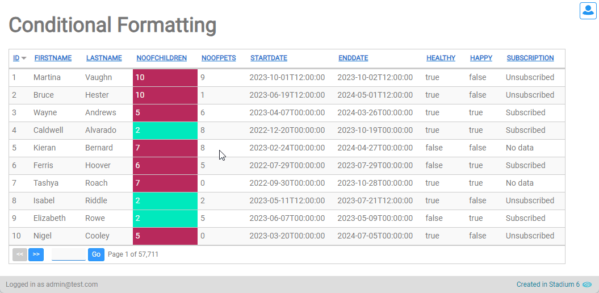
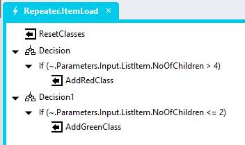
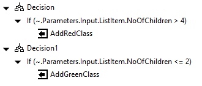

# Conditional Cell Styling



## Sample Application
[CondCellFormatting.sapz](Stadium6/CondCellFormatting.sapz?raw=true)

## Page
1. Add a "RepeaterItemLoad" event to the *Repeater* control


## Event Handler



1. In the *Repeater* control event handler
   1. Add a *SetValue* action to remove all condition classes from the control
      1. Target: NoOfChildren.Classes (or the .Classes property of any other control)
      2. Value: = NoOfChildrenLabel.Classes.replaceAll("green").replaceAll("red")
   4. Add as many *Decisions* as you have conditions
   2. For each *Decision*
      1. Set the *Decision* condition you require (e.g. parseInt(NoOfChildrenLabel.Text) > 4)
      2. In order to add a class of "red", add a *SetValue* action into the "If" condition
         1. Target: NoOfChildren.Classes (or the .Classes property of any other control)
         2. Value: = NoOfChildrenLabel.Classes + " red"



2. Open the *StyleSheet*
3. Add the class and attributes to the *StyleSheet* as you see fit

**Example CSS**
```CSS
/*Changes the background color and font styles of a cell*/
#app .stadium-dg-repeater {
	.grid-repeater-item:has(.red) {
		background-color: #b82a5c;
		.label-container {
			color: white;
		}
	}
	.grid-repeater-item:has(.green) {
		background-color: #00e9bc;
		.label-container {
			color: white;
		}
	}
}
/*Hides a cell label*/
.displaynone {
	display: none;
}
```