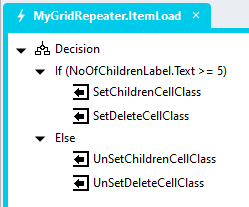

# Conditional Cell Styling

To conditionally style cells

## Page
1. Add a "RepeaterItemLoad" event to the *Repeater* control


## Event Handler


1. In the *Repeater* control event handler
   1. Add a *Decision* action
   2. Set the *Decision* condition you require (e.g. Control.Text > 10)
      1. Add a *SetValue* action into the condition 
      2. Add a class to the control *Classes* property
         1. Set the *Target* property to the *Control.CLasses* property
         2. Set the *Value* property to an expression like the one below

```javascript
NoOfChildrenLabel.Classes + ' red-background'
```

   3. In the *Else* condition
      1. Add a *SetValue* action into the condition 
      2. Remove the class from the control *Classes* property
         1. Set the *Target* property to the *Control.CLasses* property
         2. Set the *Value* property to an expression like the one below

```javascript
NoOfChildrenLabel.Classes.replaceAll('red-background', '')
```



2. Open the *StyleSheet*
3. Add the class and attributes to the *StyleSheet* as you see fit

**Example CSS**
```CSS
/*Changes the background color and font styles of a cell*/
.grid-repeater-item:has(.red-background) {
	background-color: red;
	span {
		color: white;
		font-weight: bold;
	}
}
/*Hides a cell label*/
.displaynone {
	display: none;
}
```