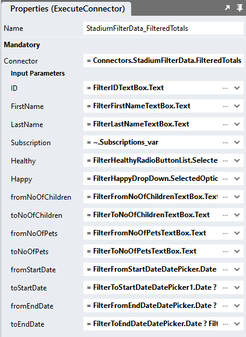

# Custom Filters
Custom filters can be created by 

1. Adding suitable input controls to the page for the user
2. Passing the values to the query or API call
3. Using the provided values in a "WHERE" clause

## StadiumFilterData Queries (filtered)
Both, the "TotalRecords" query and the "Select" query require the addition of a "WHERE" clause. The specific filter options provided to the user will determine which parameters are required in the "WHERE" clause of the query. 

## Page
The example application provides users with an opportunity to filter the results by

1. ID (TextBox)
2. FirstName (TextBox)
3. LastName (TextBox)
4. NoOfChildren
   1. From (TextBox)
   2. To (TextBox)
5. NoOfPets
   1. From (TextBox)
   2. To (TextBox)
6. StartDate 
   1. From (DatePicker)
   2. To (DatePicker)
7. EndDate
   1. From (DatePicker)
   2. To (DatePicker)
8. Happy (DropDown)
9. Healthy (RadioButtonList)
10. Subscriptions (CheckBoxList)


The resulting filter should look like this


### "FilterTotals" Query
```sql
select count(ID) as total from MyData
 WHERE 
	ID = IsNull(nullif(@ID,''),ID) AND 
	FirstName like IsNull(nullif('%' + @FirstName + '%',''),FirstName) AND 
	LastName like IsNull(nullif('%' + @LastName + '%',''),LastName) AND 
	IsNull(nullif(@Subscription,''),Subscription) like '%' + Subscription + '%' COLLATE Latin1_General_CS_AS  AND 
	Healthy = IsNull(nullif(@Healthy,''),Healthy) AND 
	Happy = IsNull(nullif(@Happy,''),Happy) AND 
	(NoOfChildren >= IsNull(nullif(@fromNoOfChildren,''),0) AND 
	NoOfChildren <= IsNull(nullif(@toNoOfChildren,''),1000000)) AND 
	(NoOfPets >= IsNull(nullif(@fromNoOfPets,''),0) AND 
	NoOfPets <= IsNull(nullif(@toNoOfPets,''),1000000)) AND 
	(StartDate >= IsNull(nullif(CONVERT(datetime, @fromStartDate, 127),''),'1900-01-01') AND 
	StartDate <= IsNull(nullif(CONVERT(datetime, @toStartDate, 127),''),'2100-01-01')) AND 
	(EndDate >= IsNull(nullif(CONVERT(datetime, @fromEndDate, 127),''),'1900-01-01') AND 
	EndDate <= IsNull(nullif(CONVERT(datetime, @toEndDate, 127),''),'2100-01-01'))
```

### "FilterSelect" Query
```sql
SELECT ID
      ,FirstName
      ,LastName
      ,NoOfChildren
      ,NoOfPets
      ,StartDate
      ,EndDate
      ,Healthy
      ,Happy
      ,Subscription
  FROM dbo.MyData
  WHERE 
	ID = IsNull(nullif(@ID,''),ID) AND 
	FirstName like IsNull(nullif('%' + @FirstName + '%',''),FirstName) AND 
	LastName like IsNull(nullif('%' + @LastName + '%',''),LastName) AND 
	IsNull(nullif(@Subscription,''),Subscription) like '%' + Subscription + '%' COLLATE Latin1_General_CS_AS  AND 
	Healthy = IsNull(nullif(@Healthy,''),Healthy) AND 
	Happy = IsNull(nullif(@Happy,''),Happy) AND 
	(NoOfChildren >= IsNull(nullif(@fromNoOfChildren,''),0) AND 
	NoOfChildren <= IsNull(nullif(@toNoOfChildren,''),1000000)) AND 
	(NoOfPets >= IsNull(nullif(@fromNoOfPets,''),0) AND 
	NoOfPets <= IsNull(nullif(@toNoOfPets,''),1000000)) AND 
	(StartDate >= IsNull(nullif(CONVERT(datetime, @fromStartDate, 127),''),'1900-01-01') AND 
	StartDate <= IsNull(nullif(CONVERT(datetime, @toStartDate, 127),''),'2100-01-01')) AND 
	(EndDate >= IsNull(nullif(CONVERT(datetime, @fromEndDate, 127),''),'1900-01-01') AND 
	EndDate <= IsNull(nullif(CONVERT(datetime, @toEndDate, 127),''),'2100-01-01'))
  ORDER BY
  case when UPPER(@sortField) = 'ID' AND (LOWER(@sortDirection) = 'asc' OR @sortDirection = '') THEN ID END ASC,
  case when UPPER(@sortField) = 'ID' AND LOWER(@sortDirection) = 'desc' THEN ID END DESC,
  case when LOWER(@sortField) = 'FirstName' AND (LOWER(@sortDirection) = 'asc' OR @sortDirection = '') THEN FirstName END ASC,
  case when LOWER(@sortField) = 'FirstName' AND LOWER(@sortDirection) = 'desc' THEN FirstName END DESC,
  case when LOWER(@sortField) = 'LastName' AND (LOWER(@sortDirection) = 'asc' OR @sortDirection = '') THEN LastName END ASC,
  case when LOWER(@sortField) = 'LastName' AND LOWER(@sortDirection) = 'desc' THEN LastName END DESC,
  case when LOWER(@sortField) = 'NoOfChildren' AND (LOWER(@sortDirection) = 'asc' OR @sortDirection = '') THEN NoOfChildren END ASC,
  case when LOWER(@sortField) = 'NoOfChildren' AND LOWER(@sortDirection) = 'desc' THEN NoOfChildren END DESC,
  case when LOWER(@sortField) = 'NoOfPets' AND (LOWER(@sortDirection) = 'asc' OR @sortDirection = '') THEN NoOfPets END ASC,
  case when LOWER(@sortField) = 'NoOfPets' AND LOWER(@sortDirection) = 'desc' THEN NoOfPets END DESC,
  case when LOWER(@sortField) = 'StartDate' AND (LOWER(@sortDirection) = 'asc' OR @sortDirection = '') THEN StartDate END ASC,
  case when LOWER(@sortField) = 'StartDate' AND LOWER(@sortDirection) = 'desc' THEN StartDate END DESC,
  case when LOWER(@sortField) = 'EndDate' AND (LOWER(@sortDirection) = 'asc' OR @sortDirection = '') THEN EndDate END ASC,
  case when LOWER(@sortField) = 'EndDate' AND LOWER(@sortDirection) = 'desc' THEN EndDate END DESC,
  case when LOWER(@sortField) = 'Healthy' AND (LOWER(@sortDirection) = 'asc' OR @sortDirection = '') THEN Healthy END ASC,
  case when LOWER(@sortField) = 'Healthy' AND LOWER(@sortDirection) = 'desc' THEN Healthy END DESC,
  case when LOWER(@sortField) = 'Happy' AND (LOWER(@sortDirection) = 'asc' OR @sortDirection = '') THEN Happy END ASC,
  case when LOWER(@sortField) = 'Happy' AND LOWER(@sortDirection) = 'desc' THEN Happy END DESC,
  case when LOWER(@sortField) = 'Subscription' AND (LOWER(@sortDirection) = 'asc' OR @sortDirection = '') THEN Subscription END ASC,
  case when LOWER(@sortField) = 'Subscription' AND LOWER(@sortDirection) = 'desc' THEN Subscription END DESC,
  case when @sortField = '' then ID end ASC,
  case when @sortField = 'undefined' then ID end ASC
OFFSET @offsetRows ROWS FETCH NEXT @pageSize ROWS ONLY
```

**NOTE: When pasting this SQL into Stadium and pressing the "Fetch Fields & Parameters" button, an error will pop up. This is expected and not a problem. You need to set the Type option for the parameters called "offsetRows" and "pageSize" to "Int64" as shown below and press the "Fetch Fields & Parameters" button again.**


## Page Scripts
Amend the "Initialise" and "GetData" scripts
1. Replace the "Select" and "Totals" queries with the "FilterSelect" and "FilterTotals" queries
2. Map the additional query parameters for the two queries to the respective filter fields

**FilterSelect Query**



**FilterTotals Query**


