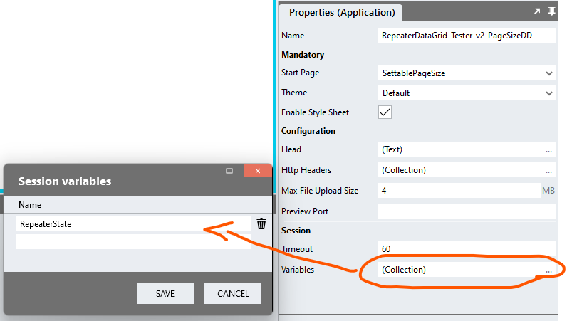
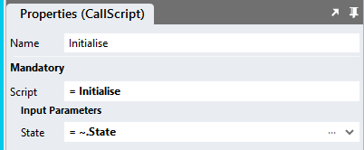
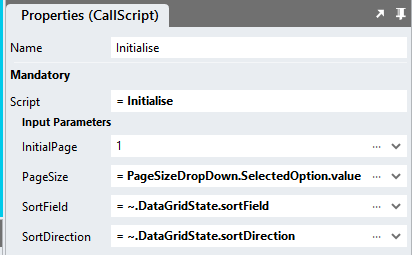
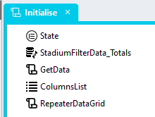

# Customisable Page Size

To enable users to select the page size


## Application
1. Add an application variable called "RepeaterState" to the application *Variables*



## Page
1. Add a *DropDown* control and name it "PageSizeDropDown"
2. Add the allowable page sizes as values (e.g. 10, 20, 50) to the *Options* property

```json
[{"text":"5","value":"5"},{"text":"10","value":"10"},{"text":"20","value":"20"},{"text":"50","value":"50"},{"text":"100","value":"100"}]
```

3. Add a *Change* event handler to the *DropDown* control
4. Drag a "State" type into the event handler
5. Set the *Value* property of the type

```javascript
{
	"pageSize": PageSizeDropDown.SelectedOption.value,
	"page": (~.Parameters.Input.PreviousOption.value / ~.Parameters.Input.SelectedOption.value * Session.Variables.RepeaterState.page) > 1 ? (~.Parameters.Input.PreviousOption.value / ~.Parameters.Input.SelectedOption.value * Session.Variables.RepeaterState.page) : 1,
	"sortDirection": Session.Variables.RepeaterState.sortDirection,
	"sortField": Session.Variables.RepeaterState.sortField
}
```

6. Drag the "Initialise" script to the event handler
7. Assign the "State" type as the input parameter of the script



## Change Event Handler


1. Drag the "RepeaterDataGridState" global script into the event handler
   1. Add the DataGrid class into the script "Classes" input parameter
2. Drag the "DataGridState" type into the event handler 
   1. Assign the "RepeaterDataGridState" return value to the type
3. Drag the "Initialise" script into the event handler
   1. Pass the selected *DropDown* value into the "Initialise" script "PageSize" input parameter 
   2. Pass the "SortField" and "SortDirection" values from the "DataGridState" type into the appropriate "Initialise" script input parameters



## "GetData" Script

1. Add a *SetValue* action to the "Initialise" script



