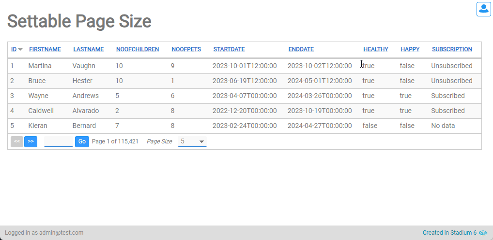
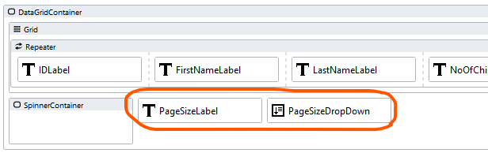
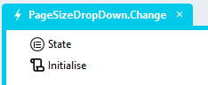
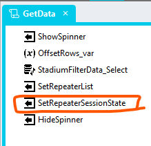

# Customisable Page Size

To enable users to select the page size



## Sample Application
[SettablePageSize.sapz](Stadium6/SettablePageSize.sapz?raw=true)

## Application
1. Add an application variable called "RepeaterState" to the application *Variables*


## Page



1. Add a *Label* control next to the *DropDown* control
2. Add the class "page-size-label" to the *Label* classes property
3. Add the Text "Page Size" to the *Label*
4. Add a *DropDown* control and name it "PageSizeDropDown"
5. Add the class "page-size-dropdown" to the classes property
6. Add the allowable page sizes as values (e.g. 10, 20, 50) to the *Options* property

```json
[{"text":"5","value":"5"},{"text":"10","value":"10"},{"text":"20","value":"20"},{"text":"50","value":"50"},{"text":"100","value":"100"}]
```

## Change Event Handler

1. Add a *Change* event handler to the *DropDown* control



2. Drag a "State" type into the event handler
3.  Set the *Value* property of the type

```javascript
{
	"pageSize": PageSizeDropDown.SelectedOption.value,
	"page": (~.Parameters.Input.PreviousOption.value / ~.Parameters.Input.SelectedOption.value * Session.Variables.RepeaterState.page) > 1 ? (~.Parameters.Input.PreviousOption.value / ~.Parameters.Input.SelectedOption.value * Session.Variables.RepeaterState.page) : 1,
	"sortDirection": Session.Variables.RepeaterState.sortDirection,
	"sortField": Session.Variables.RepeaterState.sortField
}
```

4. Drag the "Initialise" script to the event handler
5. Assign the "State" type as the input parameter of the script


## "GetData" Script

1. Add a *SetValue* action to the "Initialise" script and name it "SetRepeaterSessionState"
   1. Target: Session.Variables.RepeaterState
   2. Value: = ~.Parameters.Input.State



## Styling
Add the CSS below to style the drop down
```CSS
/*Configurable Page Size*/
.page-size-dropdown select {
	width: 60px;
	height: 22px;
	padding: 0 6px;
	background-position: calc(100% - 10px) 9px, calc(100% - 5px) 9px, calc(100% - 30px) 6px;
}
.stadium-dg-repeater {
    .paging {
		.page-size-dropdown {
			padding-right: 0;
		}
	}
}
.page-size-label span {
	font-size: 12px;
	font-style: italic;
}
```
\