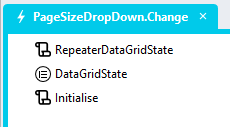

# Customisable Page Size

To enable users to select the page size

# Page 
1. Add a *DropDown* control with the allowable page sizes (e.g. 10, 20, 50)
2. Add a *Change* event handler to the *DropDown* control

3. Drag the "RepeaterDataGridState" global script into the event handler
   1. Add the DataGrid class into the script "Classes" input parameter
4. Drag the "DataGridState" type into the event handler 
   1. Assign the "RepeaterDataGridState" return value to the type
5. Drag the "Initialise" script into the event handler
   1. Pass the selected *DropDown* value into the "Initialise" script "PageSize" input parameter 
   2. Pass the "SortField" and "SortDirection" values from the "DataGridState" type into the appropriate "Initialise" script input parameters

