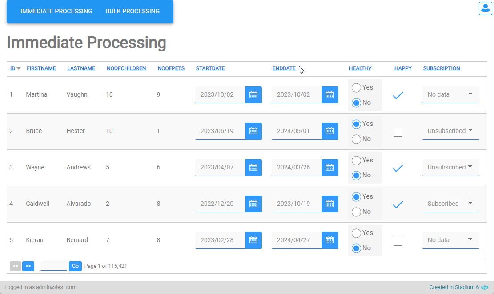
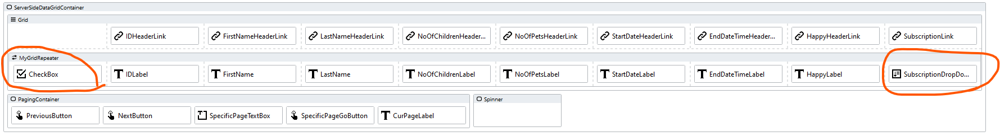
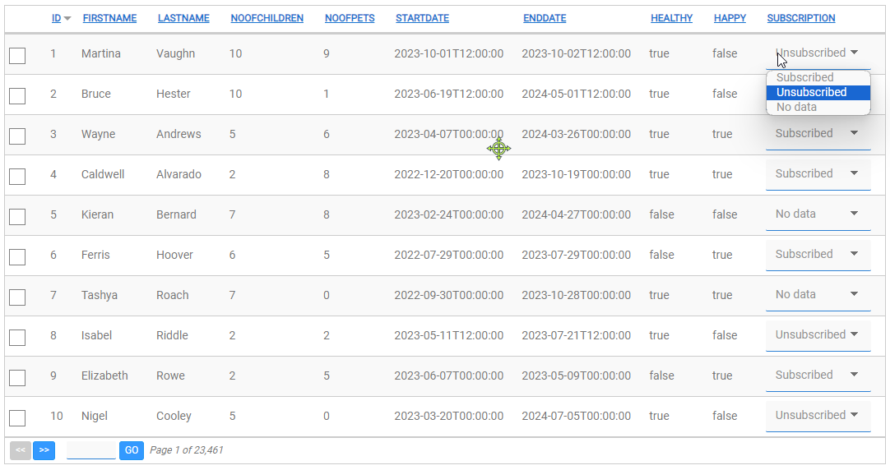
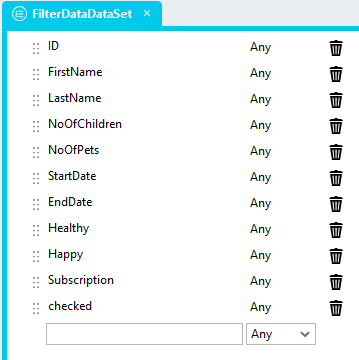
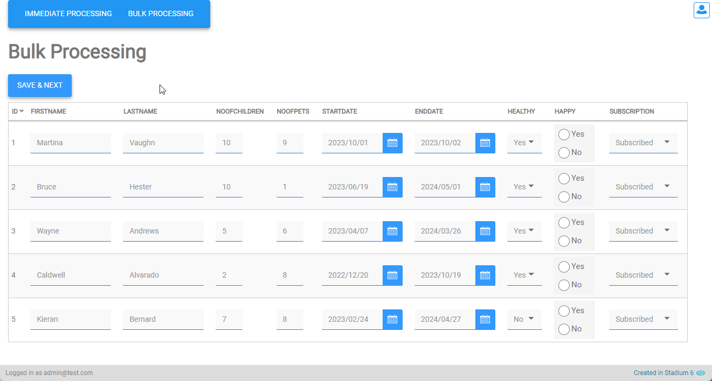

# Editable DataGrids

You may want users to enable editing of DataGrid fields in two ways

1. Immediate Processing
2. Bulk Processing

## Immediate Processing

### Page
1. Drag form controls with *Change* Event Handlers into the *Repeater* control (e.g. CheckBox, CheckBoxList, DatePicker, DropDown, RadioButtonList)
2. Map the correct ListItem Property to the control *value* property
3. Create the control *Change* Event Handler

### Event Handler
Use any value from the *Repeater* instance (row) in the event handler to update the data source 

**Example shows how to add a CheckboxList column and a DropDown column**

### Type
To set the checkbox checked property, add a "checked" property to the "DataSet" type

## Bulk Processing

