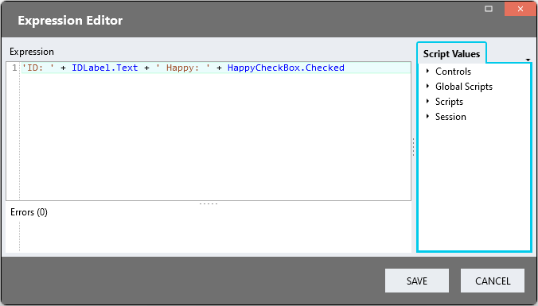

# Editable DataGrids <!-- omit in toc -->
You may want users to enable editing of DataGrid fields in two ways

- [Immediate Processing](#immediate-processing)
  - [Page](#page)
  - [Event Handler](#event-handler)
- [Bulk Processing](#bulk-processing)

## Immediate Processing

### Page
1. Drag form controls with *Change* Event Handlers into the *Repeater* control (e.g. CheckBox, CheckBoxList, DatePicker, DropDown, RadioButtonList)
2. Map the correct ListItem Property to the control *value* property
3. Create the control *Change* Event Handler

### Event Handler
Use any value from the *Repeater* instance (row) in the event handler

## Bulk Processing

