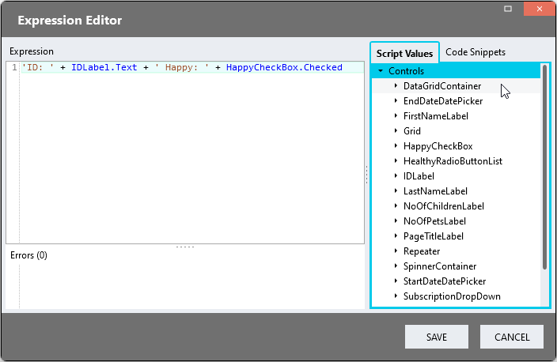
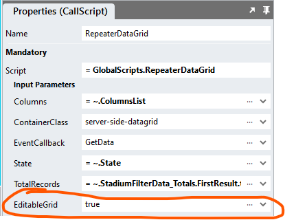

# Editable DataGrids <!-- omit in toc -->
You may want users to enable editing of DataGrid fields in two ways

- [Immediate Processing](#immediate-processing)
  - [Page](#page)
  - [Event Handler](#event-handler)
- [Bulk Processing](#bulk-processing)

## Immediate Processing

### Page
1. Drag form controls with *Change* Event Handlers into the *Repeater* control (e.g. CheckBox, CheckBoxList, DatePicker, DropDown, RadioButtonList)
2. Map the correct ListItem Property to the control *value* property
3. Create the control *Change* Event Handler

### Event Handler
Use any value from the *Repeater* instance (row) in the event handler

## Bulk Processing

When users change controls that have "Change" events, we can process the changed data immediately. However, TextBoxes do not have event handlers. So, when we add such controls to the *Repeater*, there is no way to know when users change their values and then navigate away from the page by sorting or using the DataGrid paging controls. 

One option to solve this challenge is to add an "Edit" mode in which users cannot access paging and sorting controls. 

This can be achieved by setting the "EditableGrid" input property of the "RepeaterDataGrid" script to true. 

