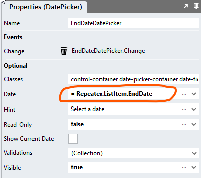

# Editable DataGrids <!-- omit in toc -->

The purpose of this DataGrid is to allow for the display of datasets that are too large to be shown in the standard DataGrid. So, a sensible use case for when users would be interested in editing such DataSets seems difficult to imagine. 

However, in case there is a need for this functionality, here are two methods for how this may be achieved: 

- [Immediate Processing](#immediate-processing)
  - [Page](#page)
  - [Event Handler](#event-handler)
- [Bulk Processing](#bulk-processing)
  - [Page](#page-1)
  - [Button.Click Event Handler](#buttonclick-event-handler)

## Immediate Processing


### Page
1. Drag form controls with *Change* Event Handlers into the *Repeater* control (e.g. CheckBox, CheckBoxList, DatePicker, DropDown, RadioButtonList)
2. Map the correct ListItem Property to the control *value* property
3. Create the control *Change* Event Handler



### Event Handler
Use any value from the *Repeater* instance (row) in the event handler


## Bulk Processing

When users change the data in controls that have a "Change" event, we can process the changed data immediately or store it in a session for later processing. However, TextBoxes do not have event handlers. So, when we add such controls to the *Repeater*, there is no way to know when users change their values and then navigate away from the page by sorting or using the DataGrid paging controls. 

This problem can be overcome by 

1. Disabling the paging and sorting features
2. Adding a "Save & Next" button above the DataGrid
3. Processing the page data in the Button.Click event handler
4. Navigating the user to the next page after processing the data


The DataGrid script supports an "Edit" mode in which users cannot access paging and sorting controls. This can be invoked by setting the "EditableGrid" input property of the "RepeaterDataGrid" script to 'true'. In "Edit" mode, the DataGrid generates all headings as *Label* controls and does not add paging controls. 


### Page

1. Replace pertinent *Label* controls in the *Repeater* with form controls
2. Add a *Button* outside of the DataGrid *Container* control
3. Add "Save & Next" to the *Button Text* property
4. Create the *Button.Click* event

### Button.Click Event Handler

1. Drag a *ForEach* into the handler
2. Assign the *Repeater.List* to the *ForEach* List property
3. Process each row as needed inside the loop
4. Add a "State" type below the *ForEach*
5. Set the *Value* property to

```javascript
= {
	"pageSize": Session.Variables.State.pageSize,
	"page": parseInt(Session.Variables.State.page) + 1,
	"sortDirection": Session.Variables.State.sortDirection,
	"sortField": Session.Variables.State.sortField
}
```

6. Drag a "GetData" script into the handler
7. Assign the "State" type to the "GetData" "State" input parameter