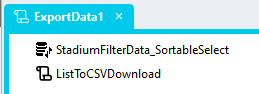
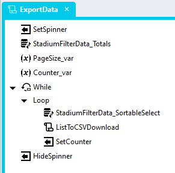

# Export
Enabling data export to CSV can be achieved with the use of the [List to CSV Download](https://github.com/stadium-software/utils-list-to-csv-download) repo

## Export Page Script

1. Add an Export button or image control above the DataGrid
2. Add a Click event handler to the control
3. In the event handler
   1. Fetch the data to be exported by executing the relevant "Select" query or by calling a WebService
   2. Assign the results set to the List input property of the *List to CSV Download* module script

**Caution: Retrieving and exporting large data sets from a database or API can cause the browser to hang or crash**

## Multiple Files Export

1. Get the total number of records in the dataset by dragging the "TotalRecords" query to the script
2. Drag a variable to the script, call it "Counter_var" and set the initial value to 0
3. Drag a variable to the script, call it "PageSize_var" and set the initial value to number of records you wish to export in each file (e.g. 1000)
4. Drag a "While" loop to the script with the condition: ~.Counter_var <= ~.StadiumFilterData_Totals.FirstResult.total
   1. Drag the relevant "Select" query into the "While" loop and assign the "PageSize_var" to the "pageSize" query parameter
   2. Push each batch to the "List to CSV Download" script in the "While" loop. This will cause users to receive a number of files, rather than just one
   3. Drag a SetValue into the loop
      1. Target: ~.Counter_var
      2. Source: ~.Counter_var + ~.PageSize_var
   4. In Chrome users will be asked to verify the download of multiple files

**CAUTION: Pushing many files to the user using this method can also cause the browser to hang or crash.**

