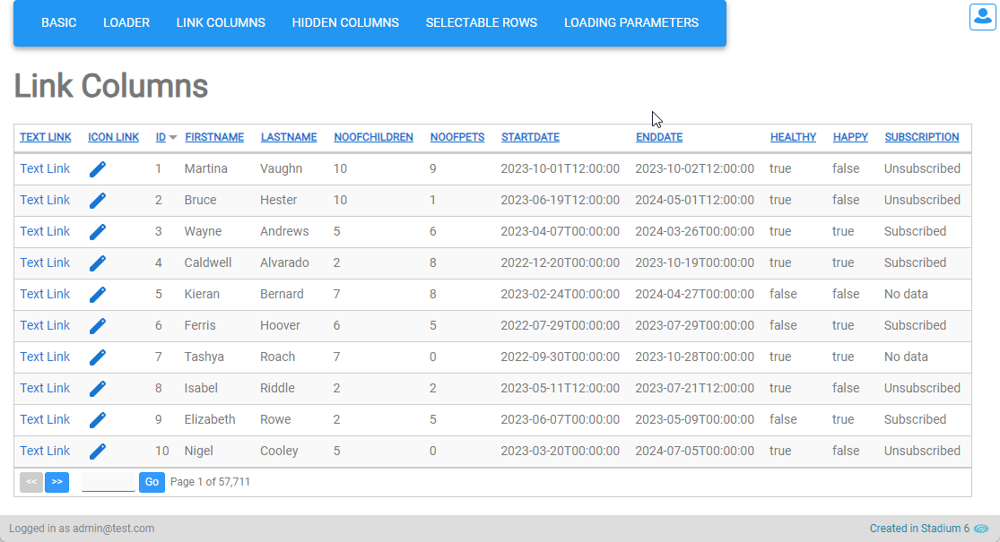

# Link Columns

## Setup

To add a link columns to the Datagrid: 

1. Add the column to the "ColumnsList" in the "Initialise" script

2. Drag an *Image*, *Link* or *Button* control into the *Repeater* control

2. Create the control *Click* Event Handler
3. In the *Click* Event Handler, you have access to all the controls in that *Repeater* row in the *Controls* group in the properties dropdown