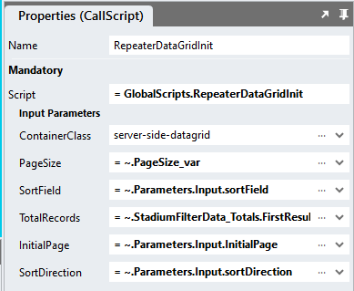

# Load Specific Page

To load a specific page of data in the DataGrid when the page loads:

1. Add these parameters to the "Initialise" page script
   1. InitialPage
   2. sortDirection
   3. sortField



2. Use the "InitialPage" parameter value
   1. In the "Select" query "offsetRows" parameter by using the calculation below
   2. In the "InitialPage" "RepeaterDataGridInit" script parameter

```code
~.Parameters.Input.InitialPage * ~.PageSize_var - ~.PageSize_var
```

3. Wherever the "Initialise" page script is called onn the page
   1. Provide a value for the "Initialise" "InitialPage" input parameter 
   2. Provide a value for the "sortField" (a column from your dataset)
   3. Provide a value for the "sortDirection" (asc or desc)

