# Selectable Rows

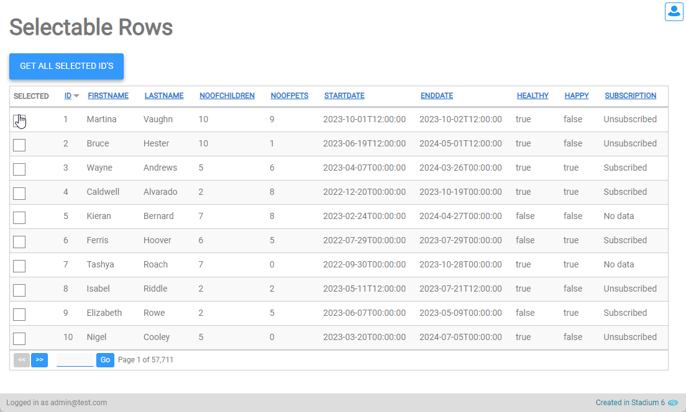

## Sample Application
Two separate sample applications depict this functionality
1. [Base.sapz](Stadium6/Base.sapz?raw=true) contains the [Method 2: Assigning from a list](#method-2-assigning-from-a-list) option described below

2. [Selectable-DataSet.sapz](Stadium6/Selectable-DataSet.sapz?raw=true) contains the [Method 1: Adding a boolean to the DataSet](#method-1-adding-a-boolean-to-the-dataset)

## Setup

To enable users to select rows by checking a checkbox

1. Create an application *Variable* in the application properties called "SelectedRows"

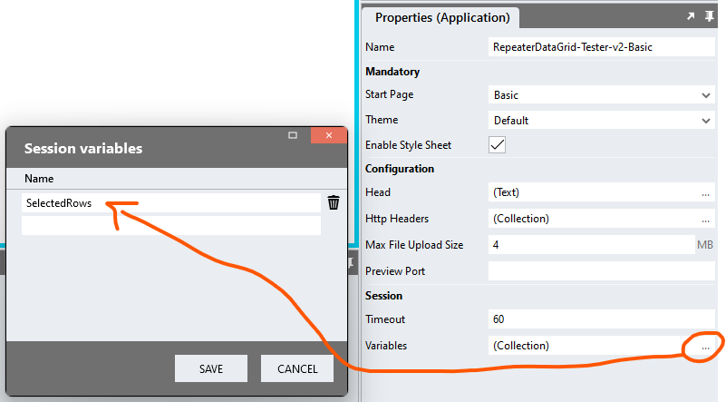

2. Drag a *SetValue* action into the Page.Load event handler
   1. Target: Session.Variables.SelectedRows
   2. Value: Initialise the variable with an empty list
```javascript
= []
```

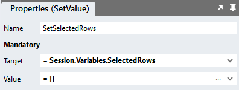

3. Add a column for a *CheckBox* control to the "ColumnsList" in the "Initialise" script with a sortable property of false

**For example**
```javascript
{
	"name": "SelectCheckbox",
	"header": "Selected",
	"sortable": false
}
```

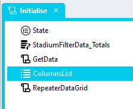

4. Drag a *CheckBox* control into the *Repeater* control

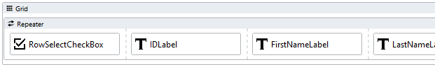

5. Create the control *Change* Event Handler

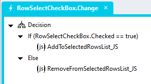

6. In the *Change* Event Handler, add a *Decision*

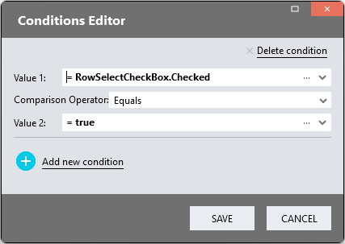

7. Drag a *Java Script* action into the "If" branch of the *Decision*
8. Add the script below to the *Code* property of the action to add the value of the "IDLabel" to the list in the session variable

```javascript
Session.Variables.SelectedRows.push(parseInt(IDLabel.Text));
```

9. Drag a *Java Script* action into the "Else" branch of the *Decision*
10. Add the script below to the *Code* property of the action to remove the value of the "IDLabel" from the list in the session variable

```javascript
Session.Variables.SelectedRows.splice(Session.Variables.SelectedRows.indexOf(parseInt(IDLabel.Text)), 1);
```

## Accessing Checked Checkboxes
To get the list of ID's of checked rows, 

1. Use a *ForEach* to loop through the list of seelcted rows in the SelectedRows variable
```javascript
Session.Variables.SelectedRows
```

## Checking Checkboxes On Load

Showing some checkboxes as checked when the DataGrid is loaded can be achieved using two methods. 

### Method 1: Adding a boolean to the DataSet

1. Add a "Checked" column to your query or dataset
2. Add a "Checked" property to your *DataSet* type

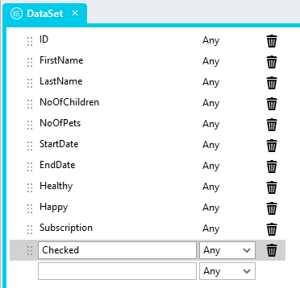

3. Map the "Checked" property to the *Checkbox* control *Checked* property

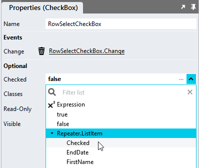

4. Initialise the "SelectedRows" session variable with the selected row ID's

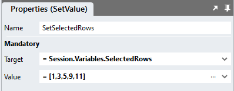

### Method 2: Assigning from a list

1. Add ID's of the rows to be checked into the "SelectedRows" session variable in the Page.Load event handler


2. Select the *Repeater* control in the page and add the *Item Load* event handler

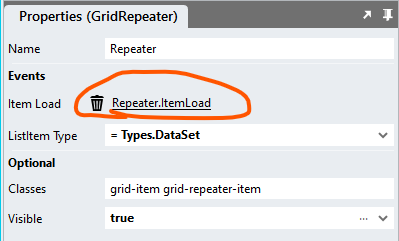

3. In the event handler, add logic to determine if a checkbox needs to be checked or not

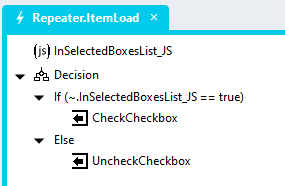

4. Add a *Java Script* action into the event handler and name it "InSelectedBoxesList_JS"
5. Add the script below to the *Code* property of the "InSelectedBoxesList_JS" action

```javascript
return Session.Variables.SelectedRows.includes(~.Parameters.Input.ListItem.ID);
```

6. Add a *Decision* below the "InSelectedBoxesList_JS" action

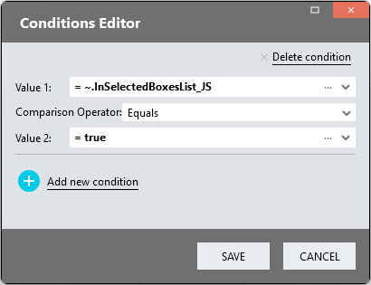

7. Drag a *SetValue* action into the "If" branch of the *Decision*
   1. Target: RowSelectCheckbox.Checked
   2. Value: true
8. Drag a *SetValue* action into the "Else" branch of the *Decision*
   1. Target: RowSelectCheckbox.Checked
   2. Value: false

