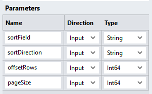
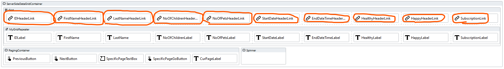
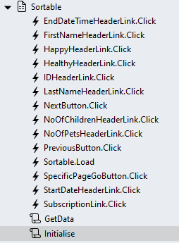

# Sortable
To allow users to click on column headers to make the DataGrid data sortable a number of changes are necessary. 

## Query
Sorting requires the addition of an *ORDER BY* clause to the Select query

Create a new query called "SortableSelect". This will return a page of data that must be attached to the *Repeater*

The "SortableSelect" query includes the parameters below to facilitate *paging* and *sorting*:
1. @sortField: The name of the sort field
2. @sortDirection: The sorting direction (asc or desc)
3. @offsetRows: The number of records to skip
4. @pageSize: The number of records to fetch



### "SortableSelect" Query
1. Create a new query called "SortableSelect" under the "StadiumFilterData" connector
2. Add the query below 
3. Press the "Fetch Fields & Parameters" button
4. Change the Type of the "@offsetRows" and "@pageSize" parameters to "Int64"

**NOTE: When creating this SQL in the Stadium Query Editor and pressing the "Fetch Fields & Parameters" button, an error will pop up. This is expected and not a problem. You need to set the *Type* option for the parameters called "offsetRows" and "pageSize" to "Int64" as shown below. Then press the "Fetch Fields & Parameters" button again.**

```sql
SELECT ID
      ,FirstName
      ,LastName
      ,NoOfChildren
      ,NoOfPets
      ,StartDate
      ,EndDate
      ,Healthy
      ,Happy
      ,Subscription
  FROM dbo.MyData
  ORDER BY
  case when UPPER(@sortField) = 'ID' AND (LOWER(@sortDirection) = 'asc' OR @sortDirection = '') THEN ID END ASC,
  case when UPPER(@sortField) = 'ID' AND LOWER(@sortDirection) = 'desc' THEN ID END DESC,
  case when LOWER(@sortField) = 'FirstName' AND (LOWER(@sortDirection) = 'asc' OR @sortDirection = '') THEN FirstName END ASC,
  case when LOWER(@sortField) = 'FirstName' AND LOWER(@sortDirection) = 'desc' THEN FirstName END DESC,
  case when LOWER(@sortField) = 'LastName' AND (LOWER(@sortDirection) = 'asc' OR @sortDirection = '') THEN LastName END ASC,
  case when LOWER(@sortField) = 'LastName' AND LOWER(@sortDirection) = 'desc' THEN LastName END DESC,
  case when LOWER(@sortField) = 'NoOfChildren' AND (LOWER(@sortDirection) = 'asc' OR @sortDirection = '') THEN NoOfChildren END ASC,
  case when LOWER(@sortField) = 'NoOfChildren' AND LOWER(@sortDirection) = 'desc' THEN NoOfChildren END DESC,
  case when LOWER(@sortField) = 'NoOfPets' AND (LOWER(@sortDirection) = 'asc' OR @sortDirection = '') THEN NoOfPets END ASC,
  case when LOWER(@sortField) = 'NoOfPets' AND LOWER(@sortDirection) = 'desc' THEN NoOfPets END DESC,
  case when LOWER(@sortField) = 'StartDate' AND (LOWER(@sortDirection) = 'asc' OR @sortDirection = '') THEN StartDate END ASC,
  case when LOWER(@sortField) = 'StartDate' AND LOWER(@sortDirection) = 'desc' THEN StartDate END DESC,
  case when LOWER(@sortField) = 'EndDate' AND (LOWER(@sortDirection) = 'asc' OR @sortDirection = '') THEN EndDate END ASC,
  case when LOWER(@sortField) = 'EndDate' AND LOWER(@sortDirection) = 'desc' THEN EndDate END DESC,
  case when LOWER(@sortField) = 'Healthy' AND (LOWER(@sortDirection) = 'asc' OR @sortDirection = '') THEN Healthy END ASC,
  case when LOWER(@sortField) = 'Healthy' AND LOWER(@sortDirection) = 'desc' THEN Healthy END DESC,
  case when LOWER(@sortField) = 'Happy' AND (LOWER(@sortDirection) = 'asc' OR @sortDirection = '') THEN Happy END ASC,
  case when LOWER(@sortField) = 'Happy' AND LOWER(@sortDirection) = 'desc' THEN Happy END DESC,
  case when LOWER(@sortField) = 'Subscription' AND (LOWER(@sortDirection) = 'asc' OR @sortDirection = '') THEN Subscription END ASC,
  case when LOWER(@sortField) = 'Subscription' AND LOWER(@sortDirection) = 'desc' THEN Subscription END DESC,
  case when @sortField = '' then ID end ASC,
  case when @sortField = 'undefined' then ID end ASC
OFFSET @offsetRows ROWS FETCH NEXT @pageSize ROWS ONLY
```

## Page Scripts

### Initialise
1. Create a page script as per the description in the [Readme](/blob/main/README.md) file or copy this script from the "Basic" page 
2. Remove the "BasicSelect" query from the script and replace it with the "SortableSelect" query
3. Complete the "SortableSelect" query parameters
   1. offsetRows: 0 (to start with the first record the initial offset 0)
   2. pageSize: an interger that defines how many records the DataGrid shows (e.g. 10)
   3. sortField: The initial sort field for the dataset (e.g. ID)
   4. sortDirection: The initial sort direction of the dataset (e.g. asc)
4. Change the *Source* property of the *SetValue* action below
   1. Source: The dataset returned by the "SortableSelect" query
5. Adjust the "RepeaterDataGridInit" input parameters as required

## Page
To enable users to page:
1. Swap the Header *Label* controls into *Link* controls



2. Create the *Click Event Handler* for each of the header *Link* controls



3. Drag the "GetData" script into the control *Click Event Handler* script


